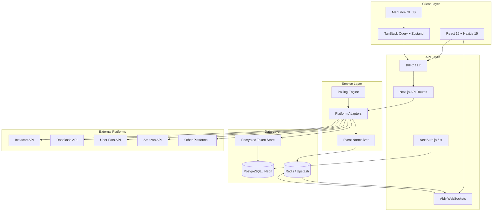
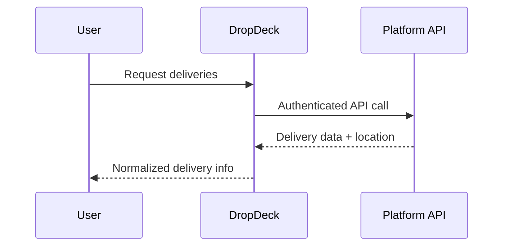
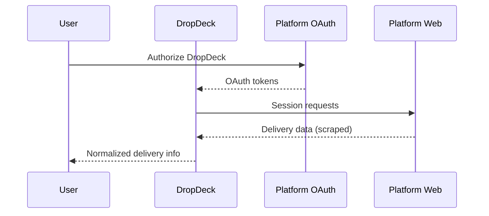
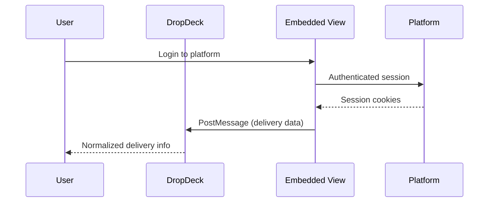

# DropDeck: Project Overview

## Executive Summary

DropDeck is a **multi-platform delivery tracking aggregator** - a responsive web application that unifies real-time delivery tracking across 11+ delivery platforms into a single, intuitive dashboard. Users can view driver locations, estimated delivery times, and order status for all active deliveries simultaneously, eliminating the need to switch between multiple apps.

**Project Status:** Planning Phase
**Target Launch:** Q2 2026
**Document Version:** 1.0

---

## Vision and Goals

### Vision Statement

> To provide consumers with a unified, real-time view of all their deliveries across every platform, transforming the fragmented delivery tracking experience into a seamless, single-pane-of-glass solution.

### Primary Goals

1. **Unified Tracking**: Aggregate delivery data from 11+ platforms into a single dashboard
2. **Real-Time Updates**: Display live driver locations with smooth animations and accurate ETAs
3. **Platform Agnostic**: Support food delivery, grocery, alcohol, and general package platforms
4. **Persistent Sessions**: OAuth tokens and session data persist across browser sessions
5. **Responsive Design**: Optimal experience across desktop, tablet, and mobile devices
6. **Privacy-First**: Secure credential storage with user-controlled data

### Success Metrics

| Metric | Target |
|--------|--------|
| Platforms Supported | 11+ at launch |
| Location Update Latency | < 2 seconds |
| UI Frame Rate | 60fps for map animations |
| Session Persistence | 30-day token retention |
| Platform Sync Success | > 95% |

---

## Target Platforms

### Platform Capabilities Matrix

| Platform | Category | API Access | Live Location | ETA | Webhooks | Priority |
|----------|----------|------------|---------------|-----|----------|----------|
| **Instacart** | Grocery | Partner API | Yes | Yes | Yes | P0 |
| **DoorDash** | Food/Convenience | Drive API | Yes | Yes | Yes | P0 |
| **Uber Eats** | Food/Grocery | Consumer API | Yes | Yes | Yes | P0 |
| **Amazon** | General/Grocery | Shipping API v2 | Yes | Yes | Limited | P0 |
| **Walmart+** | Grocery/General | Session-Based | Limited | Yes | No | P1 |
| **Shipt** | Grocery | Session-Based | Session-Dependent | Yes | No | P1 |
| **Drizly** | Alcohol | Legacy/Uber | Yes | Yes | Possible | P1 |
| **Total Wine** | Alcohol | Onfleet | Limited | Yes | Yes | P2 |
| **Costco** | Wholesale | Via Instacart | Via Instacart | Via Instacart | Via Instacart | P1 |
| **Sam's Club** | Wholesale | Session-Based | Limited | Yes | No | P2 |
| **Amazon Fresh** | Grocery | Via Amazon | Via Amazon | Via Amazon | Via Amazon | P0 |

**Priority Legend:**
- **P0**: Launch-critical, implement first
- **P1**: Important for user value, implement in Phase 2
- **P2**: Nice-to-have, implement when resources allow

---

## High-Level Architecture



---

## Key Value Propositions

### For Users

1. **Single Dashboard View**
   - No more switching between 5+ apps to track deliveries
   - All active deliveries visible at a glance
   - Unified notification system

2. **Real-Time Driver Tracking**
   - Live map with driver location markers
   - Smooth animation between location updates
   - Accurate ETA countdown timers

3. **Smart Organization**
   - Sort by ETA, platform, or custom order
   - Filter by delivery type or status
   - Responsive grid adapts to screen size

4. **Persistent Sessions**
   - Login once per platform, stay connected
   - Automatic token refresh
   - Cross-device sync (when logged in)

### Technical Differentiators

1. **Unified Data Model**
   - Normalize heterogeneous platform data into consistent format
   - Status mapping across different platform terminologies
   - Consistent ETA calculations

2. **Adapter Pattern Architecture**
   - Pluggable platform adapters for maintainability
   - Support for API, OAuth session, and embedded approaches
   - Graceful degradation when platforms are unavailable

3. **Real-Time Infrastructure**
   - Redis pub/sub for event distribution
   - WebSocket connections for instant updates
   - Optimistic UI updates with TanStack Query

4. **Security-First Design**
   - AES-256-GCM encryption for stored tokens
   - Per-platform session isolation
   - Minimal data retention policies

---

## Integration Strategies

### Strategy A: Direct API Integration
For platforms with official consumer/partner APIs (Uber Eats, Instacart, DoorDash, Amazon):



### Strategy B: OAuth Session Proxy
For platforms supporting OAuth but without tracking APIs (Walmart+, Shipt):



### Strategy C: Embedded Session Bridge
For platforms without APIs (Drizly, Total Wine, Sam's Club):



---

## User Experience Overview

### Dashboard Layout

```
+------------------------------------------------------------------+
|  DropDeck                    [Sort: ETA v] [Settings]  [Profile] |
+------------------------------------------------------------------+
|                                                                  |
|  +------------------------+  +------------------------+          |
|  | [Instacart Icon]  8min |  | [DoorDash Icon]  23min |          |
|  |                        |  |                        |          |
|  |     [Map with          |  |     [Map with          |          |
|  |      driver marker]    |  |      driver marker]    |          |
|  |                        |  |                        |          |
|  | Out for delivery       |  | Preparing              |          |
|  | 1.2 mi away            |  | Est. pickup: 5:45 PM   |          |
|  +------------------------+  +------------------------+          |
|                                                                  |
|  +------------------------+  +------------------------+          |
|  | [Amazon Icon]    45min |  | [Walmart Icon]   2 hrs |          |
|  |                        |  |                        |          |
|  |     [Map with          |  |     [Map with          |          |
|  |      delivery truck]   |  |      route preview]    |          |
|  |                        |  |                        |          |
|  | 3 stops away           |  | Scheduled: 6-7 PM      |          |
|  | Tracking #: TBA...     |  | Order confirmed        |          |
|  +------------------------+  +------------------------+          |
|                                                                  |
+------------------------------------------------------------------+
```

### Key UI Features

- **Borderless Pane Design**: Subtle elevation instead of hard borders
- **Platform Branding**: Recognizable icons and accent colors per platform
- **Information Hierarchy**: ETA prominently displayed, then status, then map
- **Responsive Grid**: 1 column (mobile) to 4 columns (wide desktop)
- **Theme Support**: Light, dark, and system-preference modes

---

## Project Scope

### MVP (Phase 1-4)

- Core authentication system with NextAuth.js
- 4 primary platform adapters (Instacart, DoorDash, Uber Eats, Amazon)
- Real-time location tracking with MapLibre
- Responsive dashboard with grid layout
- Basic sorting and filtering
- Light/dark theme support

### Post-MVP (Phase 5-6)

- Additional platform adapters (Walmart+, Shipt, Drizly, etc.)
- Push notifications (PWA)
- Delivery history view
- Quick actions (contact driver, share ETA)
- Advanced analytics dashboard

### Out of Scope (Future Consideration)

- Native mobile apps (iOS/Android)
- Multi-user household accounts
- Order placement through DropDeck
- Price comparison features
- Integration with smart home devices

---

## Risk Summary

| Risk Category | Key Risk | Mitigation |
|---------------|----------|------------|
| **Technical** | Platform API changes | Adapter abstraction, monitoring, version pinning |
| **Technical** | Rate limiting | Caching, request batching, circuit breakers |
| **Business** | ToS violations | Legal review, user consent, official partner paths |
| **Security** | Credential theft | AES-256-GCM encryption, minimal retention |
| **Operational** | Platform blocks | Multiple integration strategies, graceful degradation |

---

## Document Navigation

| Document | Description |
|----------|-------------|
| [01-FEATURES.md](./01-FEATURES.md) | Detailed feature specifications |
| [02-ARCHITECTURE.md](./02-ARCHITECTURE.md) | System and component architecture |
| [03-TECHNOLOGY-STACK.md](./03-TECHNOLOGY-STACK.md) | Technology decisions and rationale |
| [04-PLATFORM-INTEGRATIONS.md](./04-PLATFORM-INTEGRATIONS.md) | Per-platform integration details |
| [05-DATA-MODELS.md](./05-DATA-MODELS.md) | Database schema and data models |
| [06-API-DESIGN.md](./06-API-DESIGN.md) | tRPC router and API specifications |
| [07-SECURITY.md](./07-SECURITY.md) | Security architecture and practices |
| [08-TESTING-STRATEGY.md](./08-TESTING-STRATEGY.md) | Testing approach and coverage targets |
| [09-DEPLOYMENT.md](./09-DEPLOYMENT.md) | Deployment and CI/CD configuration |
| [10-UI-UX-DESIGN-SYSTEM.md](./10-UI-UX-DESIGN-SYSTEM.md) | Complete UI/UX design system |
| [11-BRAND-GUIDELINES.md](./11-BRAND-GUIDELINES.md) | Brand identity and usage guidelines |

---

*Document Version: 1.0 | Last Updated: January 2026*
