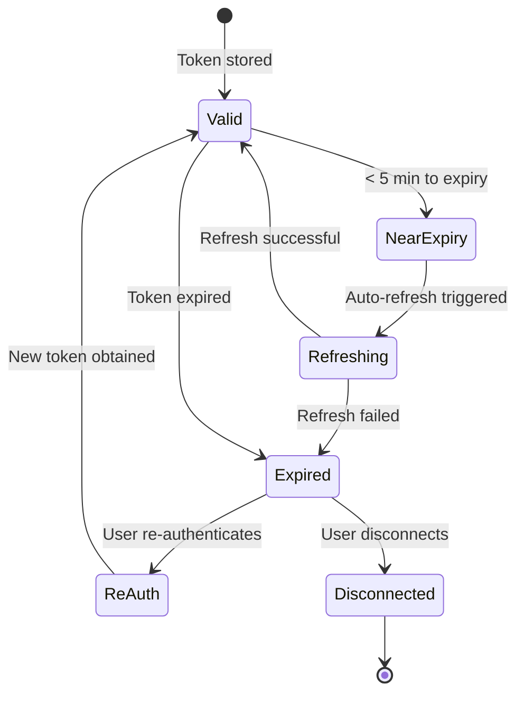
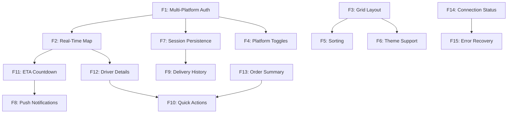

# DropDeck: Feature Specifications

## Overview

This document provides detailed feature specifications for DropDeck, including user stories, acceptance criteria, and technical implementation notes. Features are organized by priority and grouped into functional areas.

---

## Feature Priority Matrix

| Feature ID | Feature Name | Priority | MVP | Complexity | Dependencies |
|------------|--------------|----------|-----|------------|--------------|
| F1 | Multi-Platform Authentication | P0 | Yes | High | NextAuth.js, Platform APIs |
| F2 | Real-Time Delivery Map | P0 | Yes | High | MapLibre, WebSockets |
| F3 | Responsive Grid Layout | P0 | Yes | Medium | React, Tailwind |
| F4 | Platform Toggle Controls | P1 | Yes | Low | Zustand, tRPC |
| F5 | Sorting & Organization | P1 | Yes | Medium | TanStack Query |
| F6 | Theme Support | P1 | Yes | Low | Tailwind, next-themes |
| F7 | Session Persistence | P0 | Yes | High | Encryption, Database |
| F8 | Push Notifications | P2 | No | Medium | Service Worker, PWA |
| F9 | Delivery History | P2 | No | Medium | Database queries |
| F10 | Quick Actions | P2 | No | Low | Platform APIs |
| F11 | ETA Countdown Timer | P0 | Yes | Low | React, Date utilities |
| F12 | Driver Details Display | P1 | Yes | Low | Normalized data model |
| F13 | Order Summary View | P1 | Yes | Low | Platform adapters |
| F14 | Connection Status Indicators | P0 | Yes | Low | WebSocket state |
| F15 | Error Recovery UI | P0 | Yes | Medium | Error boundaries |

---

## Core Features (MVP)

### F1: Multi-Platform Authentication

**Priority:** P0 (Critical)
**Complexity:** High
**Sprint:** 1.3

#### Description

Users can connect and disconnect individual delivery platform accounts using OAuth 2.0, session-based authentication, or embedded browser flows. Connected accounts persist across browser sessions with automatic token refresh.

#### User Stories

| ID | As a... | I want to... | So that... |
|----|---------|--------------|------------|
| F1.1 | User | Connect my Instacart account | I can see my Instacart deliveries |
| F1.2 | User | See which platforms are connected | I know what data is being tracked |
| F1.3 | User | Disconnect a platform | I can remove access at any time |
| F1.4 | User | Stay logged in across sessions | I don't have to reconnect every time |
| F1.5 | User | Be notified when a token expires | I can re-authenticate before losing data |

#### Acceptance Criteria

- [ ] Support OAuth 2.0 Authorization Code flow for platforms that offer it
- [ ] Support session-based authentication for platforms without OAuth
- [ ] Secure credential storage with AES-256-GCM encryption at rest
- [ ] Token refresh handling with automatic re-authentication prompts
- [ ] Clear visual indication of connection status per platform
- [ ] Graceful handling of authentication failures with user-friendly messages
- [ ] "Connect" / "Disconnect" buttons in settings panel
- [ ] Loading states during OAuth redirect flow
- [ ] Error states with retry options

#### Technical Implementation

```typescript
// Platform connection interface
interface PlatformConnection {
  id: string;
  userId: string;
  platform: Platform;
  accessToken: EncryptedData | null;
  refreshToken: EncryptedData | null;
  sessionCookies: EncryptedData | null;
  expiresAt: Date | null;
  lastSyncAt: Date;
  status: 'connected' | 'expired' | 'error' | 'disconnected';
  errorMessage?: string;
}

// Authentication flow states
type AuthFlowState =
  | 'idle'
  | 'initiating'
  | 'awaiting_callback'
  | 'exchanging_code'
  | 'storing_tokens'
  | 'success'
  | 'error';
```

#### UI Mockup Description

**Settings > Connected Platforms Panel:**
- List of all supported platforms with logo and name
- Status badge: Connected (green), Expired (yellow), Error (red), Not Connected (gray)
- "Connect" button for disconnected platforms
- "Disconnect" button for connected platforms
- Last sync timestamp for connected platforms
- "Refresh" button for expired/error states

---

### F2: Real-Time Delivery Map Display

**Priority:** P0 (Critical)
**Complexity:** High
**Sprint:** 4.1-4.2

#### Description

Display driver location on an interactive map with smooth animations and ETA countdown. Each delivery pane contains a dedicated map showing the driver's position, route to destination, and destination marker.

#### User Stories

| ID | As a... | I want to... | So that... |
|----|---------|--------------|------------|
| F2.1 | User | See where my driver is on a map | I know how close they are |
| F2.2 | User | See my delivery address on the map | I can verify the destination |
| F2.3 | User | See the driver marker move smoothly | The experience feels polished |
| F2.4 | User | See a live ETA countdown | I know exactly when to expect delivery |
| F2.5 | User | See the driver's route | I understand their path |

#### Acceptance Criteria

- [ ] MapLibre GL JS rendering with free OpenStreetMap tiles
- [ ] Driver marker with platform-specific icon overlay
- [ ] Smooth interpolation between location updates (target: 60fps)
- [ ] Route polyline from driver to destination (when available)
- [ ] Destination marker with delivery address
- [ ] Real-time ETA countdown (updates every second)
- [ ] Map auto-centers on delivery area with appropriate zoom
- [ ] Dark mode map style when theme is dark
- [ ] Fallback display when location data unavailable
- [ ] Touch gestures for zoom/pan on mobile

#### Technical Implementation

```typescript
// Location data structure
interface DeliveryLocation {
  deliveryId: string;
  platform: Platform;
  driver: {
    lat: number;
    lng: number;
    heading?: number;        // Degrees, for rotated marker
    speed?: number;          // km/h, for interpolation calculation
    accuracy?: number;       // Meters
    lastUpdate: Date;
  };
  destination: {
    lat: number;
    lng: number;
    address: string;
    instructions?: string;
  };
  route?: {
    encodedPolyline?: string;
    waypoints?: [number, number][];
  };
  eta: {
    minutes: number;
    updatedAt: Date;
    confidence: 'high' | 'medium' | 'low';
  };
}

// Animation interpolation
function interpolatePosition(
  start: { lat: number; lng: number },
  end: { lat: number; lng: number },
  progress: number // 0 to 1
): { lat: number; lng: number } {
  return {
    lat: start.lat + (end.lat - start.lat) * easeOutCubic(progress),
    lng: start.lng + (end.lng - start.lng) * easeOutCubic(progress),
  };
}
```

#### Map Tile Configuration

```typescript
const mapStyles = {
  light: 'https://tiles.openfreemap.org/styles/liberty',
  dark: 'https://tiles.openfreemap.org/styles/dark',
  satellite: 'https://tiles.openfreemap.org/styles/satellite',
};

const mapConfig = {
  minZoom: 10,
  maxZoom: 18,
  defaultZoom: 15,
  attributionControl: true,
  interactive: true,
  trackResize: true,
};
```

---

### F3: Responsive Grid Layout

**Priority:** P0 (Critical)
**Complexity:** Medium
**Sprint:** 1.4

#### Description

Dynamic grid layout that optimally arranges delivery panes based on viewport size and number of active deliveries. The layout adjusts smoothly as deliveries are added or removed.

#### User Stories

| ID | As a... | I want to... | So that... |
|----|---------|--------------|------------|
| F3.1 | User | See all deliveries in a grid | I can monitor everything at once |
| F3.2 | Mobile user | See deliveries in a single column | They're easy to scroll through |
| F3.3 | Desktop user | See 3-4 deliveries side by side | I use my screen space efficiently |
| F3.4 | User | Have panes resize smoothly | Layout changes don't feel jarring |

#### Acceptance Criteria

- [ ] Borderless pane design with subtle elevation/shadow separation
- [ ] Auto-responsive: 1 column (mobile) → 2 columns (tablet) → 3-4 columns (desktop)
- [ ] Minimum pane size of 320x240px for map legibility
- [ ] Smooth resize transitions using CSS transitions or Framer Motion
- [ ] Empty state when no active deliveries
- [ ] Skeleton loading states during initial data fetch
- [ ] Panes maintain aspect ratio during resize

#### Responsive Breakpoints

| Breakpoint | Width Range | Columns | Gap | Behavior |
|------------|-------------|---------|-----|----------|
| Mobile (sm) | < 640px | 1 | 16px | Full width, stacked |
| Tablet (md) | 640-1024px | 2 | 20px | Side-by-side |
| Desktop (lg) | 1024-1440px | 3 | 24px | Optimal viewing |
| Wide (xl) | > 1440px | 4 | 24px | Maximum density |

#### Grid Algorithm

```typescript
interface GridLayout {
  columns: number;
  rows: number;
  paneWidth: number;
  paneHeight: number;
  gap: number;
}

function calculateGridLayout(
  viewportWidth: number,
  viewportHeight: number,
  activeDeliveries: number
): GridLayout {
  const minPaneWidth = 320;
  const minPaneHeight = 240;
  const gap = viewportWidth < 640 ? 16 : viewportWidth < 1024 ? 20 : 24;

  // Calculate maximum columns that fit
  const maxCols = Math.floor((viewportWidth + gap) / (minPaneWidth + gap));
  const cols = Math.min(Math.max(maxCols, 1), activeDeliveries, 4);
  const rows = Math.ceil(activeDeliveries / cols);

  // Calculate pane dimensions
  const paneWidth = (viewportWidth - (cols - 1) * gap) / cols;
  const paneHeight = Math.max(minPaneHeight, (viewportHeight - (rows - 1) * gap) / rows);

  return { columns: cols, rows, paneWidth, paneHeight, gap };
}
```

---

### F7: Session Persistence

**Priority:** P0 (Critical)
**Complexity:** High
**Sprint:** 1.3

#### Description

Connected platform accounts and user preferences persist across browser sessions. OAuth tokens and session cookies are stored encrypted in the database with automatic refresh handling.

#### User Stories

| ID | As a... | I want to... | So that... |
|----|---------|--------------|------------|
| F7.1 | User | Stay logged in for 30 days | I don't have to re-authenticate constantly |
| F7.2 | User | Have my preferences saved | My settings persist across sessions |
| F7.3 | User | Use DropDeck on multiple devices | My data syncs across devices |
| F7.4 | User | Have tokens refresh automatically | I don't lose connectivity unexpectedly |

#### Acceptance Criteria

- [ ] OAuth tokens stored encrypted (AES-256-GCM) in database
- [ ] Session cookies stored encrypted for session-based platforms
- [ ] Automatic token refresh on app load and before expiry
- [ ] "Remember me" functionality with 30-day session duration
- [ ] Preferences sync across devices when logged in
- [ ] Secure session invalidation on logout
- [ ] Token rotation on refresh for enhanced security

#### Token Lifecycle



---

### F11: ETA Countdown Timer

**Priority:** P0 (Critical)
**Complexity:** Low
**Sprint:** 4.2

#### Description

Display a live countdown timer showing the estimated time until delivery arrives. The timer updates every second and adjusts when new ETA data is received from the platform.

#### User Stories

| ID | As a... | I want to... | So that... |
|----|---------|--------------|------------|
| F11.1 | User | See a countdown to my delivery | I know exactly how long to wait |
| F11.2 | User | See the timer update in real-time | The info feels current |
| F11.3 | User | See when an ETA is uncertain | I have appropriate expectations |

#### Acceptance Criteria

- [ ] Countdown displayed in minutes (or hours:minutes for longer ETAs)
- [ ] Timer updates every second locally
- [ ] Timer adjusts when new ETA received from platform
- [ ] Confidence indicator (high/medium/low) displayed
- [ ] "Arriving" state when under 2 minutes
- [ ] "Delivered" state when complete
- [ ] Fallback text when ETA unavailable

#### Display States

| ETA Range | Display Format | Example |
|-----------|----------------|---------|
| > 60 min | `X hr Y min` | `1 hr 23 min` |
| 10-60 min | `X min` | `23 min` |
| 2-10 min | `X min` | `5 min` |
| < 2 min | `Arriving` | `Arriving` |
| Delivered | `Delivered` | `Delivered at 5:30 PM` |
| Unknown | `--` | `--` |

---

## Secondary Features

### F4: Platform Toggle Controls

**Priority:** P1
**Complexity:** Low
**Sprint:** 2.1

#### Description

Enable/disable visibility of specific platforms from the dashboard without disconnecting them. Hidden platforms remain connected but don't appear in the grid.

#### Acceptance Criteria

- [ ] Toggle switch per platform in settings panel
- [ ] Platforms can be hidden even when connected
- [ ] Toggle state persists in user preferences
- [ ] Visual feedback when platform is toggled off
- [ ] Hidden platform count indicator in toolbar

---

### F5: Sorting & Organization

**Priority:** P1
**Complexity:** Medium
**Sprint:** 2.1

#### Description

Multiple sorting options for delivery pane arrangement in the grid.

#### Sort Options

| Mode | Description | Implementation |
|------|-------------|----------------|
| **Time to Delivery** | Nearest ETA first (default) | Sort by `eta.minutes` ascending |
| **Alphabetical** | Platform name A-Z | Sort by `platform` string |
| **Most Recent** | Last updated first | Sort by `meta.lastFetchedAt` descending |
| **Manual** | Drag-and-drop order | Store order in `userPreferences.manualPlatformOrder` |

#### Acceptance Criteria

- [ ] Sort selector dropdown in toolbar
- [ ] Instant re-ordering with smooth animation
- [ ] Manual sort mode enables drag-and-drop
- [ ] Manual order persists to user preferences
- [ ] Default sort: Time to Delivery

---

### F6: Theme Support

**Priority:** P1
**Complexity:** Low
**Sprint:** 1.4

#### Description

Light, dark, and system-preference theme modes with instant switching.

#### Acceptance Criteria

- [ ] Three-way toggle: Auto (system) / Light / Dark
- [ ] Instant theme switching without page reload
- [ ] Theme affects map styling (MapLibre dark style for dark mode)
- [ ] Preference persists via localStorage and syncs to account
- [ ] Smooth transition animation between themes
- [ ] High contrast colors in both modes

#### Theme Configuration

```typescript
const themes = {
  light: {
    mapStyle: 'https://tiles.openfreemap.org/styles/liberty',
    background: 'hsl(0 0% 100%)',
    foreground: 'hsl(0 0% 3.9%)',
    card: 'hsl(0 0% 100%)',
    cardForeground: 'hsl(0 0% 3.9%)',
    primary: 'hsl(221 83% 53%)',
    muted: 'hsl(0 0% 96.1%)',
  },
  dark: {
    mapStyle: 'https://tiles.openfreemap.org/styles/dark',
    background: 'hsl(0 0% 3.9%)',
    foreground: 'hsl(0 0% 98%)',
    card: 'hsl(0 0% 6%)',
    cardForeground: 'hsl(0 0% 98%)',
    primary: 'hsl(217 91% 60%)',
    muted: 'hsl(0 0% 14.9%)',
  },
};
```

---

### F12: Driver Details Display

**Priority:** P1
**Complexity:** Low
**Sprint:** 4.1

#### Description

Display driver information when available, including name, photo, and vehicle details.

#### Acceptance Criteria

- [ ] Driver name displayed (first name only for privacy)
- [ ] Driver photo thumbnail when available
- [ ] Vehicle description when available (make, model, color)
- [ ] "Contact driver" link where platform supports it
- [ ] Placeholder when driver info unavailable

---

### F13: Order Summary View

**Priority:** P1
**Complexity:** Low
**Sprint:** 4.3

#### Description

Display order summary information in an expandable section of each delivery pane.

#### Acceptance Criteria

- [ ] Item count badge on pane
- [ ] Expandable panel with item list
- [ ] Item thumbnails when available
- [ ] Order total when available
- [ ] "View on [Platform]" link to original order

---

### F14: Connection Status Indicators

**Priority:** P0
**Complexity:** Low
**Sprint:** 2.3

#### Description

Visual indicators showing the connection status for each platform and overall real-time connectivity.

#### Acceptance Criteria

- [ ] Global WebSocket status indicator in header
- [ ] Per-platform connection status on each pane
- [ ] "Last updated" timestamp per pane
- [ ] Automatic reconnection with visual feedback
- [ ] Offline mode indicator

---

### F15: Error Recovery UI

**Priority:** P0
**Complexity:** Medium
**Sprint:** 5.4

#### Description

User-friendly error handling with recovery options.

#### Error States

| Error Type | User Message | Recovery Action |
|------------|--------------|-----------------|
| Token Expired | "Session expired" | "Reconnect" button |
| Network Error | "Connection lost" | Auto-retry with backoff |
| Platform Error | "Unable to reach [Platform]" | "Retry" button |
| Rate Limited | "Too many requests" | "Retry in X seconds" |
| Data Error | "Unable to load delivery" | "Refresh" button |

#### Acceptance Criteria

- [ ] Error boundaries prevent full app crash
- [ ] User-friendly error messages (no technical jargon)
- [ ] Clear recovery actions for each error type
- [ ] Automatic retry with exponential backoff
- [ ] Error logging for debugging

---

## Future Features (Post-MVP)

### F8: Push Notifications (PWA)

**Priority:** P2
**Complexity:** Medium
**Sprint:** 5.3

#### Description

Browser push notifications for delivery status changes when app is in background.

#### Notification Types

| Event | Title | Body |
|-------|-------|------|
| Driver Assigned | "Driver on the way" | "[Platform]: [Driver] is heading to pick up your order" |
| Out for Delivery | "Out for delivery" | "[Platform]: Your order is on its way" |
| Arriving Soon | "Almost there!" | "[Platform]: Your delivery arrives in 5 minutes" |
| Delivered | "Delivered!" | "[Platform]: Your order has been delivered" |
| Delayed | "Delivery delayed" | "[Platform]: Your delivery is running late" |

---

### F9: Delivery History

**Priority:** P2
**Complexity:** Medium
**Sprint:** Post-MVP

#### Description

View past deliveries with completion timestamps, photos, and details.

#### Features

- Searchable/filterable list of past deliveries
- Delivery photos when available
- Timestamps for key events
- Rating/feedback submitted
- Export capability (CSV)

---

### F10: Quick Actions

**Priority:** P2
**Complexity:** Low
**Sprint:** Post-MVP

#### Description

Common actions accessible from each delivery pane.

#### Actions

| Action | Availability | Implementation |
|--------|--------------|----------------|
| Contact Driver | Platform-dependent | Deep link to platform app |
| View Full Tracking | All platforms | Open platform tracking URL |
| Share ETA | All | Generate shareable link |
| Report Issue | Platform-dependent | Deep link to platform help |

---

## Accessibility Requirements

All features must comply with WCAG 2.1 AA standards:

| Requirement | Implementation |
|-------------|----------------|
| **Keyboard Navigation** | All controls accessible via Tab, Enter, Space, Arrow keys |
| **Screen Reader Support** | ARIA labels, live regions for updates, semantic HTML |
| **Color Contrast** | Minimum 4.5:1 for text, 3:1 for UI components |
| **Focus Indicators** | Visible focus rings on all interactive elements (Drop Cyan `#06B6D4`) |
| **Motion Sensitivity** | Respect `prefers-reduced-motion` media query |
| **Text Scaling** | UI remains functional at 200% zoom |

See [10-UI-UX-DESIGN-SYSTEM.md](./10-UI-UX-DESIGN-SYSTEM.md#accessibility) for detailed accessibility specifications including color contrast ratios, ARIA patterns, and focus state implementations.

---

## UI/UX Design References

For visual design specifications and implementation details, refer to:

| Document | Content |
|----------|---------|
| [10-UI-UX-DESIGN-SYSTEM.md](./10-UI-UX-DESIGN-SYSTEM.md) | Color system, typography, spacing, component patterns, animations |
| [11-BRAND-GUIDELINES.md](./11-BRAND-GUIDELINES.md) | Logo usage, voice and tone, platform branding |

### Key Design Decisions

| Feature | Design Reference |
|---------|------------------|
| Delivery Cards | Borderless pane design with subtle elevation per Design System Section 5 |
| Platform Badges | Platform-specific colors at 15% opacity background |
| Status Indicators | Semantic colors (Green=delivered, Cyan=active, Amber=delayed, Red=error) |
| ETA Display | Prominent 24px bold, tabular-nums for countdown |
| Theme Support | CSS class-based with `next-themes`, 200ms transitions |
| Map Styling | Light/dark variants from OpenFreeMap |

---

## Feature Dependencies



---

---

## Related Documents

| Document | Description |
|----------|-------------|
| [10-UI-UX-DESIGN-SYSTEM.md](./10-UI-UX-DESIGN-SYSTEM.md) | Complete design system with visual specifications |
| [11-BRAND-GUIDELINES.md](./11-BRAND-GUIDELINES.md) | Brand identity and usage guidelines |
| [02-ARCHITECTURE.md](./02-ARCHITECTURE.md) | Component architecture details |
| [03-TECHNOLOGY-STACK.md](./03-TECHNOLOGY-STACK.md) | UI technology choices |

---

*Document Version: 1.1 | Last Updated: January 2026*
