# DropDeck: System Architecture

## Overview

This document details the system architecture for DropDeck, including high-level design, component architecture, data flow patterns, and directory structure. The architecture follows modern Next.js 15 best practices with a server-first approach and client-islands pattern.

---

## Architecture Principles

### Core Design Principles

1. **Server-First**: Fetch, compute, and render on the server where possible
2. **Client-Islands**: Hydrate only interactive components (maps, real-time counters)
3. **Strict Separation**: Database and auth logic never leak into client bundles
4. **Adapter Abstraction**: Platform integrations isolated behind common interface
5. **Real-Time by Design**: WebSocket infrastructure as first-class citizen
6. **Security-First**: Encrypted storage, minimal data retention, isolated sessions

### Architecture Patterns Used

| Pattern | Application |
|---------|-------------|
| **Adapter Pattern** | Platform integrations with common interface |
| **Repository Pattern** | Data access through Drizzle ORM |
| **Observer Pattern** | Real-time updates via pub/sub |
| **Circuit Breaker** | Graceful degradation for platform failures |
| **Strategy Pattern** | Multiple authentication strategies |

---

## High-Level System Architecture

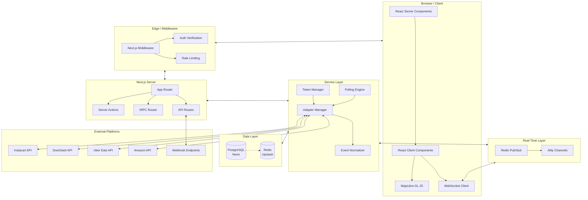

---

## Component Architecture

### Layer Breakdown

```mermaid
flowchart LR
    subgraph Presentation["Presentation Layer"]
        Pages[Pages & Layouts]
        Components[UI Components]
        Hooks[Custom Hooks]
    end

    subgraph Application["Application Layer"]
        TRPC_Routers[tRPC Routers]
        ServerActions[Server Actions]
        Middleware[Middleware]
    end

    subgraph Domain["Domain Layer"]
        Adapters[Platform Adapters]
        Services[Business Services]
        Types[Domain Types]
    end

    subgraph Infrastructure["Infrastructure Layer"]
        DB[Database Client]
        Cache[Redis Client]
        Auth[Auth Provider]
        WebSocket[WebSocket Server]
    end

    Presentation --> Application
    Application --> Domain
    Domain --> Infrastructure
```

### Component Responsibility Matrix

| Layer | Component | Responsibility |
|-------|-----------|----------------|
| **Presentation** | Pages | Route handling, layout composition |
| **Presentation** | Components | UI rendering, user interaction |
| **Presentation** | Hooks | State management, data fetching |
| **Application** | tRPC Routers | API endpoint definitions |
| **Application** | Server Actions | Form handling, mutations |
| **Application** | Middleware | Auth, rate limiting, redirects |
| **Domain** | Adapters | Platform-specific integration logic |
| **Domain** | Services | Business logic, data transformation |
| **Domain** | Types | TypeScript interfaces, Zod schemas |
| **Infrastructure** | Database | Drizzle ORM, query building |
| **Infrastructure** | Cache | Redis operations, pub/sub |
| **Infrastructure** | Auth | NextAuth.js configuration |
| **Infrastructure** | WebSocket | Ably/WebSocket connection management |

---

## Directory Structure

```
src/
├── app/                              # Next.js App Router
│   ├── (auth)/                       # Auth route group (no layout)
│   │   ├── login/
│   │   │   └── page.tsx              # Login page
│   │   ├── register/
│   │   │   └── page.tsx              # Registration page
│   │   └── callback/
│   │       └── [platform]/
│   │           └── route.ts          # OAuth callback handlers
│   │
│   ├── (dashboard)/                  # Main app route group
│   │   ├── layout.tsx                # Dashboard layout with sidebar
│   │   ├── page.tsx                  # Main dashboard (delivery grid)
│   │   ├── settings/
│   │   │   ├── page.tsx              # Settings overview
│   │   │   ├── platforms/
│   │   │   │   └── page.tsx          # Platform connections
│   │   │   └── preferences/
│   │   │       └── page.tsx          # User preferences
│   │   └── history/
│   │       └── page.tsx              # Delivery history
│   │
│   ├── api/                          # API routes
│   │   ├── trpc/
│   │   │   └── [trpc]/
│   │   │       └── route.ts          # tRPC handler
│   │   ├── auth/
│   │   │   └── [...nextauth]/
│   │   │       └── route.ts          # NextAuth.js handler
│   │   └── webhook/
│   │       └── [platform]/
│   │           └── route.ts          # Webhook receivers
│   │
│   ├── layout.tsx                    # Root layout
│   ├── globals.css                   # Global styles
│   └── providers.tsx                 # Client providers wrapper
│
├── components/                       # React components
│   ├── dashboard/                    # Dashboard-specific components
│   │   ├── DeliveryGrid.tsx          # Grid container
│   │   ├── DeliveryPane.tsx          # Individual delivery card
│   │   ├── DeliveryPaneSkeleton.tsx  # Loading skeleton
│   │   ├── EmptyState.tsx            # No deliveries state
│   │   ├── PaneControls.tsx          # Sort/filter toolbar
│   │   └── ETACountdown.tsx          # Live countdown timer
│   │
│   ├── maps/                         # Map components
│   │   ├── MapContainer.tsx          # MapLibre wrapper
│   │   ├── DriverMarker.tsx          # Animated driver icon
│   │   ├── DestinationMarker.tsx     # Delivery address marker
│   │   ├── RoutePolyline.tsx         # Driver route line
│   │   └── MapControls.tsx           # Zoom, center buttons
│   │
│   ├── platform/                     # Platform-related components
│   │   ├── PlatformIcon.tsx          # Brand icons
│   │   ├── PlatformBadge.tsx         # Status badge
│   │   ├── ConnectionStatus.tsx      # Connection indicator
│   │   ├── ConnectButton.tsx         # OAuth trigger
│   │   └── PlatformCard.tsx          # Settings platform card
│   │
│   ├── layout/                       # Layout components
│   │   ├── Header.tsx                # App header
│   │   ├── Sidebar.tsx               # Navigation sidebar
│   │   ├── Footer.tsx                # App footer
│   │   └── MobileNav.tsx             # Mobile navigation
│   │
│   └── ui/                           # shadcn/ui components
│       ├── button.tsx
│       ├── card.tsx
│       ├── dialog.tsx
│       ├── dropdown-menu.tsx
│       ├── input.tsx
│       ├── select.tsx
│       ├── skeleton.tsx
│       ├── switch.tsx
│       ├── toast.tsx
│       └── tooltip.tsx
│
├── hooks/                            # Custom React hooks
│   ├── useDeliveries.ts              # Fetch active deliveries
│   ├── useRealTimeLocation.ts        # WebSocket location subscription
│   ├── usePlatformAuth.ts            # OAuth flow management
│   ├── usePreferences.ts             # User preferences
│   ├── useGridLayout.ts              # Responsive grid calculation
│   ├── useCountdown.ts               # ETA countdown logic
│   └── useMediaQuery.ts              # Responsive breakpoints
│
├── lib/                              # Library code
│   ├── adapters/                     # Platform adapters
│   │   ├── base.ts                   # Abstract adapter class
│   │   ├── types.ts                  # Adapter types
│   │   ├── registry.ts               # Adapter registry
│   │   ├── instacart.ts              # Instacart adapter
│   │   ├── doordash.ts               # DoorDash adapter
│   │   ├── ubereats.ts               # Uber Eats adapter
│   │   ├── amazon.ts                 # Amazon adapter
│   │   ├── walmart.ts                # Walmart+ adapter
│   │   ├── shipt.ts                  # Shipt adapter
│   │   ├── drizly.ts                 # Drizly adapter
│   │   ├── totalwine.ts              # Total Wine adapter
│   │   ├── costco.ts                 # Costco (via Instacart)
│   │   └── samsclub.ts               # Sam's Club adapter
│   │
│   ├── auth/                         # Authentication
│   │   ├── config.ts                 # NextAuth.js configuration
│   │   ├── providers.ts              # OAuth provider configs
│   │   └── session.ts                # Session helpers
│   │
│   ├── db/                           # Database
│   │   ├── client.ts                 # Drizzle client
│   │   ├── schema.ts                 # Database schema
│   │   └── migrations/               # Migration files
│   │
│   ├── encryption/                   # Encryption utilities
│   │   ├── tokens.ts                 # Token encryption/decryption
│   │   └── constants.ts              # Encryption constants
│   │
│   ├── realtime/                     # Real-time infrastructure
│   │   ├── ably.ts                   # Ably client configuration
│   │   ├── redis.ts                  # Redis pub/sub client
│   │   └── channels.ts               # Channel name helpers
│   │
│   ├── trpc/                         # tRPC configuration
│   │   ├── init.ts                   # tRPC initialization
│   │   ├── context.ts                # Request context
│   │   └── client.ts                 # Client-side tRPC
│   │
│   └── utils/                        # Utility functions
│       ├── geo.ts                    # Coordinate calculations
│       ├── time.ts                   # Date/time utilities
│       ├── format.ts                 # Formatting helpers
│       └── errors.ts                 # Error handling utilities
│
├── server/                           # Server-only code
│   ├── routers/                      # tRPC routers
│   │   ├── index.ts                  # Root router
│   │   ├── platform.ts               # Platform operations
│   │   ├── delivery.ts               # Delivery queries
│   │   └── preference.ts             # User preferences
│   │
│   ├── services/                     # Business services
│   │   ├── delivery-aggregator.ts    # Aggregate from all platforms
│   │   ├── token-refresh.ts          # Token refresh service
│   │   └── webhook-processor.ts      # Process incoming webhooks
│   │
│   └── jobs/                         # Background jobs
│       ├── polling.ts                # Platform polling job
│       └── token-cleanup.ts          # Expired token cleanup
│
├── stores/                           # Zustand stores
│   ├── delivery-store.ts             # Delivery state
│   ├── ui-store.ts                   # UI state (theme, sidebar)
│   └── realtime-store.ts             # WebSocket connection state
│
├── types/                            # TypeScript types
│   ├── delivery.ts                   # Delivery-related types
│   ├── platform.ts                   # Platform types
│   ├── user.ts                       # User types
│   └── api.ts                        # API types
│
└── config/                           # Configuration
    ├── platforms.ts                  # Platform metadata
    ├── env.ts                        # Environment validation
    └── constants.ts                  # App constants
```

---

## Data Flow Architecture

### Request Flow (Query)

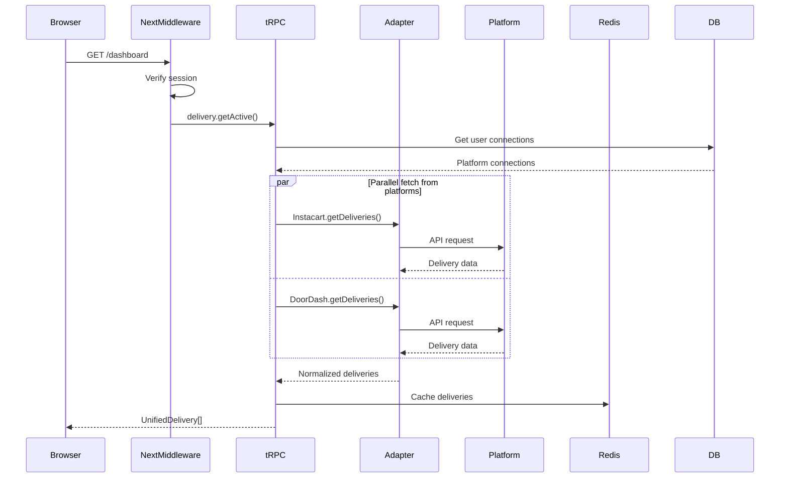

### Real-Time Update Flow

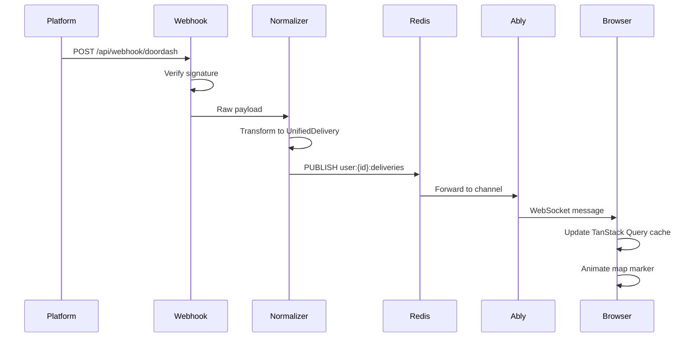

### Authentication Flow

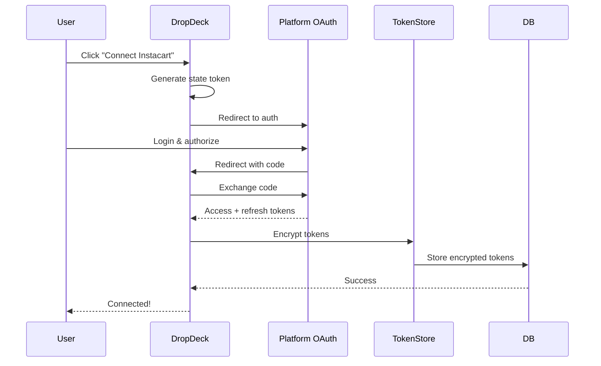

---

## Platform Adapter Architecture

### Adapter Class Hierarchy

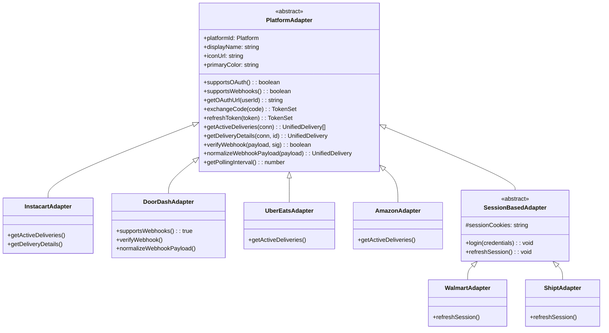

### Adapter Registry

```typescript
// lib/adapters/registry.ts
import { Platform } from '@/types/platform';
import type { PlatformAdapter } from './base';

const adapters = new Map<Platform, PlatformAdapter>();

export function registerAdapter(adapter: PlatformAdapter): void {
  adapters.set(adapter.platformId, adapter);
}

export function getAdapter(platform: Platform): PlatformAdapter {
  const adapter = adapters.get(platform);
  if (!adapter) {
    throw new Error(`No adapter registered for platform: ${platform}`);
  }
  return adapter;
}

export function getAllAdapters(): PlatformAdapter[] {
  return Array.from(adapters.values());
}
```

---

## Real-Time Architecture

### WebSocket Channel Structure

```
Channels:
├── user:{userId}:deliveries     # Delivery updates for user
├── user:{userId}:connections    # Platform connection status
├── user:{userId}:presence       # Client presence (multi-device)
└── system:status                # System-wide announcements
```

### Pub/Sub Message Flow

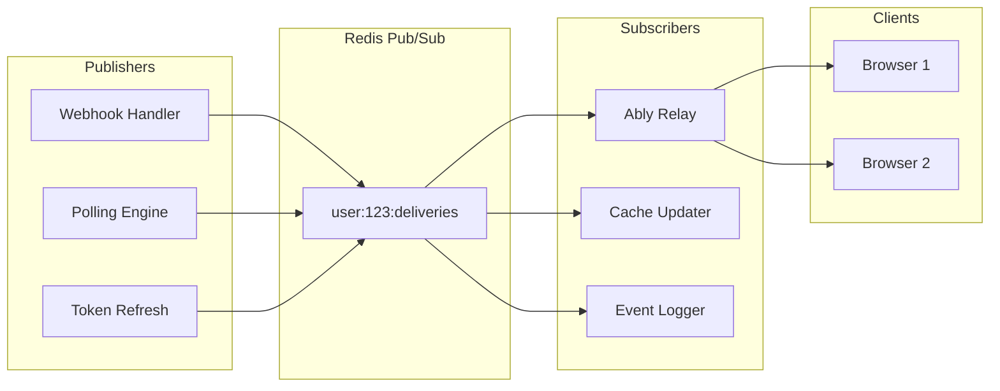

### Message Schema

```typescript
interface RealtimeMessage {
  type: 'delivery_update' | 'location_update' | 'connection_status';
  timestamp: string;
  payload: DeliveryUpdate | LocationUpdate | ConnectionStatus;
}

interface DeliveryUpdate {
  deliveryId: string;
  platform: Platform;
  status: DeliveryStatus;
  eta?: number;
  statusLabel: string;
}

interface LocationUpdate {
  deliveryId: string;
  platform: Platform;
  lat: number;
  lng: number;
  heading?: number;
  speed?: number;
}

interface ConnectionStatus {
  platform: Platform;
  status: 'connected' | 'disconnected' | 'error';
  message?: string;
}
```

---

## State Management Architecture

### State Distribution

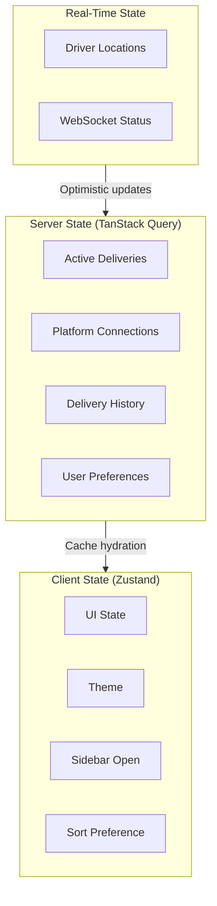

### TanStack Query Keys

```typescript
export const queryKeys = {
  deliveries: {
    all: ['deliveries'] as const,
    active: () => [...queryKeys.deliveries.all, 'active'] as const,
    byPlatform: (platform: Platform) =>
      [...queryKeys.deliveries.all, 'platform', platform] as const,
    detail: (id: string) =>
      [...queryKeys.deliveries.all, 'detail', id] as const,
    history: (filters: HistoryFilters) =>
      [...queryKeys.deliveries.all, 'history', filters] as const,
  },
  platforms: {
    all: ['platforms'] as const,
    connections: () => [...queryKeys.platforms.all, 'connections'] as const,
    connection: (platform: Platform) =>
      [...queryKeys.platforms.connections(), platform] as const,
  },
  preferences: {
    all: ['preferences'] as const,
    user: () => [...queryKeys.preferences.all, 'user'] as const,
  },
} as const;
```

---

## Error Handling Architecture

### Error Boundary Hierarchy

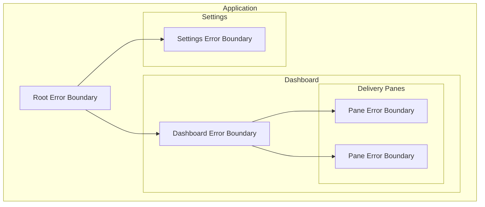

### Error Classification

| Error Type | Boundary | Recovery |
|------------|----------|----------|
| **Network Error** | Pane | Auto-retry with backoff |
| **Auth Error** | Dashboard | Redirect to re-auth |
| **Platform Error** | Pane | Show platform status |
| **Render Error** | Component | Show fallback UI |
| **Fatal Error** | Root | Show error page |

---

## Security Architecture

See [07-SECURITY.md](./07-SECURITY.md) for detailed security architecture.

### Security Layers

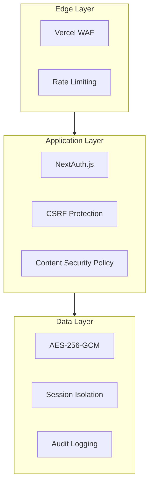

---

## Performance Architecture

### Caching Strategy

| Data Type | Cache Location | TTL | Invalidation |
|-----------|---------------|-----|--------------|
| Delivery List | Redis | 30s | On webhook, polling |
| Driver Location | Redis | 10s | On location update |
| Platform Connection | PostgreSQL | - | On connect/disconnect |
| User Preferences | PostgreSQL + localStorage | - | On change |
| Static Assets | Vercel Edge | 1 year | On deploy |

### Optimization Techniques

1. **Server Components**: Dashboard layout, settings pages
2. **Streaming**: Progressive page load with Suspense
3. **Parallel Data Fetching**: Concurrent platform queries
4. **Incremental Static Regeneration**: Marketing pages
5. **Image Optimization**: Platform icons via next/image
6. **Bundle Splitting**: Per-route code splitting
7. **Map Tile Caching**: MapLibre tile cache

---

## Deployment Architecture

See [09-DEPLOYMENT.md](./09-DEPLOYMENT.md) for detailed deployment configuration.

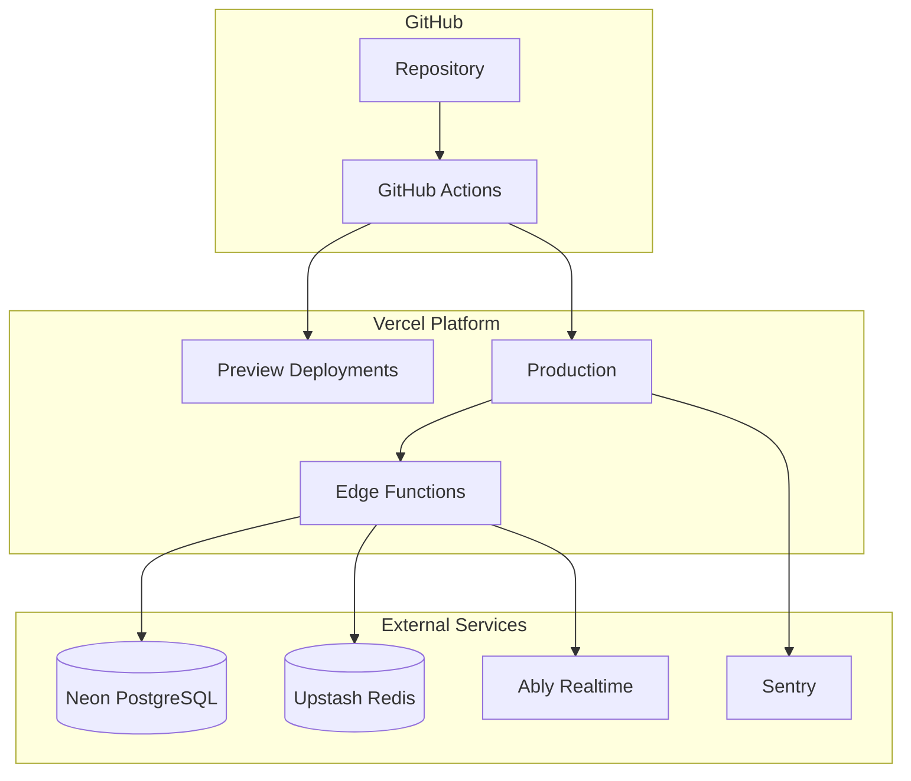

---

*Document Version: 1.0 | Last Updated: January 2026*
