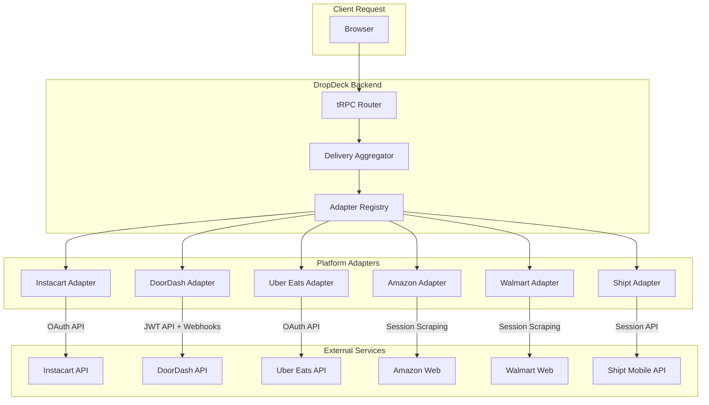

# DropDeck: Platform Integrations

## Overview

This document provides detailed integration strategies for each supported delivery platform, including API availability, authentication patterns, data extraction capabilities, and implementation approaches.

---

## Integration Strategy Matrix

| Platform | Strategy | Auth Method | Live Location | Webhooks | Rate Limit | Priority |
|----------|----------|-------------|---------------|----------|------------|----------|
| Instacart | Partner API | OAuth 2.0 | Yes | Yes | 100/min | P0 |
| DoorDash | Drive API | JWT | Yes | Yes | 60/min | P0 |
| Uber Eats | Consumer API | OAuth 2.0 | Yes | Yes | 100/min | P0 |
| Amazon | Shipping API v2 | OAuth 2.0 | Yes | Limited | 30/min | P0 |
| Walmart+ | Session Proxy | OAuth + Session | Limited | No | 20/min | P1 |
| Shipt | Session-Based | Session | Session-Dep | No | 10/min | P1 |
| Drizly | Uber Integration | OAuth 2.0 | Yes | Possible | TBD | P1 |
| Total Wine | Onfleet | API Key | Yes | Yes | 50/min | P2 |
| Costco | Via Instacart | Via Instacart | Yes | Yes | Via Instacart | P1 |
| Sam's Club | Session-Based | Session | Limited | No | 10/min | P2 |
| Amazon Fresh | Via Amazon | Via Amazon | Yes | Limited | Via Amazon | P0 |

---

## Platform Details

### Instacart

**Priority:** P0 (Critical)
**Integration Strategy:** Partner API (Connect API)
**Documentation:** [https://docs.instacart.com/developer_platform_api/](https://docs.instacart.com/developer_platform_api/)

#### API Overview

Instacart's Connect API provides comprehensive delivery tracking through their partner program. This API also powers Costco deliveries, making it a high-value integration target.

#### Authentication

```typescript
// OAuth 2.0 Client Credentials Flow
interface InstacartAuth {
  tokenUrl: 'https://connect.instacart.com/v2/oauth/token';
  grantType: 'client_credentials';
  scopes: ['connect:fulfillment', 'connect:orders', 'connect:data_ingestion'];
  tokenLifetime: 86400; // 24 hours
}

// Token request
async function getInstacartToken(): Promise<TokenSet> {
  const response = await fetch('https://connect.instacart.com/v2/oauth/token', {
    method: 'POST',
    headers: {
      'Content-Type': 'application/x-www-form-urlencoded',
      Authorization: `Basic ${btoa(`${CLIENT_ID}:${CLIENT_SECRET}`)}`,
    },
    body: new URLSearchParams({
      grant_type: 'client_credentials',
      scope: 'connect:fulfillment connect:orders',
    }),
  });
  return response.json();
}
```

#### Available Data

| Endpoint | Data | Update Frequency |
|----------|------|------------------|
| `GET /v2/orders` | Order list with status | On request |
| `GET /v2/orders/{id}` | Order details | On request |
| `GET /v2/orders/{id}/fulfillment` | Shopper info, location | Real-time |
| `POST /webhooks` | Status changes | Push-based |

#### Data Mapping

```typescript
// Instacart status to unified status mapping
const instacartStatusMap: Record<string, DeliveryStatus> = {
  'order_placed': 'preparing',
  'shopper_assigned': 'driver_assigned',
  'shopping': 'preparing',
  'checkout': 'ready_for_pickup',
  'delivering': 'out_for_delivery',
  'delivered': 'delivered',
  'cancelled': 'cancelled',
};
```

#### Webhook Events

```typescript
interface InstacartWebhook {
  event_type:
    | 'order.created'
    | 'order.updated'
    | 'shopper.assigned'
    | 'delivery.started'
    | 'delivery.completed';
  order_id: string;
  timestamp: string;
  data: {
    status: string;
    shopper?: {
      name: string;
      photo_url: string;
      location?: { lat: number; lng: number };
    };
    eta_minutes?: number;
  };
}
```

#### Rate Limiting

- **Requests:** 100 requests per minute
- **Burst:** 10 requests per second
- **Backoff:** Exponential with jitter on 429 response

---

### DoorDash

**Priority:** P0 (Critical)
**Integration Strategy:** Drive API
**Documentation:** [https://developer.doordash.com/](https://developer.doordash.com/)

#### API Overview

DoorDash's Drive API is primarily designed for merchants requesting deliveries, but provides webhook-based tracking with GPS coordinates every 30 seconds.

#### Authentication

```typescript
// JWT Authentication with HS256
interface DoorDashAuth {
  algorithm: 'HS256';
  headers: {
    alg: 'HS256';
    'dd-ver': 'DD-JWT-V1';
  };
  claims: {
    aud: 'doordash';
    iss: string; // developer_id
    kid: string; // key_id
    iat: number;
    exp: number; // iat + 300 (5 minutes)
  };
}

// JWT generation
import * as jose from 'jose';

async function generateDoorDashJWT(): Promise<string> {
  const secret = new TextEncoder().encode(SIGNING_SECRET);
  const jwt = await new jose.SignJWT({
    aud: 'doordash',
    iss: DEVELOPER_ID,
    kid: KEY_ID,
  })
    .setProtectedHeader({ alg: 'HS256', 'dd-ver': 'DD-JWT-V1' })
    .setIssuedAt()
    .setExpirationTime('5m')
    .sign(secret);
  return jwt;
}
```

#### Available Data

| Endpoint | Data | Update Frequency |
|----------|------|------------------|
| `POST /drive/v2/deliveries` | Create delivery quote | On request |
| `GET /drive/v2/deliveries/{id}` | Delivery status | On request |
| `Webhook` | Dasher location, status | Every 30 seconds |

#### Webhook Events

```typescript
interface DoorDashWebhook {
  event_name:
    | 'DELIVERY_CREATED'
    | 'DASHER_CONFIRMED'
    | 'DASHER_CONFIRMED_PICKUP_ARRIVAL'
    | 'DASHER_PICKED_UP'
    | 'DASHER_ENROUTE_TO_DROPOFF'
    | 'DASHER_CONFIRMED_DROPOFF_ARRIVAL'
    | 'DELIVERY_CANCELLED';
  external_delivery_id: string;
  delivery_status: string;
  dasher?: {
    first_name: string;
    last_name: string;
    phone_number: string;
    dasher_location?: {
      lat: number;
      lng: number;
    };
    vehicle?: {
      make: string;
      model: string;
      color: string;
    };
  };
  estimated_delivery_time?: string; // ISO 8601
}
```

#### Data Mapping

```typescript
const doordashStatusMap: Record<string, DeliveryStatus> = {
  'DELIVERY_CREATED': 'preparing',
  'DASHER_CONFIRMED': 'driver_assigned',
  'DASHER_CONFIRMED_PICKUP_ARRIVAL': 'driver_at_store',
  'DASHER_PICKED_UP': 'out_for_delivery',
  'DASHER_ENROUTE_TO_DROPOFF': 'out_for_delivery',
  'DASHER_CONFIRMED_DROPOFF_ARRIVAL': 'arriving',
  'DELIVERY_COMPLETED': 'delivered',
  'DELIVERY_CANCELLED': 'cancelled',
};
```

#### Tracking Page Scraping (Fallback)

For consumer orders without API access:

```typescript
// track.doordash.com page structure
interface DoorDashTrackingPage {
  url: 'https://track.doordash.com/orders/{order_id}';
  selectors: {
    status: '[data-testid="delivery-status"]';
    eta: '[data-testid="eta-display"]';
    driverName: '[data-testid="driver-name"]';
    mapContainer: '#delivery-map';
  };
  requiredCookies: ['dd_token', 'session_id'];
}
```

---

### Uber Eats

**Priority:** P0 (Critical)
**Integration Strategy:** Consumer Delivery API
**Documentation:** [https://developer.uber.com/docs/deliveries](https://developer.uber.com/docs/deliveries)

#### API Overview

Uber's Consumer Delivery API is in early access and provides comprehensive tracking data including courier location and trip details.

#### Authentication

```typescript
// OAuth 2.0 Authorization Code Flow
interface UberAuth {
  authorizationUrl: 'https://login.uber.com/oauth/v2/authorize';
  tokenUrl: 'https://auth.uber.com/oauth/v2/token';
  scopes: ['eats.order', 'eats.store', 'eats.report'];
  tokenLifetime: 2592000; // 30 days
  refreshTokenLifetime: 31536000; // 1 year
}

// OAuth configuration
const uberOAuthConfig = {
  clientId: process.env.UBER_CLIENT_ID!,
  clientSecret: process.env.UBER_CLIENT_SECRET!,
  redirectUri: `${process.env.NEXTAUTH_URL}/api/callback/ubereats`,
  scopes: ['eats.order', 'delivery.status'],
};
```

#### Available Data

| Endpoint | Data | Update Frequency |
|----------|------|------------------|
| `GET /v1/eats/orders` | Order history | On request |
| `GET /v1/eats/orders/{id}` | Order details | On request |
| `GET /v1/eats/orders/{id}/tracking` | Tracking URL, status | On request |
| `courier_trips` field | Courier location | Real-time |

#### Tracking Data Structure

```typescript
interface UberEatsTracking {
  order_id: string;
  status: string;
  tracking_url: string;
  courier?: {
    name: string;
    phone_number: string;
    picture_url: string;
    location: {
      latitude: number;
      longitude: number;
      bearing: number;
    };
    vehicle?: {
      make: string;
      model: string;
      license_plate: string;
    };
  };
  delivery_eta: {
    estimated_arrival: string; // ISO 8601
    estimated_minutes: number;
  };
}
```

#### Data Mapping

```typescript
const uberEatsStatusMap: Record<string, DeliveryStatus> = {
  'pending': 'preparing',
  'accepted': 'preparing',
  'preparing': 'preparing',
  'ready_for_pickup': 'ready_for_pickup',
  'courier_assigned': 'driver_assigned',
  'courier_at_store': 'driver_at_store',
  'in_transit': 'out_for_delivery',
  'arriving': 'arriving',
  'delivered': 'delivered',
  'cancelled': 'cancelled',
};
```

---

### Amazon / Amazon Fresh

**Priority:** P0 (Critical)
**Integration Strategy:** Shipping API v2 + Session Scraping
**Documentation:** [https://developer-docs.amazon.com/amazon-shipping/](https://developer-docs.amazon.com/amazon-shipping/)

#### API Overview

Amazon's Shipping API v2 (formerly SP-API) provides tracking for sellers. Consumer tracking requires authenticated session scraping of the real-time tracking endpoint.

#### Authentication (Session-Based for Consumer)

```typescript
// Required cookies for consumer tracking
interface AmazonSessionAuth {
  requiredCookies: [
    'session-id',      // Session identifier
    'ubid-main',       // Unique browser ID
    'at-main',         // Authentication token
    'sess-at-main',    // Session auth token
  ];
  antiBot: {
    captcha: true;
    fingerprinting: true;
    behavioralAnalysis: true;
  };
}
```

#### Real-Time Tracking Endpoint

```typescript
// Documented by security researchers
interface AmazonTrackingEndpoint {
  url: 'GET /DEANSExternalPackageLocationDetailsProxy/trackingObjectId/{TRACKING_ID}/clientName/AMZL';
  host: 'securephotostorageservice-*.amazon.{tld}';
  response: {
    lastKnownLocation: {
      latitude: number;
      longitude: number;
    };
    stopsRemaining: number;
    estimatedArrival: {
      startTime: string;
      endTime: string;
    };
    deliveryPhoto?: string; // URL to proof of delivery
  };
}
```

#### Stealth Requirements

```typescript
// Anti-detection measures
const amazonStealthConfig = {
  userAgent: 'Mozilla/5.0 (Macintosh; Intel Mac OS X 10_15_7)...',
  viewport: { width: 1920, height: 1080 },
  plugins: ['undetected-chromedriver', 'puppeteer-extra-plugin-stealth'],
  timing: {
    minDelay: 2000,
    maxDelay: 7000,
    humanlike: true,
  },
  proxy: {
    type: 'residential',
    rotation: true,
  },
};
```

#### Data Mapping

```typescript
const amazonStatusMap: Record<string, DeliveryStatus> = {
  'ORDER_PLACED': 'preparing',
  'SHIPPED': 'out_for_delivery',
  'OUT_FOR_DELIVERY': 'out_for_delivery',
  'ARRIVING_TODAY': 'arriving',
  'DELIVERED': 'delivered',
  'DELIVERY_ATTEMPTED': 'delayed',
  'CANCELLED': 'cancelled',
};
```

---

### Walmart+

**Priority:** P1
**Integration Strategy:** OAuth + Session Proxy
**Documentation:** [https://developer.walmart.com/](https://developer.walmart.com/)

#### API Overview

Walmart's Marketplace API is seller-focused. Consumer delivery tracking requires session-based scraping of order history pages.

#### Authentication

```typescript
// Marketplace API (seller-only)
interface WalmartMarketplaceAuth {
  tokenUrl: 'https://marketplace.walmartapis.com/v3/token';
  headers: {
    'WM_QOS.CORRELATION_ID': string; // UUID
    'WM_SVC.NAME': string;
    'WM_CONSUMER.CHANNEL.TYPE': string;
  };
  tokenLifetime: 900; // 15 minutes
}

// Consumer session (scraping)
interface WalmartConsumerAuth {
  loginUrl: 'https://www.walmart.com/account/login';
  orderHistoryUrl: 'https://www.walmart.com/orders';
  requiredCookies: ['auth', 'vtc', 'ACID'];
}
```

#### Available Data (Consumer Scraping)

| Page | Data | Update Frequency |
|------|------|------------------|
| Order History | Order list, status | On request |
| Order Details | Delivery window, status | On request |
| Tracking Page | Carrier tracking link | On request |

#### Data Mapping

```typescript
const walmartStatusMap: Record<string, DeliveryStatus> = {
  'Created': 'preparing',
  'SentForFulfillment': 'preparing',
  'Shipped': 'out_for_delivery',
  'Delivered': 'delivered',
  'Cancelled': 'cancelled',
};
```

---

### Shipt

**Priority:** P1
**Integration Strategy:** Session-Based Polling
**Documentation:** None (reverse-engineered)

#### API Overview

Shipt has no public API. Integration requires authenticated session requests to their mobile API endpoints discovered through traffic analysis.

#### Authentication

```typescript
interface ShiptAuth {
  loginUrl: 'https://api.shipt.com/v1/auth/login';
  method: 'email/password' | 'social_login';
  tokenStorage: 'session_cookie';
  sessionLifetime: 604800; // 7 days (estimated)
}
```

#### Discovered Endpoints

```typescript
// Reverse-engineered API endpoints
const shiptEndpoints = {
  orders: 'GET /v1/orders/active',
  orderDetail: 'GET /v1/orders/{id}',
  tracking: 'GET /v1/orders/{id}/tracking',
};

interface ShiptTrackingResponse {
  order_id: string;
  status: string;
  shopper?: {
    first_name: string;
    photo_url: string;
    phone: string;
  };
  delivery_window: {
    start: string;
    end: string;
  };
  current_eta?: string;
}
```

---

### Drizly (Uber-Owned)

**Priority:** P1
**Integration Strategy:** Uber Integration (likely)
**Documentation:** Legacy API (2014)

#### API Overview

Drizly was acquired by Uber in 2021. Integration may consolidate with Uber's OAuth and API infrastructure.

#### Legacy API (Reference)

```typescript
// From DrizlyDash project
interface DrizlyLegacyAPI {
  baseUrl: 'https://api.drizly.com';
  endpoints: {
    auth: 'POST /v1/auth/login',
    orders: 'GET /v1/orders',
    tracking: 'GET /v1/orders/{id}/tracking',
  };
  authentication: 'session_token';
}
```

#### Expected Uber Integration

```typescript
// Anticipated Uber-based integration
interface DrizlyUberAuth {
  oauthProvider: 'uber';
  scopes: ['drizly.orders', 'drizly.tracking'];
  // May share Uber Eats courier tracking infrastructure
}
```

---

### Total Wine

**Priority:** P2
**Integration Strategy:** Onfleet API
**Documentation:** [https://docs.onfleet.com/](https://docs.onfleet.com/)

#### API Overview

Total Wine uses Onfleet for last-mile delivery. Onfleet provides a well-documented API with real-time tracking.

#### Authentication

```typescript
interface OnfleetAuth {
  method: 'api_key';
  header: 'Authorization: Basic {base64(api_key)}';
}
```

#### Available Endpoints

```typescript
const onfleetEndpoints = {
  tasks: 'GET /tasks',
  taskDetail: 'GET /tasks/{id}',
  workerLocation: 'GET /workers/{id}/location',
  webhooks: 'POST /webhooks',
};
```

#### Webhook Events

```typescript
interface OnfleetWebhook {
  triggerId: number;
  triggerName:
    | 'taskStarted'
    | 'taskEta'
    | 'taskArrival'
    | 'taskCompleted'
    | 'taskFailed';
  taskId: string;
  data: {
    task: {
      id: string;
      state: number;
      trackingURL: string;
    };
    worker?: {
      id: string;
      name: string;
      location: [number, number]; // [lng, lat]
    };
  };
}
```

---

### Costco

**Priority:** P1
**Integration Strategy:** Instacart Proxy
**Documentation:** Via Instacart

#### Overview

Costco same-day delivery is powered entirely by Instacart through `sameday.costco.com`. Integration piggybacks on Instacart adapter.

#### Implementation

```typescript
// Costco adapter delegates to Instacart
class CostcoAdapter extends PlatformAdapter {
  private instacartAdapter: InstacartAdapter;

  constructor() {
    super();
    this.instacartAdapter = new InstacartAdapter();
  }

  async getActiveDeliveries(conn: PlatformConnection) {
    // Costco orders appear in Instacart with retailer='costco'
    const deliveries = await this.instacartAdapter.getActiveDeliveries(conn);
    return deliveries.filter(d => d.metadata?.retailer === 'costco');
  }

  // All other methods delegate to Instacart
}
```

---

### Sam's Club

**Priority:** P2
**Integration Strategy:** Session-Based Polling
**Documentation:** None

#### Overview

Sam's Club shares Walmart infrastructure but has separate authentication and order systems.

#### Implementation Approach

```typescript
interface SamsClubAuth {
  loginUrl: 'https://www.samsclub.com/account/signin';
  orderHistoryUrl: 'https://www.samsclub.com/account/orders';
  // Similar to Walmart scraping approach
}
```

---

## Integration Architecture

### Adapter Flow Diagram



---

## Polling & Rate Limiting Strategy

### Polling Intervals

| Platform | Polling Interval | Notes |
|----------|-----------------|-------|
| Instacart | 60s (webhooks primary) | Poll as fallback |
| DoorDash | 30s (webhooks primary) | Webhook every 30s |
| Uber Eats | 30s | Real-time courier location |
| Amazon | 60s | Conservative due to anti-bot |
| Walmart | 120s | Session-based, conservative |
| Shipt | 60s | During active delivery only |
| Total Wine | 60s (webhooks primary) | Onfleet webhooks |

### Circuit Breaker Configuration

```typescript
interface CircuitBreakerConfig {
  failureThreshold: 5;      // Open after 5 failures
  successThreshold: 3;      // Close after 3 successes
  timeout: 30000;           // 30 second timeout
  resetTimeout: 60000;      // Try again after 60 seconds
}

// Per-platform circuit breakers
const circuitBreakers = new Map<Platform, CircuitBreaker>();
```

### Rate Limit Handling

```typescript
// Rate limit response handler
async function handleRateLimit(
  platform: Platform,
  response: Response
): Promise<void> {
  const retryAfter = response.headers.get('Retry-After');
  const waitTime = retryAfter
    ? parseInt(retryAfter, 10) * 1000
    : calculateBackoff(platform);

  await delay(waitTime);
  incrementRateLimitCounter(platform);
}

// Exponential backoff with jitter
function calculateBackoff(platform: Platform, attempt: number = 1): number {
  const baseDelay = 1000;
  const maxDelay = 30000;
  const jitter = Math.random() * 1000;
  return Math.min(baseDelay * Math.pow(2, attempt) + jitter, maxDelay);
}
```

---

## Error Handling

### Error Classification

| Error Type | Action | User Message |
|------------|--------|--------------|
| Auth Expired | Prompt re-auth | "Session expired for [Platform]" |
| Rate Limited | Backoff, retry | "Too many requests, retrying..." |
| Platform Down | Circuit break | "[Platform] temporarily unavailable" |
| Invalid Data | Log, skip | (No message, graceful degradation) |
| Network Error | Retry with backoff | "Connection issue, retrying..." |

### Platform-Specific Error Handling

```typescript
// Platform error codes
const platformErrors: Record<Platform, Record<number, string>> = {
  instacart: {
    401: 'AUTH_EXPIRED',
    429: 'RATE_LIMITED',
    503: 'SERVICE_UNAVAILABLE',
  },
  doordash: {
    401: 'INVALID_JWT',
    403: 'ACCESS_DENIED',
    429: 'RATE_LIMITED',
  },
  // ... other platforms
};
```

---

## Legal & Compliance Notes

### Terms of Service Considerations

| Platform | ToS Risk Level | Recommendation |
|----------|---------------|----------------|
| Instacart | Low | Apply for Partner API access |
| DoorDash | Low | Apply for Drive API certification |
| Uber Eats | Medium | Apply for Consumer API early access |
| Amazon | High | Session scraping ToS violation risk |
| Walmart | Medium | Marketplace API for approved partners |
| Shipt | Medium | No official API, reverse-engineered |

### Mitigation Strategies

1. **Official Partner Path**: Apply for official API access where available
2. **User Consent**: Clear consent for credential storage and data access
3. **Data Minimization**: Only fetch/store data necessary for functionality
4. **Rate Respect**: Stay well under rate limits, implement circuit breakers
5. **Legal Review**: Consult counsel before launch for ToS analysis

---

*Document Version: 1.0 | Last Updated: January 2026*
