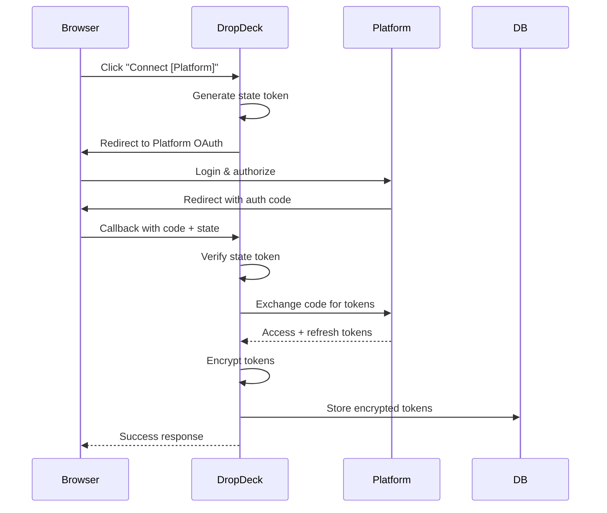
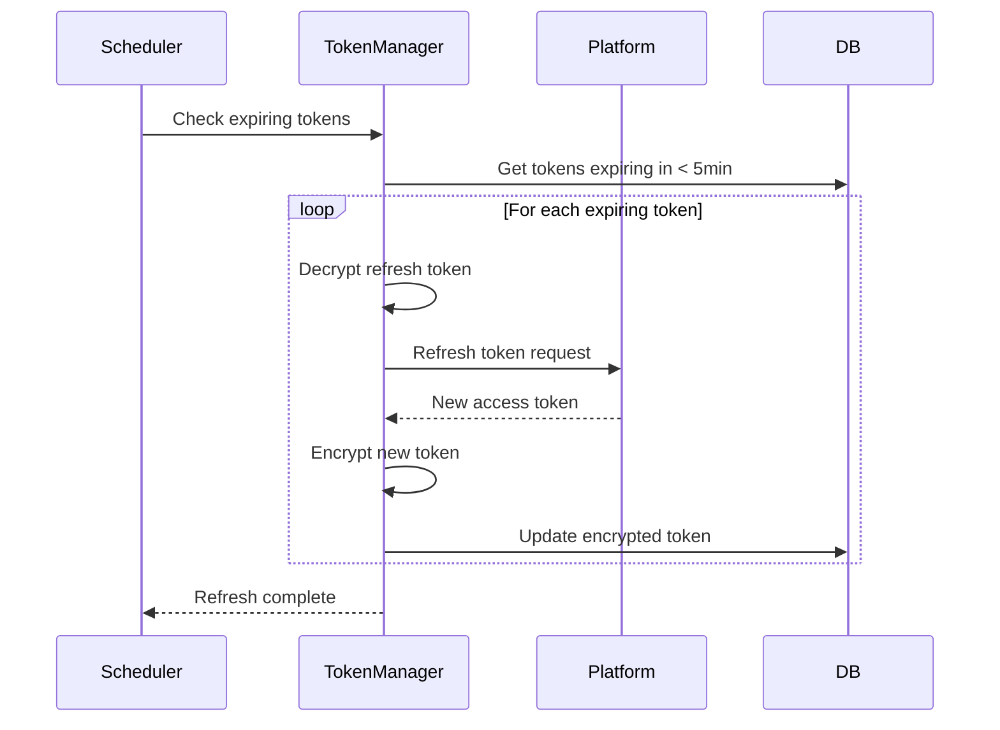

# DropDeck: API Design

## Overview

This document details the API design for DropDeck, including tRPC router structure, endpoint specifications, WebSocket subscription patterns, webhook handlers, and error handling.

---

## API Architecture

```mermaid
flowchart TB
    subgraph Client["Client"]
        Browser[Browser]
        TanStack[TanStack Query]
        tRPCClient[tRPC Client]
    end

    subgraph API["API Layer"]
        subgraph tRPC["tRPC Routers"]
            Platform[platform.*]
            Delivery[delivery.*]
            Preference[preference.*]
            User[user.*]
        end

        subgraph REST["REST Endpoints"]
            AuthRoutes[/api/auth/*]
            WebhookRoutes[/api/webhook/*]
            HealthRoutes[/api/health]
        end
    end

    subgraph Services["Services"]
        Adapters[Platform Adapters]
        TokenManager[Token Manager]
        EventPublisher[Event Publisher]
    end

    Browser --> TanStack
    TanStack --> tRPCClient
    tRPCClient --> tRPC
    Browser --> REST

    tRPC --> Services
    REST --> Services
```

---

## tRPC Router Structure

### Root Router

```typescript
// server/routers/index.ts
import { router } from '@/lib/trpc/init';
import { platformRouter } from './platform';
import { deliveryRouter } from './delivery';
import { preferenceRouter } from './preference';
import { userRouter } from './user';

export const appRouter = router({
  platform: platformRouter,
  delivery: deliveryRouter,
  preference: preferenceRouter,
  user: userRouter,
});

export type AppRouter = typeof appRouter;
```

---

## Platform Router

### Endpoints

| Procedure | Type | Description |
|-----------|------|-------------|
| `platform.getConnections` | Query | Get all platform connection statuses |
| `platform.getConnection` | Query | Get single platform connection |
| `platform.initiateOAuth` | Mutation | Start OAuth flow for platform |
| `platform.handleCallback` | Mutation | Process OAuth callback |
| `platform.disconnect` | Mutation | Disconnect platform |
| `platform.refresh` | Mutation | Force refresh platform tokens |
| `platform.testConnection` | Query | Test platform connectivity |

### Implementation

```typescript
// server/routers/platform.ts
import { z } from 'zod';
import { router, protectedProcedure } from '@/lib/trpc/init';
import { TRPCError } from '@trpc/server';
import { eq, and } from 'drizzle-orm';
import { platformConnections } from '@/lib/db/schema';
import { getAdapter } from '@/lib/adapters/registry';
import { encryptToken, decryptToken } from '@/lib/encryption/tokens';
import { Platform, platformSchema } from '@/types/platform';

export const platformRouter = router({
  /**
   * Get all platform connections for the current user
   */
  getConnections: protectedProcedure.query(async ({ ctx }) => {
    const connections = await ctx.db.query.platformConnections.findMany({
      where: eq(platformConnections.userId, ctx.user.id),
      columns: {
        id: true,
        platform: true,
        status: true,
        lastSyncAt: true,
        expiresAt: true,
        metadata: true,
        createdAt: true,
      },
    });

    return connections.map((conn) => ({
      ...conn,
      isExpiringSoon: conn.expiresAt
        ? conn.expiresAt.getTime() - Date.now() < 5 * 60 * 1000
        : false,
    }));
  }),

  /**
   * Get single platform connection
   */
  getConnection: protectedProcedure
    .input(z.object({ platform: platformSchema }))
    .query(async ({ ctx, input }) => {
      const connection = await ctx.db.query.platformConnections.findFirst({
        where: and(
          eq(platformConnections.userId, ctx.user.id),
          eq(platformConnections.platform, input.platform)
        ),
      });

      if (!connection) {
        return { connected: false, platform: input.platform };
      }

      return {
        connected: connection.status === 'connected',
        platform: connection.platform,
        status: connection.status,
        lastSyncAt: connection.lastSyncAt,
        expiresAt: connection.expiresAt,
        metadata: connection.metadata,
      };
    }),

  /**
   * Initiate OAuth flow for a platform
   */
  initiateOAuth: protectedProcedure
    .input(z.object({ platform: platformSchema }))
    .mutation(async ({ ctx, input }) => {
      const adapter = getAdapter(input.platform);

      if (!adapter.supportsOAuth()) {
        throw new TRPCError({
          code: 'BAD_REQUEST',
          message: `${input.platform} does not support OAuth authentication`,
        });
      }

      const state = crypto.randomUUID();

      // Store state for verification
      await ctx.redis.set(
        `oauth_state:${state}`,
        JSON.stringify({
          userId: ctx.user.id,
          platform: input.platform,
          timestamp: Date.now(),
        }),
        { ex: 600 } // 10 minute expiry
      );

      const authUrl = await adapter.getOAuthUrl(ctx.user.id, state);

      return { authUrl, state };
    }),

  /**
   * Handle OAuth callback
   */
  handleCallback: protectedProcedure
    .input(
      z.object({
        platform: platformSchema,
        code: z.string(),
        state: z.string(),
      })
    )
    .mutation(async ({ ctx, input }) => {
      // Verify state
      const stateData = await ctx.redis.get(`oauth_state:${input.state}`);
      if (!stateData) {
        throw new TRPCError({
          code: 'BAD_REQUEST',
          message: 'Invalid or expired OAuth state',
        });
      }

      const { userId, platform } = JSON.parse(stateData);
      if (userId !== ctx.user.id || platform !== input.platform) {
        throw new TRPCError({
          code: 'FORBIDDEN',
          message: 'OAuth state mismatch',
        });
      }

      // Delete state
      await ctx.redis.del(`oauth_state:${input.state}`);

      // Exchange code for tokens
      const adapter = getAdapter(input.platform);
      const tokens = await adapter.exchangeCode(input.code);

      // Encrypt and store
      const accessTokenEncrypted = encryptToken(tokens.accessToken);
      const refreshTokenEncrypted = tokens.refreshToken
        ? encryptToken(tokens.refreshToken)
        : null;

      await ctx.db
        .insert(platformConnections)
        .values({
          userId: ctx.user.id,
          platform: input.platform,
          accessTokenEncrypted,
          refreshTokenEncrypted,
          expiresAt: tokens.expiresAt,
          status: 'connected',
          lastSyncAt: new Date(),
        })
        .onConflictDoUpdate({
          target: [platformConnections.userId, platformConnections.platform],
          set: {
            accessTokenEncrypted,
            refreshTokenEncrypted,
            expiresAt: tokens.expiresAt,
            status: 'connected',
            lastSyncAt: new Date(),
            updatedAt: new Date(),
          },
        });

      return { success: true };
    }),

  /**
   * Disconnect a platform
   */
  disconnect: protectedProcedure
    .input(z.object({ platform: platformSchema }))
    .mutation(async ({ ctx, input }) => {
      // Try to revoke token at platform
      try {
        const connection = await ctx.db.query.platformConnections.findFirst({
          where: and(
            eq(platformConnections.userId, ctx.user.id),
            eq(platformConnections.platform, input.platform)
          ),
        });

        if (connection?.accessTokenEncrypted) {
          const adapter = getAdapter(input.platform);
          const accessToken = decryptToken(connection.accessTokenEncrypted);
          await adapter.revokeToken?.(accessToken);
        }
      } catch {
        // Continue even if revocation fails
      }

      // Delete connection
      await ctx.db
        .delete(platformConnections)
        .where(
          and(
            eq(platformConnections.userId, ctx.user.id),
            eq(platformConnections.platform, input.platform)
          )
        );

      // Clear cached deliveries
      await ctx.redis.del(`user:${ctx.user.id}:deliveries:${input.platform}`);

      return { success: true };
    }),

  /**
   * Force refresh platform tokens
   */
  refresh: protectedProcedure
    .input(z.object({ platform: platformSchema }))
    .mutation(async ({ ctx, input }) => {
      const connection = await ctx.db.query.platformConnections.findFirst({
        where: and(
          eq(platformConnections.userId, ctx.user.id),
          eq(platformConnections.platform, input.platform)
        ),
      });

      if (!connection?.refreshTokenEncrypted) {
        throw new TRPCError({
          code: 'NOT_FOUND',
          message: 'No refresh token available',
        });
      }

      const adapter = getAdapter(input.platform);
      const refreshToken = decryptToken(connection.refreshTokenEncrypted);
      const tokens = await adapter.refreshToken(refreshToken);

      const accessTokenEncrypted = encryptToken(tokens.accessToken);
      const refreshTokenEncrypted = tokens.refreshToken
        ? encryptToken(tokens.refreshToken)
        : connection.refreshTokenEncrypted;

      await ctx.db
        .update(platformConnections)
        .set({
          accessTokenEncrypted,
          refreshTokenEncrypted,
          expiresAt: tokens.expiresAt,
          status: 'connected',
          updatedAt: new Date(),
        })
        .where(eq(platformConnections.id, connection.id));

      return { success: true, expiresAt: tokens.expiresAt };
    }),

  /**
   * Test platform connectivity
   */
  testConnection: protectedProcedure
    .input(z.object({ platform: platformSchema }))
    .query(async ({ ctx, input }) => {
      const connection = await ctx.db.query.platformConnections.findFirst({
        where: and(
          eq(platformConnections.userId, ctx.user.id),
          eq(platformConnections.platform, input.platform)
        ),
      });

      if (!connection) {
        return { connected: false, error: 'Not connected' };
      }

      try {
        const adapter = getAdapter(input.platform);
        const accessToken = decryptToken(connection.accessTokenEncrypted!);
        await adapter.testConnection(accessToken);
        return { connected: true };
      } catch (error) {
        return {
          connected: false,
          error: error instanceof Error ? error.message : 'Connection failed',
        };
      }
    }),
});
```

---

## Delivery Router

### Endpoints

| Procedure | Type | Description |
|-----------|------|-------------|
| `delivery.getActive` | Query | Get all active deliveries |
| `delivery.getById` | Query | Get delivery details by ID |
| `delivery.getHistory` | Query | Get delivery history |
| `delivery.onUpdate` | Subscription | Subscribe to delivery updates |
| `delivery.onLocationUpdate` | Subscription | Subscribe to location updates |

### Implementation

```typescript
// server/routers/delivery.ts
import { z } from 'zod';
import { router, protectedProcedure } from '@/lib/trpc/init';
import { observable } from '@trpc/server/observable';
import { eq, and, desc, gt } from 'drizzle-orm';
import { deliveryCache, deliveryHistory, platformConnections } from '@/lib/db/schema';
import { getAdapter, getAllAdapters } from '@/lib/adapters/registry';
import { decryptToken } from '@/lib/encryption/tokens';
import type { UnifiedDelivery, DriverLocation } from '@/types/delivery';

export const deliveryRouter = router({
  /**
   * Get all active deliveries across all connected platforms
   */
  getActive: protectedProcedure.query(async ({ ctx }) => {
    // First check cache
    const cached = await ctx.db.query.deliveryCache.findMany({
      where: and(
        eq(deliveryCache.userId, ctx.user.id),
        gt(deliveryCache.expiresAt, new Date())
      ),
      orderBy: [deliveryCache.etaMinutes],
    });

    if (cached.length > 0) {
      return cached.map((c) => c.deliveryData as UnifiedDelivery);
    }

    // Fetch fresh from all connected platforms
    const connections = await ctx.db.query.platformConnections.findMany({
      where: and(
        eq(platformConnections.userId, ctx.user.id),
        eq(platformConnections.status, 'connected')
      ),
    });

    const deliveryPromises = connections.map(async (conn) => {
      try {
        const adapter = getAdapter(conn.platform);
        const accessToken = decryptToken(conn.accessTokenEncrypted!);
        return await adapter.getActiveDeliveries({
          accessToken,
          userId: ctx.user.id,
          platform: conn.platform,
        });
      } catch (error) {
        console.error(`Failed to fetch from ${conn.platform}:`, error);
        return [];
      }
    });

    const results = await Promise.allSettled(deliveryPromises);
    const deliveries: UnifiedDelivery[] = results
      .filter((r) => r.status === 'fulfilled')
      .flatMap((r) => (r as PromiseFulfilledResult<UnifiedDelivery[]>).value);

    // Cache results
    for (const delivery of deliveries) {
      await ctx.db
        .insert(deliveryCache)
        .values({
          userId: ctx.user.id,
          platform: delivery.platform,
          externalOrderId: delivery.externalOrderId,
          deliveryData: delivery,
          driverLocation: delivery.driver?.location ?? null,
          etaMinutes: delivery.eta.minutesRemaining,
          status: delivery.status,
          expiresAt: new Date(Date.now() + 30 * 1000), // 30 second cache
        })
        .onConflictDoUpdate({
          target: [deliveryCache.id],
          set: {
            deliveryData: delivery,
            driverLocation: delivery.driver?.location ?? null,
            etaMinutes: delivery.eta.minutesRemaining,
            status: delivery.status,
            lastUpdated: new Date(),
            expiresAt: new Date(Date.now() + 30 * 1000),
          },
        });
    }

    // Sort by ETA
    return deliveries.sort(
      (a, b) => a.eta.minutesRemaining - b.eta.minutesRemaining
    );
  }),

  /**
   * Get single delivery details
   */
  getById: protectedProcedure
    .input(
      z.object({
        platform: z.string(),
        deliveryId: z.string(),
      })
    )
    .query(async ({ ctx, input }) => {
      const connection = await ctx.db.query.platformConnections.findFirst({
        where: and(
          eq(platformConnections.userId, ctx.user.id),
          eq(platformConnections.platform, input.platform as any)
        ),
      });

      if (!connection) {
        throw new TRPCError({
          code: 'NOT_FOUND',
          message: `Not connected to ${input.platform}`,
        });
      }

      const adapter = getAdapter(input.platform as any);
      const accessToken = decryptToken(connection.accessTokenEncrypted!);

      return adapter.getDeliveryDetails(
        { accessToken, userId: ctx.user.id, platform: connection.platform },
        input.deliveryId
      );
    }),

  /**
   * Get delivery history with pagination
   */
  getHistory: protectedProcedure
    .input(
      z.object({
        limit: z.number().min(1).max(100).default(20),
        offset: z.number().min(0).default(0),
        platform: z.string().optional(),
      })
    )
    .query(async ({ ctx, input }) => {
      const where = input.platform
        ? and(
            eq(deliveryHistory.userId, ctx.user.id),
            eq(deliveryHistory.platform, input.platform as any)
          )
        : eq(deliveryHistory.userId, ctx.user.id);

      const [items, total] = await Promise.all([
        ctx.db.query.deliveryHistory.findMany({
          where,
          orderBy: [desc(deliveryHistory.orderedAt)],
          limit: input.limit,
          offset: input.offset,
        }),
        ctx.db
          .select({ count: sql<number>`count(*)` })
          .from(deliveryHistory)
          .where(where),
      ]);

      return {
        items: items.map((h) => h.deliveryData as UnifiedDelivery),
        total: total[0].count,
        hasMore: input.offset + items.length < total[0].count,
      };
    }),

  /**
   * Subscribe to delivery updates (WebSocket/SSE)
   */
  onUpdate: protectedProcedure.subscription(({ ctx }) => {
    return observable<UnifiedDelivery>((emit) => {
      const channel = `user:${ctx.user.id}:deliveries`;

      const handler = (message: string) => {
        try {
          const delivery = JSON.parse(message) as UnifiedDelivery;
          emit.next(delivery);
        } catch {
          // Ignore malformed messages
        }
      };

      ctx.redis.subscribe(channel, handler);

      return () => {
        ctx.redis.unsubscribe(channel, handler);
      };
    });
  }),

  /**
   * Subscribe to high-frequency location updates
   */
  onLocationUpdate: protectedProcedure
    .input(z.object({ deliveryId: z.string() }))
    .subscription(({ ctx, input }) => {
      return observable<DriverLocation>((emit) => {
        const channel = `delivery:${input.deliveryId}:location`;

        const handler = (message: string) => {
          try {
            const location = JSON.parse(message) as DriverLocation;
            emit.next(location);
          } catch {
            // Ignore malformed messages
          }
        };

        ctx.redis.subscribe(channel, handler);

        return () => {
          ctx.redis.unsubscribe(channel, handler);
        };
      });
    }),
});
```

---

## Preference Router

```typescript
// server/routers/preference.ts
import { z } from 'zod';
import { router, protectedProcedure } from '@/lib/trpc/init';
import { eq } from 'drizzle-orm';
import { userPreferences } from '@/lib/db/schema';

const notificationSettingsSchema = z.object({
  driverAssigned: z.boolean(),
  outForDelivery: z.boolean(),
  arrivingSoon: z.boolean(),
  delivered: z.boolean(),
  delayed: z.boolean(),
  quietHours: z
    .object({
      enabled: z.boolean(),
      start: z.string(),
      end: z.string(),
    })
    .optional(),
});

export const preferenceRouter = router({
  /**
   * Get user preferences
   */
  get: protectedProcedure.query(async ({ ctx }) => {
    const prefs = await ctx.db.query.userPreferences.findFirst({
      where: eq(userPreferences.userId, ctx.user.id),
    });

    if (!prefs) {
      // Return defaults
      return {
        theme: 'system' as const,
        sortOrder: 'eta' as const,
        enabledPlatforms: [],
        manualPlatformOrder: null,
        notificationsEnabled: true,
        notificationSettings: null,
      };
    }

    return prefs;
  }),

  /**
   * Update user preferences
   */
  update: protectedProcedure
    .input(
      z.object({
        theme: z.enum(['light', 'dark', 'system']).optional(),
        sortOrder: z.enum(['eta', 'alphabetical', 'recent', 'manual']).optional(),
        enabledPlatforms: z.array(z.string()).optional(),
        manualPlatformOrder: z.array(z.string()).optional(),
        notificationsEnabled: z.boolean().optional(),
        notificationSettings: notificationSettingsSchema.optional(),
      })
    )
    .mutation(async ({ ctx, input }) => {
      await ctx.db
        .insert(userPreferences)
        .values({
          userId: ctx.user.id,
          ...input,
        })
        .onConflictDoUpdate({
          target: userPreferences.userId,
          set: {
            ...input,
            updatedAt: new Date(),
          },
        });

      return { success: true };
    }),
});
```

---

## Webhook Handlers

### Webhook Route Structure

```typescript
// app/api/webhook/[platform]/route.ts
import { NextRequest, NextResponse } from 'next/server';
import { getAdapter } from '@/lib/adapters/registry';
import { redis } from '@/lib/realtime/redis';
import { db } from '@/lib/db/client';
import { deliveryCache } from '@/lib/db/schema';
import { eq } from 'drizzle-orm';

export async function POST(
  req: NextRequest,
  { params }: { params: Promise<{ platform: string }> }
) {
  const { platform } = await params;

  try {
    const body = await req.json();
    const signature = req.headers.get('x-webhook-signature');

    // Get adapter
    const adapter = getAdapter(platform as any);

    // Verify webhook signature
    if (!adapter.supportsWebhooks()) {
      return NextResponse.json(
        { error: 'Webhooks not supported' },
        { status: 400 }
      );
    }

    if (!adapter.verifyWebhook(body, signature)) {
      return NextResponse.json(
        { error: 'Invalid signature' },
        { status: 401 }
      );
    }

    // Idempotency check
    const eventId = body.event_id || body.id || crypto.randomUUID();
    const idempotencyKey = `webhook:${platform}:${eventId}`;
    const exists = await redis.get(idempotencyKey);

    if (exists) {
      return NextResponse.json({ received: true, duplicate: true });
    }

    // Mark as processed
    await redis.set(idempotencyKey, '1', { ex: 3600 }); // 1 hour

    // Normalize webhook payload
    const delivery = adapter.normalizeWebhookPayload(body);

    // Find user ID from external order ID
    const cached = await db.query.deliveryCache.findFirst({
      where: eq(deliveryCache.externalOrderId, delivery.externalOrderId),
    });

    if (cached) {
      // Update cache
      await db
        .update(deliveryCache)
        .set({
          deliveryData: delivery,
          driverLocation: delivery.driver?.location ?? null,
          etaMinutes: delivery.eta.minutesRemaining,
          status: delivery.status,
          lastUpdated: new Date(),
        })
        .where(eq(deliveryCache.id, cached.id));

      // Publish to user's channel
      await redis.publish(
        `user:${cached.userId}:deliveries`,
        JSON.stringify(delivery)
      );

      // High-frequency location update
      if (delivery.driver?.location) {
        await redis.publish(
          `delivery:${delivery.id}:location`,
          JSON.stringify(delivery.driver.location)
        );
      }
    }

    return NextResponse.json({ received: true });
  } catch (error) {
    console.error(`Webhook error for ${platform}:`, error);
    return NextResponse.json(
      { error: 'Internal server error' },
      { status: 500 }
    );
  }
}
```

### Platform-Specific Webhook Handlers

```typescript
// DoorDash webhook signature verification
class DoorDashAdapter extends PlatformAdapter {
  verifyWebhook(payload: unknown, signature: string | null): boolean {
    if (!signature) return false;

    const expectedSignature = crypto
      .createHmac('sha256', process.env.DOORDASH_WEBHOOK_SECRET!)
      .update(JSON.stringify(payload))
      .digest('hex');

    return crypto.timingSafeEqual(
      Buffer.from(signature),
      Buffer.from(expectedSignature)
    );
  }

  normalizeWebhookPayload(payload: DoorDashWebhook): UnifiedDelivery {
    return {
      id: `dd_${payload.external_delivery_id}`,
      platform: 'doordash',
      externalOrderId: payload.external_delivery_id,
      status: this.mapStatus(payload.delivery_status),
      statusLabel: this.getStatusLabel(payload.delivery_status),
      statusUpdatedAt: new Date(),
      driver: payload.dasher
        ? {
            name: payload.dasher.first_name,
            phone: payload.dasher.phone_number,
            location: payload.dasher.dasher_location
              ? {
                  lat: payload.dasher.dasher_location.lat,
                  lng: payload.dasher.dasher_location.lng,
                  timestamp: new Date(),
                }
              : undefined,
            vehicle: payload.dasher.vehicle,
          }
        : undefined,
      // ... rest of normalization
    };
  }
}
```

---

## Authentication Flow Diagrams

### OAuth Flow



### Token Refresh Flow



---

## Error Handling

### Error Response Schema

```typescript
interface APIError {
  code: string;
  message: string;
  details?: Record<string, unknown>;
  retryable: boolean;
  retryAfter?: number; // seconds
}

// tRPC error mapping
const errorCodes = {
  UNAUTHORIZED: { code: 'AUTH_REQUIRED', retryable: false },
  FORBIDDEN: { code: 'ACCESS_DENIED', retryable: false },
  NOT_FOUND: { code: 'NOT_FOUND', retryable: false },
  BAD_REQUEST: { code: 'INVALID_REQUEST', retryable: false },
  TIMEOUT: { code: 'TIMEOUT', retryable: true },
  TOO_MANY_REQUESTS: { code: 'RATE_LIMITED', retryable: true },
  INTERNAL_SERVER_ERROR: { code: 'INTERNAL_ERROR', retryable: true },
};
```

### Error Handler

```typescript
// lib/trpc/error-handler.ts
import { TRPCError } from '@trpc/server';

export function handleAdapterError(
  error: unknown,
  platform: string
): TRPCError {
  if (error instanceof TRPCError) {
    throw error;
  }

  // Platform-specific error handling
  if (error instanceof PlatformAuthError) {
    throw new TRPCError({
      code: 'UNAUTHORIZED',
      message: `Authentication expired for ${platform}`,
      cause: error,
    });
  }

  if (error instanceof PlatformRateLimitError) {
    throw new TRPCError({
      code: 'TOO_MANY_REQUESTS',
      message: `Rate limited by ${platform}`,
      cause: error,
    });
  }

  throw new TRPCError({
    code: 'INTERNAL_SERVER_ERROR',
    message: `Failed to communicate with ${platform}`,
    cause: error,
  });
}
```

---

## Rate Limiting

### Rate Limit Configuration

```typescript
// lib/ratelimit.ts
import { Ratelimit } from '@upstash/ratelimit';
import { redis } from './realtime/redis';

export const rateLimits = {
  // API rate limits
  api: new Ratelimit({
    redis,
    limiter: Ratelimit.slidingWindow(100, '1 m'),
    prefix: 'ratelimit:api',
  }),

  // Per-platform rate limits
  platform: (platform: string) =>
    new Ratelimit({
      redis,
      limiter: Ratelimit.slidingWindow(30, '1 m'),
      prefix: `ratelimit:platform:${platform}`,
    }),

  // Webhook rate limits
  webhook: new Ratelimit({
    redis,
    limiter: Ratelimit.slidingWindow(1000, '1 m'),
    prefix: 'ratelimit:webhook',
  }),
};
```

### Rate Limit Middleware

```typescript
// middleware.ts
import { NextResponse } from 'next/server';
import type { NextRequest } from 'next/server';
import { rateLimits } from '@/lib/ratelimit';

export async function middleware(request: NextRequest) {
  if (request.nextUrl.pathname.startsWith('/api')) {
    const ip = request.ip ?? '127.0.0.1';
    const { success, limit, remaining, reset } = await rateLimits.api.limit(ip);

    if (!success) {
      return NextResponse.json(
        { error: 'Too many requests' },
        {
          status: 429,
          headers: {
            'X-RateLimit-Limit': limit.toString(),
            'X-RateLimit-Remaining': remaining.toString(),
            'X-RateLimit-Reset': reset.toString(),
            'Retry-After': Math.ceil((reset - Date.now()) / 1000).toString(),
          },
        }
      );
    }

    const response = NextResponse.next();
    response.headers.set('X-RateLimit-Limit', limit.toString());
    response.headers.set('X-RateLimit-Remaining', remaining.toString());
    return response;
  }

  return NextResponse.next();
}
```

---

## API Versioning

### Version Header

```typescript
// All API responses include version header
response.headers.set('X-API-Version', '1.0');
response.headers.set('X-API-Deprecation', ''); // For deprecated endpoints
```

### Deprecation Notice

```typescript
// Mark deprecated procedures
const deprecatedProcedure = protectedProcedure.use(({ next, path }) => {
  console.warn(`Deprecated procedure called: ${path}`);
  return next();
});
```

---

*Document Version: 1.0 | Last Updated: January 2026*
