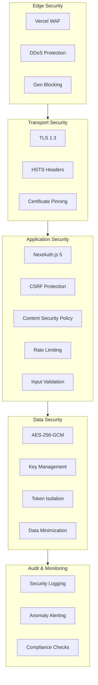
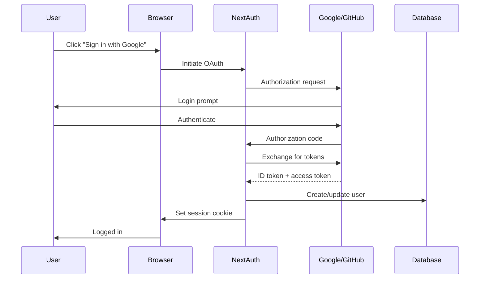
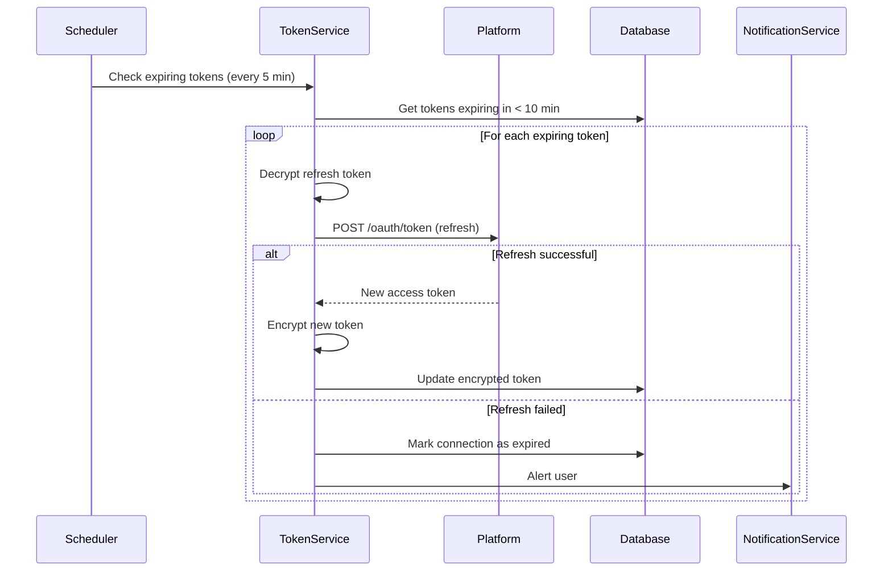

# DropDeck: Security Architecture

## Overview

This document details the security architecture for DropDeck, including authentication, encryption, session management, and compliance considerations. Security is paramount given that DropDeck stores OAuth tokens and credentials for multiple third-party platforms.

---

## Security Architecture Overview



---

## Authentication Architecture

### Primary Authentication (DropDeck Account)



### NextAuth.js Configuration

```typescript
// lib/auth/config.ts
import NextAuth from 'next-auth';
import Google from 'next-auth/providers/google';
import GitHub from 'next-auth/providers/github';
import { DrizzleAdapter } from '@auth/drizzle-adapter';
import { db } from '@/lib/db/client';

export const { auth, handlers, signIn, signOut } = NextAuth({
  adapter: DrizzleAdapter(db),
  providers: [
    Google({
      clientId: process.env.AUTH_GOOGLE_ID!,
      clientSecret: process.env.AUTH_GOOGLE_SECRET!,
    }),
    GitHub({
      clientId: process.env.AUTH_GITHUB_ID!,
      clientSecret: process.env.AUTH_GITHUB_SECRET!,
    }),
  ],
  session: {
    strategy: 'jwt',
    maxAge: 30 * 24 * 60 * 60, // 30 days
    updateAge: 24 * 60 * 60,   // Refresh every 24 hours
  },
  cookies: {
    sessionToken: {
      name: '__Secure-authjs.session-token',
      options: {
        httpOnly: true,
        sameSite: 'lax',
        path: '/',
        secure: true,
      },
    },
    csrfToken: {
      name: '__Host-authjs.csrf-token',
      options: {
        httpOnly: true,
        sameSite: 'lax',
        path: '/',
        secure: true,
      },
    },
  },
  callbacks: {
    jwt({ token, user, account }) {
      if (user) {
        token.id = user.id;
      }
      if (account) {
        token.accessToken = account.access_token;
      }
      return token;
    },
    session({ session, token }) {
      if (token && session.user) {
        session.user.id = token.id as string;
      }
      return session;
    },
  },
  pages: {
    signIn: '/login',
    error: '/auth/error',
  },
});
```

---

## Token Encryption

### Encryption Scheme

DropDeck uses AES-256-GCM (Galois/Counter Mode) for encrypting platform OAuth tokens at rest. This provides both confidentiality and authenticity.

```typescript
// lib/encryption/tokens.ts
import {
  createCipheriv,
  createDecipheriv,
  randomBytes,
  scrypt,
} from 'crypto';
import { promisify } from 'util';

const scryptAsync = promisify(scrypt);

// Encryption key derived from environment variable
const ENCRYPTION_KEY = Buffer.from(process.env.TOKEN_ENCRYPTION_KEY!, 'hex');
const ALGORITHM = 'aes-256-gcm';
const IV_LENGTH = 12; // GCM standard
const AUTH_TAG_LENGTH = 16;
const VERSION = 1;

export interface EncryptedData {
  ciphertext: string;
  iv: string;
  authTag: string;
  algorithm: 'aes-256-gcm';
  version: number;
}

/**
 * Encrypt a plaintext token
 */
export function encryptToken(plaintext: string): EncryptedData {
  const iv = randomBytes(IV_LENGTH);
  const cipher = createCipheriv(ALGORITHM, ENCRYPTION_KEY, iv, {
    authTagLength: AUTH_TAG_LENGTH,
  });

  const encrypted = Buffer.concat([
    cipher.update(plaintext, 'utf8'),
    cipher.final(),
  ]);

  const authTag = cipher.getAuthTag();

  return {
    ciphertext: encrypted.toString('base64'),
    iv: iv.toString('base64'),
    authTag: authTag.toString('base64'),
    algorithm: ALGORITHM,
    version: VERSION,
  };
}

/**
 * Decrypt an encrypted token
 */
export function decryptToken(encrypted: EncryptedData): string {
  const iv = Buffer.from(encrypted.iv, 'base64');
  const authTag = Buffer.from(encrypted.authTag, 'base64');
  const ciphertext = Buffer.from(encrypted.ciphertext, 'base64');

  const decipher = createDecipheriv(ALGORITHM, ENCRYPTION_KEY, iv, {
    authTagLength: AUTH_TAG_LENGTH,
  });
  decipher.setAuthTag(authTag);

  const decrypted = Buffer.concat([
    decipher.update(ciphertext),
    decipher.final(),
  ]);

  return decrypted.toString('utf8');
}

/**
 * Rotate encryption key (for key rotation)
 */
export function reencrypt(
  encrypted: EncryptedData,
  oldKey: Buffer,
  newKey: Buffer
): EncryptedData {
  // Decrypt with old key
  const iv = Buffer.from(encrypted.iv, 'base64');
  const authTag = Buffer.from(encrypted.authTag, 'base64');
  const ciphertext = Buffer.from(encrypted.ciphertext, 'base64');

  const decipher = createDecipheriv(ALGORITHM, oldKey, iv, {
    authTagLength: AUTH_TAG_LENGTH,
  });
  decipher.setAuthTag(authTag);
  const plaintext = Buffer.concat([
    decipher.update(ciphertext),
    decipher.final(),
  ]).toString('utf8');

  // Re-encrypt with new key
  const newIv = randomBytes(IV_LENGTH);
  const cipher = createCipheriv(ALGORITHM, newKey, newIv, {
    authTagLength: AUTH_TAG_LENGTH,
  });
  const newCiphertext = Buffer.concat([
    cipher.update(plaintext, 'utf8'),
    cipher.final(),
  ]);

  return {
    ciphertext: newCiphertext.toString('base64'),
    iv: newIv.toString('base64'),
    authTag: cipher.getAuthTag().toString('base64'),
    algorithm: ALGORITHM,
    version: VERSION + 1,
  };
}
```

### Key Management

```typescript
// Key generation (one-time setup)
// Generate a 32-byte (256-bit) key:
// openssl rand -hex 32

// Environment variable
// TOKEN_ENCRYPTION_KEY=a1b2c3d4... (64 hex characters)

// Key rotation procedure:
// 1. Generate new key
// 2. Add as TOKEN_ENCRYPTION_KEY_NEW
// 3. Run re-encryption migration
// 4. Replace TOKEN_ENCRYPTION_KEY with new key
// 5. Remove TOKEN_ENCRYPTION_KEY_NEW
```

---

## Session Management

### Session Security

```typescript
// Session validation middleware
export async function validateSession(request: NextRequest) {
  const session = await auth();

  if (!session?.user) {
    return { valid: false, user: null };
  }

  // Additional validation
  const sessionData = await getSessionData(session.user.id);

  // Check for session anomalies
  if (sessionData.ipAddress !== request.ip) {
    // Log potential session hijacking attempt
    await logSecurityEvent({
      type: 'SESSION_IP_MISMATCH',
      userId: session.user.id,
      oldIp: sessionData.ipAddress,
      newIp: request.ip,
    });
    // Optionally require re-authentication
  }

  return { valid: true, user: session.user };
}
```

### Session Invalidation

```typescript
// Force logout from all devices
export async function invalidateAllSessions(userId: string) {
  // Delete all sessions for user
  await db.delete(sessions).where(eq(sessions.userId, userId));

  // Clear any cached session data
  await redis.del(`user:${userId}:session`);
}

// Invalidate specific session
export async function invalidateSession(sessionToken: string) {
  await db.delete(sessions).where(eq(sessions.sessionToken, sessionToken));
}
```

---

## Platform Token Isolation

### Per-Platform Session Cookies

```typescript
// Each platform's session is isolated
interface PlatformSession {
  platform: Platform;
  cookies: Map<string, Cookie>;
  userAgent: string;
  lastAccess: Date;
}

// Store platform sessions separately
const platformSessions = new Map<string, Map<Platform, PlatformSession>>();

// Never mix cookies between platforms
function getPlatformCookies(userId: string, platform: Platform): Cookie[] {
  const userSessions = platformSessions.get(userId);
  if (!userSessions) return [];

  const platformSession = userSessions.get(platform);
  if (!platformSession) return [];

  return Array.from(platformSession.cookies.values());
}
```

### Token Refresh Flow



---

## Security Headers

### Content Security Policy

```typescript
// next.config.ts
const securityHeaders = [
  {
    key: 'Content-Security-Policy',
    value: [
      "default-src 'self'",
      "script-src 'self' 'unsafe-eval' 'unsafe-inline'", // Required for Next.js
      "style-src 'self' 'unsafe-inline'",
      "img-src 'self' data: https: blob:",
      "font-src 'self' data:",
      "connect-src 'self' https://*.ably.io wss://*.ably.io https://*.instacart.com https://*.doordash.com https://*.uber.com",
      "frame-ancestors 'none'",
      "base-uri 'self'",
      "form-action 'self'",
    ].join('; '),
  },
  {
    key: 'X-Frame-Options',
    value: 'DENY',
  },
  {
    key: 'X-Content-Type-Options',
    value: 'nosniff',
  },
  {
    key: 'Referrer-Policy',
    value: 'strict-origin-when-cross-origin',
  },
  {
    key: 'X-XSS-Protection',
    value: '1; mode=block',
  },
  {
    key: 'Permissions-Policy',
    value: 'camera=(), microphone=(), geolocation=(self), interest-cohort=()',
  },
  {
    key: 'Strict-Transport-Security',
    value: 'max-age=63072000; includeSubDomains; preload',
  },
];
```

---

## Input Validation

### Zod Schema Validation

```typescript
// All API inputs validated with Zod
import { z } from 'zod';

// Platform schema
export const platformSchema = z.enum([
  'instacart',
  'doordash',
  'ubereats',
  'amazon_fresh',
  'walmart',
  'shipt',
  'drizly',
  'totalwine',
  'costco',
  'samsclub',
  'amazon',
]);

// OAuth callback validation
export const oauthCallbackSchema = z.object({
  platform: platformSchema,
  code: z.string().min(1).max(2048),
  state: z.string().uuid(),
});

// Delivery ID validation
export const deliveryIdSchema = z.string().regex(/^[a-zA-Z0-9_-]+$/);

// Coordinate validation
export const coordinateSchema = z.object({
  lat: z.number().min(-90).max(90),
  lng: z.number().min(-180).max(180),
});
```

### SQL Injection Prevention

```typescript
// Drizzle ORM provides parameterized queries by default
// NEVER use string interpolation for queries

// GOOD - Parameterized
const user = await db.query.users.findFirst({
  where: eq(users.email, userInput),
});

// BAD - Never do this
// const user = await db.execute(`SELECT * FROM users WHERE email = '${userInput}'`);
```

---

## CSRF Protection

### CSRF Token Handling

```typescript
// NextAuth.js handles CSRF automatically for auth routes

// For custom API routes, use csrf tokens
import { getCsrfToken } from 'next-auth/react';

// Client-side form
function PlatformConnectForm() {
  const [csrfToken, setCsrfToken] = useState('');

  useEffect(() => {
    getCsrfToken().then(setCsrfToken);
  }, []);

  return (
    <form action="/api/platform/connect" method="POST">
      <input type="hidden" name="csrfToken" value={csrfToken} />
      {/* ... */}
    </form>
  );
}
```

### SameSite Cookie Configuration

```typescript
// All cookies use SameSite=Lax or Strict
cookies: {
  sessionToken: {
    options: {
      sameSite: 'lax',    // Allows top-level navigations
      secure: true,        // HTTPS only
      httpOnly: true,      // No JavaScript access
    },
  },
},
```

---

## Rate Limiting

### Rate Limit Configuration

```typescript
// lib/security/ratelimit.ts
import { Ratelimit } from '@upstash/ratelimit';
import { redis } from '@/lib/realtime/redis';

export const rateLimits = {
  // General API - 100 requests per minute
  api: new Ratelimit({
    redis,
    limiter: Ratelimit.slidingWindow(100, '1 m'),
    prefix: 'rl:api',
    analytics: true,
  }),

  // Authentication - 10 attempts per 15 minutes
  auth: new Ratelimit({
    redis,
    limiter: Ratelimit.slidingWindow(10, '15 m'),
    prefix: 'rl:auth',
    analytics: true,
  }),

  // OAuth initiation - 5 per hour
  oauth: new Ratelimit({
    redis,
    limiter: Ratelimit.slidingWindow(5, '1 h'),
    prefix: 'rl:oauth',
    analytics: true,
  }),

  // Platform API calls - Per platform limits
  platformCall: (platform: string) =>
    new Ratelimit({
      redis,
      limiter: Ratelimit.slidingWindow(30, '1 m'),
      prefix: `rl:platform:${platform}`,
      analytics: true,
    }),

  // Webhooks - High limit for legitimate platform callbacks
  webhook: new Ratelimit({
    redis,
    limiter: Ratelimit.slidingWindow(1000, '1 m'),
    prefix: 'rl:webhook',
    analytics: true,
  }),
};
```

### Rate Limit Headers

```typescript
// Include rate limit info in response headers
function addRateLimitHeaders(
  response: NextResponse,
  result: RateLimitResult
): NextResponse {
  response.headers.set('X-RateLimit-Limit', result.limit.toString());
  response.headers.set('X-RateLimit-Remaining', result.remaining.toString());
  response.headers.set('X-RateLimit-Reset', result.reset.toString());

  if (!result.success) {
    response.headers.set(
      'Retry-After',
      Math.ceil((result.reset - Date.now()) / 1000).toString()
    );
  }

  return response;
}
```

---

## Audit Logging

### Security Event Logging

```typescript
// lib/security/audit.ts
interface SecurityEvent {
  type: SecurityEventType;
  userId?: string;
  ip?: string;
  userAgent?: string;
  timestamp: Date;
  metadata?: Record<string, unknown>;
}

type SecurityEventType =
  | 'LOGIN_SUCCESS'
  | 'LOGIN_FAILURE'
  | 'LOGOUT'
  | 'PLATFORM_CONNECT'
  | 'PLATFORM_DISCONNECT'
  | 'TOKEN_REFRESH'
  | 'TOKEN_REFRESH_FAILURE'
  | 'SESSION_IP_MISMATCH'
  | 'RATE_LIMIT_EXCEEDED'
  | 'INVALID_CSRF'
  | 'SUSPICIOUS_ACTIVITY';

export async function logSecurityEvent(event: SecurityEvent): Promise<void> {
  // Log to database
  await db.insert(auditLogs).values({
    type: event.type,
    userId: event.userId,
    ip: event.ip,
    userAgent: event.userAgent,
    metadata: event.metadata,
    timestamp: event.timestamp,
  });

  // High-severity events trigger alerts
  if (isHighSeverity(event.type)) {
    await sendSecurityAlert(event);
  }
}

function isHighSeverity(type: SecurityEventType): boolean {
  return [
    'SESSION_IP_MISMATCH',
    'SUSPICIOUS_ACTIVITY',
    'TOKEN_REFRESH_FAILURE',
  ].includes(type);
}
```

### Audit Log Retention

```typescript
// Keep audit logs for 1 year
// Automated cleanup job
export async function cleanupOldAuditLogs(): Promise<void> {
  const oneYearAgo = new Date();
  oneYearAgo.setFullYear(oneYearAgo.getFullYear() - 1);

  await db.delete(auditLogs).where(lt(auditLogs.timestamp, oneYearAgo));
}
```

---

## Privacy Compliance

### GDPR Compliance

| Requirement | Implementation |
|-------------|----------------|
| **Consent** | Explicit consent before storing platform credentials |
| **Data Portability** | Export endpoint for user data |
| **Right to Deletion** | Account deletion removes all user data |
| **Data Minimization** | Only store necessary data |
| **Encryption** | All sensitive data encrypted at rest |

### CCPA Compliance

| Requirement | Implementation |
|-------------|----------------|
| **Disclosure** | Privacy policy details data collection |
| **Opt-Out** | Users can disconnect platforms anytime |
| **Access** | Users can view all stored data |
| **Deletion** | Account deletion within 45 days |

### Data Export

```typescript
// Export all user data
export async function exportUserData(userId: string): Promise<UserDataExport> {
  const [user, preferences, connections, history] = await Promise.all([
    db.query.users.findFirst({ where: eq(users.id, userId) }),
    db.query.userPreferences.findFirst({
      where: eq(userPreferences.userId, userId),
    }),
    db.query.platformConnections.findMany({
      where: eq(platformConnections.userId, userId),
      columns: {
        // Exclude encrypted tokens
        platform: true,
        status: true,
        lastSyncAt: true,
        createdAt: true,
      },
    }),
    db.query.deliveryHistory.findMany({
      where: eq(deliveryHistory.userId, userId),
    }),
  ]);

  return {
    user,
    preferences,
    connections,
    history: history.map((h) => h.deliveryData),
    exportedAt: new Date().toISOString(),
  };
}
```

### Account Deletion

```typescript
// Complete account deletion
export async function deleteUserAccount(userId: string): Promise<void> {
  // 1. Revoke all platform tokens
  const connections = await db.query.platformConnections.findMany({
    where: eq(platformConnections.userId, userId),
  });

  for (const conn of connections) {
    if (conn.accessTokenEncrypted) {
      try {
        const adapter = getAdapter(conn.platform);
        const token = decryptToken(conn.accessTokenEncrypted);
        await adapter.revokeToken?.(token);
      } catch {
        // Continue even if revocation fails
      }
    }
  }

  // 2. Delete all user data (cascade deletes handle related tables)
  await db.delete(users).where(eq(users.id, userId));

  // 3. Clear any cached data
  const cacheKeys = await redis.keys(`user:${userId}:*`);
  if (cacheKeys.length > 0) {
    await redis.del(...cacheKeys);
  }

  // 4. Log deletion
  await logSecurityEvent({
    type: 'ACCOUNT_DELETED',
    userId,
    timestamp: new Date(),
  });
}
```

---

## Security Checklist

### Pre-Launch Security Review

- [ ] All environment variables stored securely (not in code)
- [ ] Token encryption key is 256 bits from secure random source
- [ ] All API endpoints require authentication
- [ ] Rate limiting enabled on all endpoints
- [ ] CSRF protection enabled
- [ ] Security headers configured
- [ ] Input validation on all user inputs
- [ ] SQL injection prevention verified
- [ ] XSS prevention verified
- [ ] Audit logging enabled
- [ ] Error messages don't leak sensitive information
- [ ] Dependency security scan passed
- [ ] Penetration testing completed

### Ongoing Security Practices

- [ ] Monthly dependency updates
- [ ] Quarterly security review
- [ ] Annual penetration testing
- [ ] Key rotation schedule defined
- [ ] Incident response plan documented
- [ ] Security monitoring alerts configured

---

## Threat Model

| Threat | Likelihood | Impact | Mitigation |
|--------|------------|--------|------------|
| Credential theft | Medium | Critical | Encryption, minimal retention |
| Session hijacking | Low | High | Short sessions, IP validation |
| XSS attack | Low | High | CSP, input sanitization |
| CSRF attack | Low | Medium | SameSite cookies, CSRF tokens |
| SQL injection | Very Low | Critical | Parameterized queries (Drizzle) |
| DDoS | Medium | Medium | Vercel protection, rate limiting |
| Platform account compromise | Low | High | User education, token isolation |
| Key compromise | Very Low | Critical | Key rotation, HSM consideration |

---

*Document Version: 1.0 | Last Updated: January 2026*
