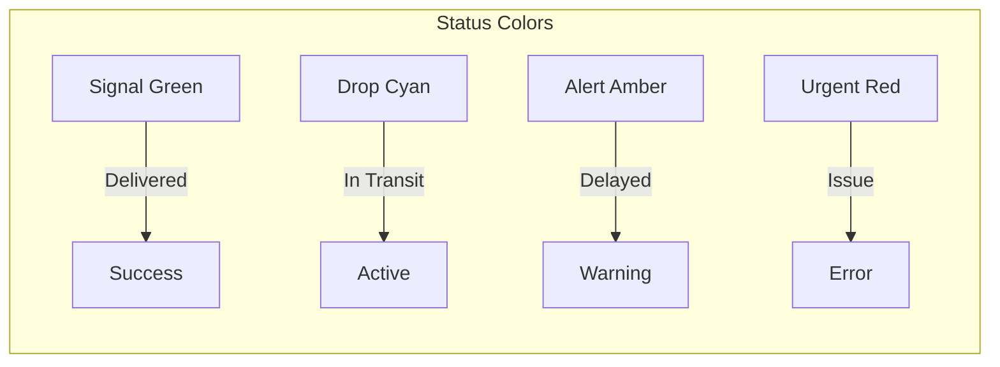
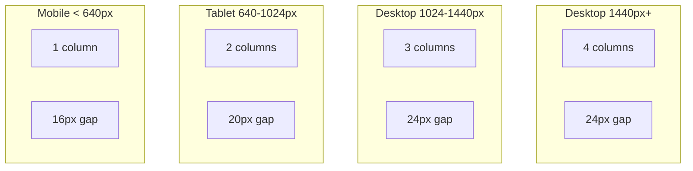
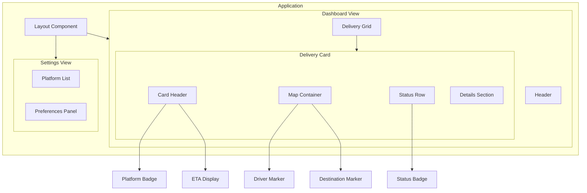
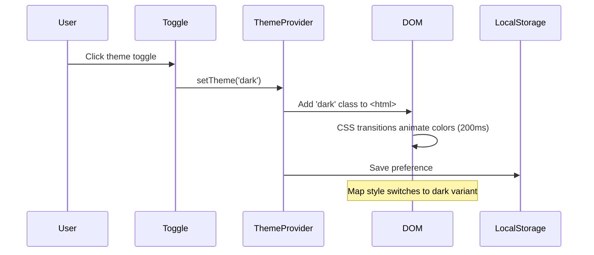
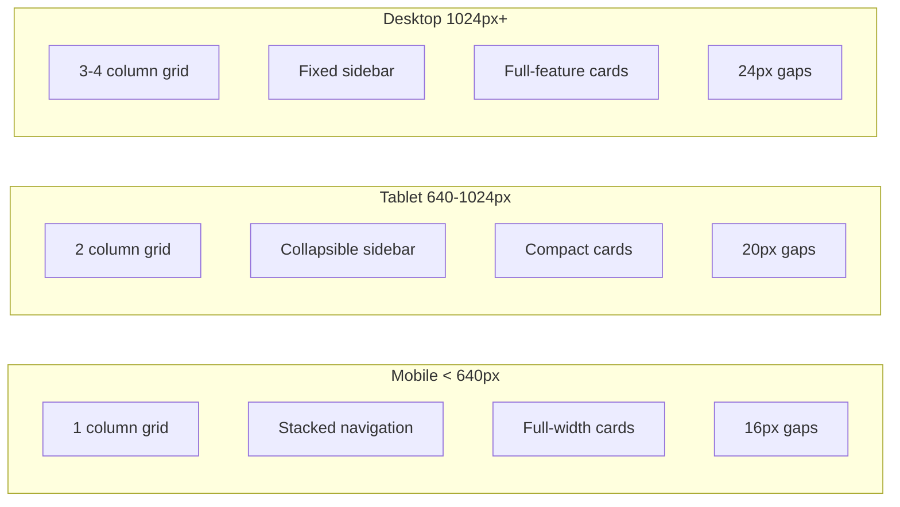
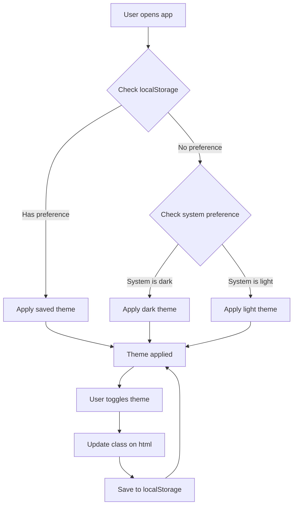

# DropDeck: UI/UX Design System

## Overview

This document defines the comprehensive design system for DropDeck, establishing visual consistency, interaction patterns, and implementation guidelines. The design system is derived from the DropDeck brand identity and optimized for a delivery tracking dashboard experience.

**Tagline:** *"Every drop. One deck."*

---

## Table of Contents

1. [Brand Identity Overview](#brand-identity-overview)
2. [Color System](#color-system)
3. [Typography](#typography)
4. [Spacing and Layout](#spacing-and-layout)
5. [Component Design Patterns](#component-design-patterns)
6. [Animation and Motion](#animation-and-motion)
7. [Responsive Design](#responsive-design)
8. [Dark Mode Implementation](#dark-mode-implementation)
9. [Accessibility](#accessibility)
10. [Icon System](#icon-system)
11. [Implementation Reference](#implementation-reference)

---

## Brand Identity Overview

### Brand Concept

DropDeck merges two powerful metaphors:

1. **Drop** - The universal delivery moment: packages dropped at your door, food dropped off, groceries delivered
2. **Deck** - A dual meaning:
   - *Card deck*: Multiple cards (delivery services) organized into one hand
   - *Command deck*: A control center dashboard for monitoring operations

The brand should feel **organized**, **unified**, and **in control** - transforming delivery chaos into calm oversight.

### Logo Variants

The DropDeck logo uses a "Card Grid" concept - a rounded square containing a 2x2 grid where cards appear stacked/layered, with one cell featuring a downward chevron indicating "drop."

| Variant | File | Usage |
|---------|------|-------|
| **Full Logo (Card Grid)** | `images/DropDeck-logo-card-grid.svg` | App icons, splash screens, marketing |
| **Horizontal (Light)** | `images/DropDeck-logo-horizontal.svg` | Header, light backgrounds |
| **Horizontal (Dark)** | `images/DropDeck-logo-horizontal-dark.svg` | Header, dark backgrounds |
| **Simple Icon** | `images/DropDeck-icon-simple.svg` | Favicons, small contexts |

### Logo Specifications

```
Clear Space: Minimum = height of the "D" in DropDeck
Minimum Sizes:
  - Full logo (icon + wordmark): 120px wide minimum
  - Icon only: 24px minimum (favicon), 32px recommended
  - Print: 0.75" minimum width
```

### Logo Color Variants

| Variant | Icon | Wordmark | Background |
|---------|------|----------|------------|
| **Primary Dark** | Drop Cyan | White | Deck Navy |
| **Primary Light** | Deck Navy | Deck Navy | White/Slate 50 |
| **Monochrome Dark** | White | White | Any dark |
| **Monochrome Light** | Deck Navy | Deck Navy | Any light |
| **Single Color** | Drop Cyan | Drop Cyan | Transparent |

---

## Color System

### Primary Brand Colors

| Name | Hex | HSL | Tailwind | Usage |
|------|-----|-----|----------|-------|
| **Deck Navy** | `#1E293B` | `hsl(215 28% 17%)` | `slate-800` | Primary brand, dark mode backgrounds |
| **Drop Cyan** | `#06B6D4` | `hsl(189 94% 43%)` | `cyan-500` | Accent, CTAs, active states, links |
| **Signal Green** | `#10B981` | `hsl(160 84% 39%)` | `emerald-500` | Success states, "delivered" status |
| **Alert Amber** | `#F59E0B` | `hsl(38 92% 50%)` | `amber-500` | Warnings, "delayed" status |
| **Urgent Red** | `#EF4444` | `hsl(0 84% 60%)` | `red-500` | Errors, "issue" status |

### Extended Neutral Palette

| Name | Hex | HSL | Tailwind | Usage |
|------|-----|-----|----------|-------|
| **Slate 50** | `#F8FAFC` | `hsl(210 40% 98%)` | `slate-50` | Light mode background |
| **Slate 100** | `#F1F5F9` | `hsl(210 40% 96%)` | `slate-100` | Card backgrounds (light) |
| **Slate 200** | `#E2E8F0` | `hsl(214 32% 91%)` | `slate-200` | Borders, dividers (light) |
| **Slate 400** | `#94A3B8` | `hsl(215 16% 65%)` | `slate-400` | Muted text, placeholders |
| **Slate 600** | `#475569` | `hsl(215 19% 35%)` | `slate-600` | Secondary elements (dark) |
| **Slate 700** | `#334155` | `hsl(215 25% 27%)` | `slate-700` | Secondary text (light mode) |
| **Slate 800** | `#1E293B` | `hsl(215 28% 17%)` | `slate-800` | Primary text (light mode), icon bg |
| **Slate 900** | `#0F172A` | `hsl(222 47% 11%)` | `slate-900` | Dark mode background |

### Platform Accent Colors

These colors are used for platform identification badges and icons:

| Platform | Color Name | Hex | Background (15% opacity) |
|----------|------------|-----|--------------------------|
| DoorDash | Red | `#FF3008` | `rgba(255, 48, 8, 0.15)` |
| Uber Eats | Green | `#06C167` | `rgba(6, 193, 103, 0.15)` |
| Instacart | Green | `#43B02A` | `rgba(67, 176, 42, 0.15)` |
| Amazon | Orange | `#FF9900` | `rgba(255, 153, 0, 0.15)` |
| Walmart | Blue | `#0071DC` | `rgba(0, 113, 220, 0.15)` |
| Shipt | Green | `#00A859` | `rgba(0, 168, 89, 0.15)` |
| Costco | Red | `#E31837` | `rgba(227, 24, 55, 0.15)` |
| Sam's Club | Blue | `#0067A0` | `rgba(0, 103, 160, 0.15)` |
| Total Wine | Burgundy | `#6D2C41` | `rgba(109, 44, 65, 0.15)` |
| Drizly | Purple | `#6B46C1` | `rgba(107, 70, 193, 0.15)` |

### Semantic Color Usage



### CSS Custom Properties (Tailwind CSS 4.x)

```css
/* globals.css - Tailwind CSS 4.x CSS-first configuration */
@import 'tailwindcss';

@theme {
  /* Brand Colors */
  --color-brand-navy: #1E293B;
  --color-brand-cyan: #06B6D4;
  --color-brand-cyan-gradient-start: #06B6D4;
  --color-brand-cyan-gradient-end: #0891B2;

  /* Semantic Colors */
  --color-success: #10B981;
  --color-warning: #F59E0B;
  --color-error: #EF4444;
  --color-info: #06B6D4;

  /* Platform Colors */
  --color-platform-doordash: #FF3008;
  --color-platform-ubereats: #06C167;
  --color-platform-instacart: #43B02A;
  --color-platform-amazon: #FF9900;
  --color-platform-walmart: #0071DC;
  --color-platform-shipt: #00A859;
  --color-platform-costco: #E31837;
  --color-platform-samsclub: #0067A0;
  --color-platform-totalwine: #6D2C41;
  --color-platform-drizly: #6B46C1;

  /* Light Mode Surfaces */
  --color-surface-primary: #FFFFFF;
  --color-surface-secondary: #F8FAFC;
  --color-surface-tertiary: #F1F5F9;
  --color-border-primary: #E2E8F0;
  --color-border-secondary: #CBD5E1;

  /* Light Mode Text */
  --color-text-primary: #1E293B;
  --color-text-secondary: #334155;
  --color-text-tertiary: #64748B;
  --color-text-muted: #94A3B8;

  /* Dark Mode Surfaces (use with .dark selector) */
  --color-dark-surface-primary: #0F172A;
  --color-dark-surface-secondary: #1E293B;
  --color-dark-surface-tertiary: #334155;
  --color-dark-border-primary: #334155;
  --color-dark-border-secondary: #475569;

  /* Dark Mode Text */
  --color-dark-text-primary: #F8FAFC;
  --color-dark-text-secondary: #E2E8F0;
  --color-dark-text-tertiary: #94A3B8;
  --color-dark-text-muted: #64748B;
}

/* Theme-aware CSS custom properties */
:root {
  --dd-navy: #1E293B;
  --dd-cyan: #06B6D4;
  --dd-green: #10B981;
  --dd-amber: #F59E0B;
  --dd-red: #EF4444;

  /* Dynamic theme colors */
  --dd-bg-primary: #FFFFFF;
  --dd-bg-secondary: #F8FAFC;
  --dd-bg-card: #FFFFFF;
  --dd-text-primary: #1E293B;
  --dd-text-secondary: #334155;
  --dd-border: #E2E8F0;
  --dd-shadow: rgba(0, 0, 0, 0.1);
}

.dark {
  --dd-bg-primary: #0F172A;
  --dd-bg-secondary: #1E293B;
  --dd-bg-card: #1E293B;
  --dd-text-primary: #F8FAFC;
  --dd-text-secondary: #E2E8F0;
  --dd-border: #334155;
  --dd-shadow: rgba(0, 0, 0, 0.3);
}
```

---

## Typography

### Font Families

| Role | Font Family | Fallback Stack | Usage |
|------|-------------|----------------|-------|
| **Primary (Sans)** | Inter | `system-ui, -apple-system, sans-serif` | All UI text |
| **Monospace** | JetBrains Mono | `ui-monospace, monospace` | Tracking IDs, technical data |
| **Logo Wordmark** | Inter Bold / Geist | - | Logo text only |

### Type Scale

| Element | Weight | Size | Line Height | Letter Spacing | CSS Class |
|---------|--------|------|-------------|----------------|-----------|
| **H1 (Page titles)** | 700 (Bold) | 32px / 2rem | 1.2 | -0.02em | `text-3xl font-bold tracking-tight` |
| **H2 (Section heads)** | 600 (Semibold) | 24px / 1.5rem | 1.3 | -0.01em | `text-2xl font-semibold` |
| **H3 (Card titles)** | 600 (Semibold) | 18px / 1.125rem | 1.4 | 0 | `text-lg font-semibold` |
| **Body** | 400 (Regular) | 16px / 1rem | 1.5 | 0 | `text-base` |
| **Body Small** | 400 (Regular) | 14px / 0.875rem | 1.5 | 0 | `text-sm` |
| **Caption/Meta** | 400 (Regular) | 12px / 0.75rem | 1.4 | 0.01em | `text-xs` |
| **Status Badges** | 500 (Medium) | 12px / 0.75rem | 1 | 0.02em | `text-xs font-medium tracking-wide` |

### Typography CSS

```css
@theme {
  /* Font Families */
  --font-sans: 'Inter', system-ui, -apple-system, BlinkMacSystemFont, sans-serif;
  --font-mono: 'JetBrains Mono', ui-monospace, SFMono-Regular, monospace;

  /* Font Sizes */
  --font-size-xs: 0.75rem;      /* 12px */
  --font-size-sm: 0.875rem;     /* 14px */
  --font-size-base: 1rem;       /* 16px */
  --font-size-lg: 1.125rem;     /* 18px */
  --font-size-xl: 1.25rem;      /* 20px */
  --font-size-2xl: 1.5rem;      /* 24px */
  --font-size-3xl: 2rem;        /* 32px */

  /* Line Heights */
  --line-height-tight: 1.2;
  --line-height-snug: 1.3;
  --line-height-normal: 1.5;
  --line-height-relaxed: 1.625;

  /* Letter Spacing */
  --letter-spacing-tighter: -0.02em;
  --letter-spacing-tight: -0.01em;
  --letter-spacing-normal: 0;
  --letter-spacing-wide: 0.01em;
  --letter-spacing-wider: 0.02em;
}
```

### Usage Examples

```html
<!-- Page Title -->
<h1 class="text-3xl font-bold tracking-tight text-slate-800 dark:text-slate-50">
  Your Deliveries
</h1>

<!-- Section Heading -->
<h2 class="text-2xl font-semibold text-slate-800 dark:text-slate-100">
  Active Deliveries
</h2>

<!-- Card Title with Platform -->
<h3 class="text-lg font-semibold text-slate-800 dark:text-white">
  DoorDash <span class="text-slate-500">• In Transit</span>
</h3>

<!-- Tracking ID (Monospace) -->
<code class="font-mono text-xs text-slate-600 dark:text-slate-400">
  Tracking: 1Z999AA10123456784
</code>

<!-- Status Badge -->
<span class="text-xs font-medium tracking-wide uppercase">
  Out for Delivery
</span>
```

---

## Spacing and Layout

### Spacing Scale

Based on a 4px base unit:

| Token | Value | Tailwind | Usage |
|-------|-------|----------|-------|
| `space-1` | 4px | `p-1`, `m-1` | Tight internal spacing |
| `space-2` | 8px | `p-2`, `m-2` | Default internal spacing |
| `space-3` | 12px | `p-3`, `m-3` | Component padding |
| `space-4` | 16px | `p-4`, `m-4` | Card padding (mobile) |
| `space-5` | 20px | `p-5`, `m-5` | Card padding (tablet) |
| `space-6` | 24px | `p-6`, `m-6` | Card padding (desktop), section gaps |
| `space-8` | 32px | `p-8`, `m-8` | Large section spacing |
| `space-10` | 40px | `p-10`, `m-10` | Page margins |
| `space-12` | 48px | `p-12`, `m-12` | Major section spacing |

### Grid System



### Responsive Grid CSS

```css
@theme {
  /* Grid Gaps */
  --gap-sm: 16px;
  --gap-md: 20px;
  --gap-lg: 24px;

  /* Container Max Widths */
  --container-sm: 640px;
  --container-md: 768px;
  --container-lg: 1024px;
  --container-xl: 1280px;
  --container-2xl: 1536px;
}

/* Delivery Grid Layout */
.delivery-grid {
  display: grid;
  gap: var(--gap-sm);
  grid-template-columns: 1fr;
}

@media (min-width: 640px) {
  .delivery-grid {
    gap: var(--gap-md);
    grid-template-columns: repeat(2, 1fr);
  }
}

@media (min-width: 1024px) {
  .delivery-grid {
    gap: var(--gap-lg);
    grid-template-columns: repeat(3, 1fr);
  }
}

@media (min-width: 1440px) {
  .delivery-grid {
    grid-template-columns: repeat(4, 1fr);
  }
}
```

### Border Radius Scale

| Token | Value | Tailwind | Usage |
|-------|-------|----------|-------|
| `radius-sm` | 6px | `rounded-md` | Buttons, inputs |
| `radius-md` | 12px | `rounded-xl` | Cards, panes |
| `radius-lg` | 16px | `rounded-2xl` | Modal dialogs, large cards |
| `radius-full` | 9999px | `rounded-full` | Pills, badges, avatars |

### CSS Border Radius

```css
@theme {
  --radius-sm: 6px;
  --radius-md: 12px;
  --radius-lg: 16px;
  --radius-full: 9999px;
}
```

---

## Component Design Patterns

### Delivery Pane Card

The primary UI element for displaying delivery information.

#### Light Mode

```css
.delivery-card {
  background: #FFFFFF;
  border: 1px solid #E2E8F0;
  border-radius: 12px;
  box-shadow: 0 1px 3px rgba(0, 0, 0, 0.1);
  padding: 16px;
}

.delivery-card:hover {
  border-color: #CBD5E1;
  box-shadow: 0 4px 6px rgba(0, 0, 0, 0.1);
}
```

#### Dark Mode

```css
.dark .delivery-card {
  background: #1E293B;
  border: 1px solid #334155;
  box-shadow: 0 1px 3px rgba(0, 0, 0, 0.3);
}

.dark .delivery-card:hover {
  border-color: #475569;
  box-shadow: 0 4px 6px rgba(0, 0, 0, 0.4);
}
```

#### Borderless Variant

```css
.delivery-card-borderless {
  background: transparent;
  border: none;
  border-radius: 0;
  box-shadow: none;
}
```

#### Card Structure

```
+------------------------------------------+
| [Platform Icon]  Platform Name     8 min |  <- Header with ETA
|------------------------------------------|
|                                          |
|     +----------------------------+       |  <- Map Container
|     |                            |       |
|     |    [Map with driver        |       |
|     |     marker and route]      |       |
|     |                            |       |
|     +----------------------------+       |
|                                          |
|  Status: Out for Delivery                |  <- Status Row
|  1.2 mi away                             |  <- Distance/Details
+------------------------------------------+
```

### Platform Badges

Small, pill-shaped indicators with platform color:

```css
.platform-badge {
  display: inline-flex;
  align-items: center;
  gap: 4px;
  padding: 2px 8px;
  border-radius: 9999px;
  font-size: 12px;
  font-weight: 500;
}

/* Platform-specific styles */
.platform-badge-doordash {
  background: rgba(255, 48, 8, 0.15);
  color: #FF3008;
}

.platform-badge-ubereats {
  background: rgba(6, 193, 103, 0.15);
  color: #06C167;
}

.platform-badge-instacart {
  background: rgba(67, 176, 42, 0.15);
  color: #43B02A;
}

.platform-badge-amazon {
  background: rgba(255, 153, 0, 0.15);
  color: #FF9900;
}

.platform-badge-walmart {
  background: rgba(0, 113, 220, 0.15);
  color: #0071DC;
}
```

### Status Indicators

```css
/* Status badge base */
.status-badge {
  display: inline-flex;
  align-items: center;
  gap: 6px;
  padding: 4px 10px;
  border-radius: 9999px;
  font-size: 12px;
  font-weight: 500;
}

/* Semantic status colors */
.status-delivered {
  background: rgba(16, 185, 129, 0.15);
  color: #10B981;
}

.status-in-transit {
  background: rgba(6, 182, 212, 0.15);
  color: #06B6D4;
}

.status-preparing {
  background: rgba(148, 163, 184, 0.15);
  color: #64748B;
}

.status-delayed {
  background: rgba(245, 158, 11, 0.15);
  color: #F59E0B;
}

.status-issue {
  background: rgba(239, 68, 68, 0.15);
  color: #EF4444;
}
```

### Map Container Styling

```css
.map-container {
  width: 100%;
  aspect-ratio: 16 / 10;
  border-radius: 8px;
  overflow: hidden;
  background: #F1F5F9;
}

.dark .map-container {
  background: #334155;
}

/* Map overlay for platform icons */
.map-platform-marker {
  width: 32px;
  height: 32px;
  background: white;
  border-radius: 4px;
  box-shadow: 0 2px 4px rgba(0, 0, 0, 0.2);
  display: flex;
  align-items: center;
  justify-content: center;
}

.map-platform-marker img {
  width: 20px;
  height: 20px;
}
```

### ETA Display Component

```css
.eta-display {
  font-size: 24px;
  font-weight: 700;
  color: var(--dd-text-primary);
  font-variant-numeric: tabular-nums;
}

.eta-display-small {
  font-size: 18px;
  font-weight: 600;
}

.eta-arriving {
  color: #06B6D4;
  animation: pulse 2s ease-in-out infinite;
}

.eta-delivered {
  color: #10B981;
}

@keyframes pulse {
  0%, 100% { opacity: 1; }
  50% { opacity: 0.7; }
}
```

### Component Hierarchy Diagram



---

## Animation and Motion

### Design Principles

1. **Purposeful**: Animation indicates state change or draws attention
2. **Quick**: 150-300ms duration for UI transitions
3. **Subtle**: Avoid bouncy/elastic easing; use ease-out

### Animation Tokens

| Element | Animation | Duration | Easing |
|---------|-----------|----------|--------|
| Card enter | Fade + slide up | 200ms | ease-out |
| Status change | Background pulse | 300ms | ease-in-out |
| Driver marker | Smooth position interpolation | 1000ms | linear |
| New delivery | Scale from 0.95 + fade | 250ms | ease-out |
| ETA update | Number ticker/flip | 150ms | ease-out |
| Theme switch | Color transition | 200ms | ease-in-out |
| Hover states | All properties | 150ms | ease-out |

### Framer Motion Configuration

```typescript
// lib/motion/variants.ts
import { Variants } from 'framer-motion';

export const cardVariants: Variants = {
  hidden: {
    opacity: 0,
    y: 20,
    scale: 0.95,
  },
  visible: {
    opacity: 1,
    y: 0,
    scale: 1,
    transition: {
      duration: 0.2,
      ease: 'easeOut',
    },
  },
  exit: {
    opacity: 0,
    scale: 0.95,
    transition: {
      duration: 0.15,
      ease: 'easeIn',
    },
  },
};

export const statusPulseVariants: Variants = {
  idle: {
    backgroundColor: 'var(--status-bg)',
  },
  pulse: {
    backgroundColor: ['var(--status-bg)', 'var(--status-bg-highlight)', 'var(--status-bg)'],
    transition: {
      duration: 0.3,
      ease: 'easeInOut',
    },
  },
};

export const markerMoveVariants = {
  animate: (custom: { lat: number; lng: number }) => ({
    x: custom.lng,
    y: custom.lat,
    transition: {
      duration: 1,
      ease: 'linear',
    },
  }),
};

// Easing functions
export const easing = {
  easeOut: [0.0, 0.0, 0.2, 1],
  easeIn: [0.4, 0.0, 1, 1],
  easeInOut: [0.4, 0.0, 0.2, 1],
};
```

### CSS Transitions

```css
/* Global transitions */
* {
  transition-property: color, background-color, border-color, text-decoration-color, fill, stroke;
  transition-timing-function: cubic-bezier(0.4, 0, 0.2, 1);
  transition-duration: 150ms;
}

/* Card hover transition */
.delivery-card {
  transition: border-color 150ms ease-out, box-shadow 150ms ease-out, transform 150ms ease-out;
}

.delivery-card:hover {
  transform: translateY(-2px);
}

/* Reduced motion support */
@media (prefers-reduced-motion: reduce) {
  *,
  *::before,
  *::after {
    animation-duration: 0.01ms !important;
    animation-iteration-count: 1 !important;
    transition-duration: 0.01ms !important;
  }
}
```

### Theme Switch Animation



---

## Responsive Design

### Breakpoint System

| Breakpoint | Width | CSS Media Query | Tailwind Prefix |
|------------|-------|-----------------|-----------------|
| **Mobile** | < 640px | `@media (max-width: 639px)` | Default |
| **Tablet (sm)** | >= 640px | `@media (min-width: 640px)` | `sm:` |
| **Desktop (md)** | >= 768px | `@media (min-width: 768px)` | `md:` |
| **Large Desktop (lg)** | >= 1024px | `@media (min-width: 1024px)` | `lg:` |
| **Wide (xl)** | >= 1280px | `@media (min-width: 1280px)` | `xl:` |
| **Extra Wide (2xl)** | >= 1536px | `@media (min-width: 1536px)` | `2xl:` |

### Layout Behavior by Breakpoint



### Responsive Component Patterns

```tsx
// DeliveryGrid responsive configuration
<div className="grid grid-cols-1 gap-4 sm:grid-cols-2 sm:gap-5 lg:grid-cols-3 lg:gap-6 xl:grid-cols-4">
  {deliveries.map(delivery => (
    <DeliveryCard key={delivery.id} delivery={delivery} />
  ))}
</div>

// Responsive padding
<div className="p-4 sm:p-5 lg:p-6">
  {/* Card content */}
</div>

// Responsive typography
<h1 className="text-2xl sm:text-3xl lg:text-4xl font-bold">
  Your Deliveries
</h1>
```

### Mobile-Specific Considerations

1. **Touch targets**: Minimum 44x44px for interactive elements
2. **Map gestures**: Support pinch-to-zoom, pan
3. **Navigation**: Bottom navigation or hamburger menu
4. **Cards**: Full-width, stacked vertically
5. **ETA**: Prominently displayed at top of card

---

## Dark Mode Implementation

### Strategy

DropDeck uses CSS class-based dark mode with `next-themes` for persistence and system preference detection.

### Theme Switching Flow



### Implementation

```tsx
// providers.tsx
import { ThemeProvider } from 'next-themes';

export function Providers({ children }: { children: React.ReactNode }) {
  return (
    <ThemeProvider
      attribute="class"
      defaultTheme="system"
      enableSystem
      disableTransitionOnChange={false}
    >
      {children}
    </ThemeProvider>
  );
}
```

### Map Style Switching

```typescript
// Map styles for light and dark modes
const mapStyles = {
  light: 'https://tiles.openfreemap.org/styles/liberty',
  dark: 'https://tiles.openfreemap.org/styles/dark',
};

// Hook to get current map style
function useMapStyle() {
  const { theme, systemTheme } = useTheme();
  const currentTheme = theme === 'system' ? systemTheme : theme;
  return mapStyles[currentTheme as 'light' | 'dark'] ?? mapStyles.light;
}
```

### Dark Mode Color Mappings

| Element | Light Mode | Dark Mode |
|---------|------------|-----------|
| Page background | `#F8FAFC` (slate-50) | `#0F172A` (slate-900) |
| Card background | `#FFFFFF` | `#1E293B` (slate-800) |
| Card border | `#E2E8F0` (slate-200) | `#334155` (slate-700) |
| Primary text | `#1E293B` (slate-800) | `#F8FAFC` (slate-50) |
| Secondary text | `#334155` (slate-700) | `#E2E8F0` (slate-200) |
| Muted text | `#64748B` (slate-500) | `#94A3B8` (slate-400) |
| Accent (cyan) | `#06B6D4` | `#06B6D4` (unchanged) |

---

## Accessibility

### WCAG 2.1 AA Requirements

| Requirement | Implementation |
|-------------|----------------|
| **Color Contrast** | Minimum 4.5:1 for text, 3:1 for UI components |
| **Keyboard Navigation** | All controls accessible via Tab, Enter, Space, Arrow keys |
| **Screen Reader** | ARIA labels, live regions, semantic HTML |
| **Focus Indicators** | Visible focus rings on all interactive elements |
| **Motion Sensitivity** | Respect `prefers-reduced-motion` |
| **Text Scaling** | UI remains functional at 200% zoom |

### Color Contrast Ratios

| Combination | Ratio | Status |
|-------------|-------|--------|
| Slate 800 on White | 12.6:1 | Pass AAA |
| Slate 700 on Slate 50 | 7.4:1 | Pass AAA |
| Cyan 500 on Slate 900 | 6.3:1 | Pass AA |
| White on Slate 800 | 12.6:1 | Pass AAA |
| Amber 500 on White | 2.1:1 | Fail (use with icons) |
| Green 500 on White | 2.9:1 | Pass AA (large text only) |

### Focus States

```css
/* Focus ring styles */
:focus-visible {
  outline: 2px solid #06B6D4;
  outline-offset: 2px;
}

/* Focus within cards */
.delivery-card:focus-within {
  outline: 2px solid #06B6D4;
  outline-offset: 2px;
}

/* High contrast focus for dark mode */
.dark :focus-visible {
  outline-color: #22D3EE; /* cyan-400 for better visibility */
}
```

### ARIA Patterns

```tsx
// Delivery card with proper ARIA
<article
  role="article"
  aria-labelledby={`delivery-${id}-title`}
  aria-describedby={`delivery-${id}-status`}
>
  <h3 id={`delivery-${id}-title`}>
    {platform} Order
  </h3>
  <p id={`delivery-${id}-status`}>
    Status: <span aria-live="polite">{status}</span>
  </p>
  <p aria-live="polite" aria-atomic="true">
    ETA: {eta} minutes
  </p>
</article>

// Status update announcement
<div role="status" aria-live="polite" className="sr-only">
  Your {platform} delivery status changed to {status}
</div>
```

### Screen Reader Considerations

1. **Live regions**: ETA updates announced automatically
2. **Heading hierarchy**: Proper H1-H6 structure
3. **Link text**: Descriptive, not "click here"
4. **Images**: Alt text for all meaningful images
5. **Form labels**: Visible and associated with inputs

---

## Icon System

### Icon Library: Lucide Icons

DropDeck uses [Lucide Icons](https://lucide.dev/) (MIT licensed, React-compatible) for consistent iconography.

### Icon Specifications

| Context | Size | Stroke Width |
|---------|------|--------------|
| Inline (text) | 16px | 1.5px |
| Buttons | 20px | 2px |
| Feature icons | 24px | 1.5px |
| Empty states | 48px | 1.5px |

### Delivery Status Icons

| Status | Lucide Icon | Description |
|--------|-------------|-------------|
| Order Placed | `clipboard-check` | Order confirmed |
| Preparing | `chef-hat` or `package` | Being prepared |
| Shopper Assigned | `user-check` | Shopper assigned (grocery) |
| Shopping | `shopping-cart` | Shopper is shopping |
| In Transit | `truck` or `car` | Driver en route |
| Arriving | `map-pin` | Almost there |
| Delivered | `package-check` | Successfully delivered |
| Delayed | `alert-triangle` | Running late |
| Issue | `alert-circle` | Problem with order |

### Icon Component

```tsx
// components/ui/icon.tsx
import { LucideIcon } from 'lucide-react';
import { cn } from '@/lib/utils';

interface IconProps {
  icon: LucideIcon;
  size?: 'sm' | 'md' | 'lg' | 'xl';
  className?: string;
}

const sizeMap = {
  sm: 16,
  md: 20,
  lg: 24,
  xl: 48,
};

const strokeMap = {
  sm: 1.5,
  md: 2,
  lg: 1.5,
  xl: 1.5,
};

export function Icon({ icon: LucideIcon, size = 'md', className }: IconProps) {
  return (
    <LucideIcon
      size={sizeMap[size]}
      strokeWidth={strokeMap[size]}
      className={cn('flex-shrink-0', className)}
    />
  );
}
```

---

## Implementation Reference

### File Structure

```
src/
├── styles/
│   ├── globals.css          # CSS variables, @theme, base styles
│   └── components/          # Component-specific styles (if needed)
│
├── components/
│   ├── ui/                  # shadcn/ui base components
│   │   ├── button.tsx
│   │   ├── card.tsx
│   │   └── ...
│   │
│   ├── dashboard/           # Dashboard components
│   │   ├── DeliveryGrid.tsx
│   │   ├── DeliveryPane.tsx
│   │   └── ETACountdown.tsx
│   │
│   ├── maps/               # Map components
│   │   ├── MapContainer.tsx
│   │   ├── DriverMarker.tsx
│   │   └── DestinationMarker.tsx
│   │
│   └── platform/           # Platform components
│       ├── PlatformIcon.tsx
│       ├── PlatformBadge.tsx
│       └── ConnectionStatus.tsx
│
└── lib/
    ├── motion/
    │   └── variants.ts      # Framer Motion variants
    └── utils/
        └── cn.ts            # Class name utility
```

### Tailwind Configuration for DropDeck

```css
/* globals.css */
@import 'tailwindcss';

@theme {
  /* Brand Colors */
  --color-brand-navy: #1E293B;
  --color-brand-cyan: #06B6D4;

  /* Semantic Colors */
  --color-success: #10B981;
  --color-warning: #F59E0B;
  --color-error: #EF4444;

  /* Platform Colors */
  --color-platform-doordash: #FF3008;
  --color-platform-ubereats: #06C167;
  --color-platform-instacart: #43B02A;
  --color-platform-amazon: #FF9900;
  --color-platform-walmart: #0071DC;
  --color-platform-shipt: #00A859;
  --color-platform-costco: #E31837;
  --color-platform-samsclub: #0067A0;
  --color-platform-totalwine: #6D2C41;
  --color-platform-drizly: #6B46C1;

  /* Typography */
  --font-sans: 'Inter', system-ui, -apple-system, sans-serif;
  --font-mono: 'JetBrains Mono', ui-monospace, monospace;

  /* Border Radius */
  --radius-sm: 6px;
  --radius-md: 12px;
  --radius-lg: 16px;
  --radius-full: 9999px;

  /* Shadows */
  --shadow-sm: 0 1px 2px rgba(0, 0, 0, 0.05);
  --shadow-md: 0 1px 3px rgba(0, 0, 0, 0.1);
  --shadow-lg: 0 4px 6px rgba(0, 0, 0, 0.1);
}

/* Base styles */
@layer base {
  :root {
    --dd-bg-primary: theme('colors.white');
    --dd-bg-secondary: theme('colors.slate.50');
    --dd-bg-card: theme('colors.white');
    --dd-text-primary: theme('colors.slate.800');
    --dd-text-secondary: theme('colors.slate.600');
    --dd-border: theme('colors.slate.200');
  }

  .dark {
    --dd-bg-primary: theme('colors.slate.900');
    --dd-bg-secondary: theme('colors.slate.800');
    --dd-bg-card: theme('colors.slate.800');
    --dd-text-primary: theme('colors.slate.50');
    --dd-text-secondary: theme('colors.slate.300');
    --dd-border: theme('colors.slate.700');
  }

  body {
    @apply bg-[var(--dd-bg-secondary)] text-[var(--dd-text-primary)] antialiased;
  }
}

/* Component styles */
@layer components {
  .delivery-card {
    @apply bg-[var(--dd-bg-card)] border border-[var(--dd-border)] rounded-xl shadow-md;
    @apply transition-all duration-150 ease-out;
  }

  .delivery-card:hover {
    @apply -translate-y-0.5 shadow-lg;
  }

  .platform-badge {
    @apply inline-flex items-center gap-1 px-2 py-0.5 rounded-full text-xs font-medium;
  }

  .status-badge {
    @apply inline-flex items-center gap-1.5 px-2.5 py-1 rounded-full text-xs font-medium;
  }
}
```

### Quick Reference Card

| Element | Class/Value |
|---------|-------------|
| Primary color | `text-brand-cyan` / `#06B6D4` |
| Background (light) | `bg-slate-50` |
| Background (dark) | `bg-slate-900` |
| Card border radius | `rounded-xl` / 12px |
| Card shadow | `shadow-md` |
| Primary font | `font-sans` / Inter |
| Mono font | `font-mono` / JetBrains Mono |
| Grid gap (mobile) | `gap-4` / 16px |
| Grid gap (desktop) | `gap-6` / 24px |
| Transition duration | `duration-150` |

---

## Related Documents

- [00-PROJECT-OVERVIEW.md](./00-PROJECT-OVERVIEW.md) - Project vision and goals
- [01-FEATURES.md](./01-FEATURES.md) - Feature specifications with UI acceptance criteria
- [02-ARCHITECTURE.md](./02-ARCHITECTURE.md) - Component architecture
- [03-TECHNOLOGY-STACK.md](./03-TECHNOLOGY-STACK.md) - Tailwind, shadcn/ui, Framer Motion
- [11-BRAND-GUIDELINES.md](./11-BRAND-GUIDELINES.md) - Brand voice, logo usage rules

---

*Document Version: 1.0 | Last Updated: January 2026*
