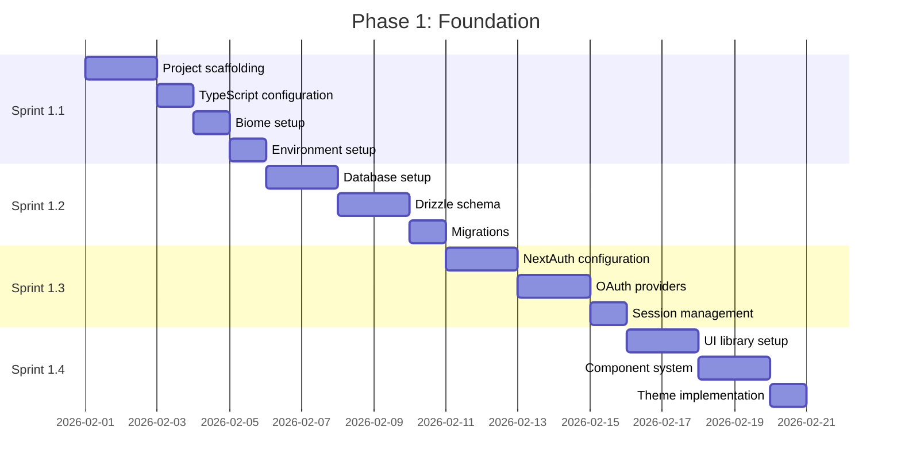

# Phase 1: Foundation

**Duration:** 3 weeks (Weeks 1-3)
**Objective:** Establish core infrastructure, authentication, and UI foundation

---

## Phase Overview



---

## Sprint 1.1: Project Setup

**Duration:** 5 days
**Complexity:** Medium
**Dependencies:** None

### Objectives
- Initialize Next.js 15 project with App Router
- Configure TypeScript with strict settings
- Set up Bun runtime and package management
- Configure Biome for linting and formatting
- Establish project structure

### Tasks

#### Project Initialization
- [ ] Create new Next.js 15 project with Bun
  ```bash
  bunx create-next-app@latest dropdeck --typescript --tailwind --app --src-dir
  ```
- [ ] Verify Bun is set as default runtime
- [ ] Create initial directory structure per architecture spec
- [ ] Add `.nvmrc` with Node.js version fallback
- [ ] Create `README.md` with setup instructions

#### TypeScript Configuration
- [ ] Configure `tsconfig.json` with strict mode
- [ ] Set up path aliases (`@/*` for `./src/*`)
- [ ] Enable strict null checks
- [ ] Configure module resolution for Bun

#### Biome Setup
- [ ] Install Biome: `bun add -D @biomejs/biome`
- [ ] Create `biome.json` configuration
- [ ] Configure import sorting
- [ ] Set up pre-commit hooks with Husky
- [ ] Add lint and format scripts to `package.json`

#### Environment Configuration
- [ ] Create `.env.example` with all required variables
- [ ] Create `.env.local` for development
- [ ] Implement environment validation with Zod
- [ ] Add environment loading to `next.config.ts`

#### Git Setup
- [ ] Initialize git repository (if not already)
- [ ] Create `.gitignore` for Next.js/Bun
- [ ] Set up branch protection rules
- [ ] Create PR template
- [ ] Configure Husky pre-commit hooks

### Acceptance Criteria
- [ ] Project builds successfully with `bun run build`
- [ ] Dev server starts with `bun run dev`
- [ ] TypeScript compilation passes with no errors
- [ ] Biome lint passes with no errors
- [ ] Environment variables load correctly
- [ ] Directory structure matches architecture spec

### Technical Notes
- Use `bunx` for one-off commands instead of `npx`
- Ensure `turbopack` is enabled for dev server
- Test that hot reload works correctly

---

## Sprint 1.2: Database Setup

**Duration:** 5 days
**Complexity:** Medium
**Dependencies:** Sprint 1.1

### Objectives
- Set up Neon PostgreSQL database
- Configure Drizzle ORM
- Create initial database schema
- Implement migrations workflow

### Tasks

#### Neon Database Setup
- [ ] Create Neon project and database
- [ ] Generate connection strings (pooled and direct)
- [ ] Add connection strings to environment variables
- [ ] Test database connectivity
- [ ] Configure connection pooling settings

#### Drizzle ORM Setup
- [ ] Install Drizzle dependencies:
  ```bash
  bun add drizzle-orm @neondatabase/serverless
  bun add -D drizzle-kit
  ```
- [ ] Create `drizzle.config.ts`
- [ ] Create database client (`lib/db/client.ts`)
- [ ] Test connection with simple query

#### Schema Definition
- [ ] Create `lib/db/schema.ts` with all tables:
  - [ ] `users` table
  - [ ] `accounts` table (NextAuth)
  - [ ] `sessions` table (NextAuth)
  - [ ] `verification_tokens` table (NextAuth)
  - [ ] `platform_connections` table
  - [ ] `user_preferences` table
  - [ ] `delivery_cache` table
  - [ ] `delivery_history` table
- [ ] Define all enums (platform, status, theme, etc.)
- [ ] Set up table relations
- [ ] Add indexes for common queries

#### Migrations
- [ ] Generate initial migration: `bun run db:generate`
- [ ] Review generated SQL
- [ ] Apply migration: `bun run db:push`
- [ ] Verify tables created correctly
- [ ] Create seed script for development data

### Acceptance Criteria
- [ ] Database connection works in dev and production mode
- [ ] All tables created with correct schema
- [ ] Indexes exist for foreign keys and common queries
- [ ] Drizzle Studio accessible: `bun run db:studio`
- [ ] Seed data loads successfully

### Technical Notes
```typescript
// Connection configuration for serverless
import { neon } from '@neondatabase/serverless';
import { drizzle } from 'drizzle-orm/neon-http';

const sql = neon(process.env.DATABASE_URL!);
export const db = drizzle(sql, { schema });
```

---

## Sprint 1.3: Authentication

**Duration:** 5 days
**Complexity:** High
**Dependencies:** Sprint 1.2

### Objectives
- Configure NextAuth.js v5
- Implement Google and GitHub OAuth
- Set up session management
- Create login/logout UI

### Tasks

#### NextAuth Configuration
- [ ] Install NextAuth: `bun add next-auth@beta @auth/drizzle-adapter`
- [ ] Create `auth.ts` configuration file
- [ ] Configure Drizzle adapter
- [ ] Set up JWT strategy with 30-day sessions
- [ ] Configure secure cookie settings

#### OAuth Providers
- [ ] Set up Google OAuth:
  - [ ] Create Google Cloud Console project
  - [ ] Configure OAuth consent screen
  - [ ] Generate client ID and secret
  - [ ] Add callback URL
- [ ] Set up GitHub OAuth:
  - [ ] Create GitHub OAuth App
  - [ ] Generate client ID and secret
  - [ ] Add callback URL
- [ ] Add providers to NextAuth config

#### Session Management
- [ ] Implement session callbacks (jwt, session)
- [ ] Add user ID to session
- [ ] Create `getSession` helper function
- [ ] Implement session refresh logic
- [ ] Add session invalidation endpoint

#### Auth UI Components
- [ ] Create login page (`app/(auth)/login/page.tsx`)
- [ ] Create OAuth button components
- [ ] Add loading states
- [ ] Create error page (`app/(auth)/error/page.tsx`)
- [ ] Implement redirect after login

#### Auth Middleware
- [ ] Create middleware for route protection
- [ ] Configure public routes (login, callback)
- [ ] Configure protected routes (dashboard, settings)
- [ ] Add redirect logic for unauthenticated users

### Acceptance Criteria
- [ ] Users can sign in with Google
- [ ] Users can sign in with GitHub
- [ ] Session persists across page reloads
- [ ] Protected routes redirect to login
- [ ] Logout clears session completely
- [ ] Session refreshes automatically

### Technical Notes
```typescript
// Middleware configuration
export { auth as middleware } from '@/lib/auth/config';

export const config = {
  matcher: ['/((?!api|_next/static|_next/image|favicon.ico).*)'],
};
```

---

## Sprint 1.4: UI Foundation

**Duration:** 5 days
**Complexity:** Medium
**Dependencies:** Sprint 1.1
**Design Reference:** [docs/10-UI-UX-DESIGN-SYSTEM.md](../docs/10-UI-UX-DESIGN-SYSTEM.md)

### Objectives
- Set up Tailwind CSS 4.x with DropDeck Design System
- Install and configure shadcn/ui
- Create base component library with brand styling
- Implement theme system (light/dark/system)
- Integrate DropDeck branding assets

### Tasks

#### Design System Setup
- [ ] Create `globals.css` with DropDeck CSS custom properties (see Design System Section 2)
- [ ] Define brand color tokens:
  - [ ] `--color-brand-navy: #1E293B` (Deck Navy)
  - [ ] `--color-brand-cyan: #06B6D4` (Drop Cyan)
  - [ ] `--color-success: #10B981` (Signal Green)
  - [ ] `--color-warning: #F59E0B` (Alert Amber)
  - [ ] `--color-error: #EF4444` (Urgent Red)
- [ ] Define platform color tokens for all 10 platforms
- [ ] Set up theme-aware CSS variables (`:root` and `.dark`)

#### Tailwind Configuration
- [ ] Verify Tailwind 4.x is installed
- [ ] Configure `@theme` block with design system tokens
- [ ] Add border radius scale (`--radius-sm/md/lg/full`)
- [ ] Configure responsive breakpoints (sm:640px, md:768px, lg:1024px, xl:1280px)
- [ ] Set up typography with Inter and JetBrains Mono fonts
- [ ] Add font loading optimization via `next/font`

#### shadcn/ui Setup
- [ ] Initialize shadcn/ui: `bunx shadcn@latest init`
- [ ] Configure component location (`src/components/ui`)
- [ ] Customize shadcn theme to use DropDeck colors
- [ ] Install and brand base components:
  - [ ] `button` (Drop Cyan for primary variant)
  - [ ] `card` (rounded-xl, design system shadows)
  - [ ] `dialog` (rounded-lg corners)
  - [ ] `dropdown-menu`
  - [ ] `input`
  - [ ] `select`
  - [ ] `skeleton` (Slate-200/700 pulse)
  - [ ] `switch` (Drop Cyan when active)
  - [ ] `toast` (semantic status colors)
  - [ ] `tooltip`

#### Logo Integration
- [ ] Copy logo SVGs to `public/` or configure Next.js image imports
- [ ] Create `Logo` component with light/dark variants
- [ ] Implement logo switching based on theme
- [ ] Add favicon from `images/DropDeck-icon-simple.svg`
- [ ] Configure app icons for PWA manifest

#### Layout Components
- [ ] Create root layout (`app/layout.tsx`)
- [ ] Create dashboard layout (`app/(dashboard)/layout.tsx`)
- [ ] Create `Header` component with logo integration
- [ ] Create `Sidebar` component (collapsible)
- [ ] Create `MobileNav` component
- [ ] Implement responsive navigation per Design System breakpoints

#### Theme System
- [ ] Install next-themes: `bun add next-themes`
- [ ] Create `ThemeProvider` component
- [ ] Implement theme toggle (light/dark/system)
- [ ] Persist theme preference to localStorage
- [ ] Add CSS transitions (200ms ease-in-out per Design System)
- [ ] Configure map style switching based on theme

#### Provider Setup
- [ ] Create `Providers` wrapper component
- [ ] Add TanStack Query provider
- [ ] Add theme provider
- [ ] Add toast provider
- [ ] Add tRPC provider (placeholder)

#### Animation Foundation
- [ ] Install Framer Motion: `bun add framer-motion`
- [ ] Create `lib/motion/variants.ts` with design system animation variants
- [ ] Add reduced motion support (`prefers-reduced-motion`)

### Acceptance Criteria
- [ ] All shadcn/ui components render with DropDeck brand styling
- [ ] Theme toggles between light/dark/system with 200ms transitions
- [ ] Theme persists across page reloads
- [ ] Layout is responsive at all Design System breakpoints
- [ ] Sidebar collapses on mobile (< 640px)
- [ ] Toast notifications work with semantic colors
- [ ] Logo displays correctly in both themes
- [ ] Focus states use Drop Cyan (`#06B6D4`)
- [ ] Color contrast meets WCAG 2.1 AA standards

### Technical Notes
```typescript
// Theme provider setup
<ThemeProvider
  attribute="class"
  defaultTheme="system"
  enableSystem
  disableTransitionOnChange={false}
>
  {children}
</ThemeProvider>
```

```css
/* Theme transition */
* {
  transition: color 200ms ease-in-out,
              background-color 200ms ease-in-out,
              border-color 200ms ease-in-out;
}
```

---

## Phase 1 Completion Checklist

### Technical Verification
- [ ] `bun run build` completes without errors
- [ ] `bun run dev` starts successfully
- [ ] `bun run lint` passes
- [ ] `bun run test` (unit tests if any) passes
- [ ] Database migrations applied successfully
- [ ] Authentication flow works end-to-end
- [ ] Theme switching works correctly

### Documentation
- [ ] README.md updated with setup instructions
- [ ] Environment variables documented
- [ ] API documentation started

### Code Quality
- [ ] No TypeScript errors
- [ ] No Biome warnings
- [ ] Consistent code formatting
- [ ] Proper error handling in place

---

## Dependencies for Phase 2

Phase 1 completion enables:
- **Sprint 2.1**: tRPC setup requires auth context
- **Sprint 2.2**: Platform adapters require database schema
- **Sprint 2.3**: Real-time infrastructure requires session management
- **Sprint 2.4**: MapLibre requires UI foundation

---

## Risk Mitigation

| Risk | Likelihood | Impact | Mitigation |
|------|------------|--------|------------|
| Neon connection issues | Low | High | Test pooling settings, have fallback |
| NextAuth v5 breaking changes | Medium | Medium | Pin to specific version |
| Tailwind 4.x compatibility | Low | Low | Fallback to 3.x if needed |
| OAuth setup complexity | Medium | Medium | Allow extra time, document process |

---

---

## Design System References

| Topic | Document |
|-------|----------|
| Color System | [10-UI-UX-DESIGN-SYSTEM.md#color-system](../docs/10-UI-UX-DESIGN-SYSTEM.md#color-system) |
| Typography | [10-UI-UX-DESIGN-SYSTEM.md#typography](../docs/10-UI-UX-DESIGN-SYSTEM.md#typography) |
| Spacing & Layout | [10-UI-UX-DESIGN-SYSTEM.md#spacing-and-layout](../docs/10-UI-UX-DESIGN-SYSTEM.md#spacing-and-layout) |
| Dark Mode | [10-UI-UX-DESIGN-SYSTEM.md#dark-mode-implementation](../docs/10-UI-UX-DESIGN-SYSTEM.md#dark-mode-implementation) |
| Logo Usage | [11-BRAND-GUIDELINES.md#logo-system](../docs/11-BRAND-GUIDELINES.md#logo-system) |

---

*Phase 1 Est. Completion: Week 3 | Total Tasks: 82*
