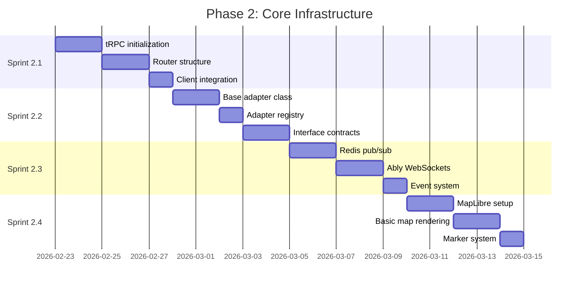

# Phase 2: Core Infrastructure

**Duration:** 2.5 weeks (Weeks 4-6)
**Objective:** Build API layer, platform adapter framework, and real-time infrastructure

---

## Phase Overview



---

## Sprint 2.1: tRPC Setup

**Duration:** 5 days
**Complexity:** Medium
**Dependencies:** Phase 1 complete (auth, database)

### Objectives
- Initialize tRPC 11.x
- Create router structure
- Integrate with TanStack Query
- Implement type-safe API layer

### Tasks

#### tRPC Initialization
- [ ] Install tRPC packages:
  ```bash
  bun add @trpc/server @trpc/client @trpc/react-query @tanstack/react-query superjson
  ```
- [ ] Create tRPC initialization file (`lib/trpc/init.ts`)
- [ ] Configure transformer (superjson)
- [ ] Set up error formatter

#### Context Setup
- [ ] Create context factory (`lib/trpc/context.ts`)
- [ ] Add session to context
- [ ] Add database client to context
- [ ] Add Redis client to context
- [ ] Type the context properly

#### Procedure Types
- [ ] Create `publicProcedure` (no auth required)
- [ ] Create `protectedProcedure` (auth required)
- [ ] Add input validation middleware
- [ ] Add rate limiting middleware

#### Router Structure
- [ ] Create root router (`server/routers/index.ts`)
- [ ] Create platform router (`server/routers/platform.ts`)
- [ ] Create delivery router (`server/routers/delivery.ts`)
- [ ] Create preference router (`server/routers/preference.ts`)
- [ ] Create user router (`server/routers/user.ts`)

#### API Route Handler
- [ ] Create tRPC route handler (`app/api/trpc/[trpc]/route.ts`)
- [ ] Configure for App Router
- [ ] Set up CORS headers

#### Client Integration
- [ ] Create tRPC client (`lib/trpc/client.ts`)
- [ ] Create tRPC React hooks (`lib/trpc/react.ts`)
- [ ] Add TanStack Query provider
- [ ] Configure query client defaults

### Acceptance Criteria
- [ ] tRPC procedures callable from client
- [ ] Types flow from server to client
- [ ] Auth middleware protects routes
- [ ] Input validation works correctly
- [ ] Errors handled gracefully
- [ ] DevTools show queries in development

### Technical Notes
```typescript
// Router structure
export const appRouter = router({
  platform: platformRouter,
  delivery: deliveryRouter,
  preference: preferenceRouter,
  user: userRouter,
});

export type AppRouter = typeof appRouter;
```

---

## Sprint 2.2: Platform Adapter Base

**Duration:** 5 days
**Complexity:** High
**Dependencies:** Sprint 2.1

### Objectives
- Create abstract adapter base class
- Define adapter interface contracts
- Build adapter registry
- Implement common utilities

### Tasks

#### Base Adapter Class
- [ ] Create abstract `PlatformAdapter` class (`lib/adapters/base.ts`)
- [ ] Define required abstract methods:
  - [ ] `getActiveDeliveries()`
  - [ ] `getDeliveryDetails()`
  - [ ] `supportsOAuth()`
  - [ ] `getOAuthUrl()`
  - [ ] `exchangeCode()`
  - [ ] `refreshToken()`
- [ ] Define optional methods with defaults:
  - [ ] `supportsWebhooks()` -> false
  - [ ] `verifyWebhook()` -> false
  - [ ] `normalizeWebhookPayload()` -> throws
  - [ ] `getPollingInterval()` -> 30000
- [ ] Add platform metadata properties

#### Adapter Types
- [ ] Create adapter types (`lib/adapters/types.ts`)
- [ ] Define `TokenSet` interface
- [ ] Define `AdapterConnection` interface
- [ ] Define `WebhookPayload` interface
- [ ] Define status mapping types

#### Adapter Registry
- [ ] Create registry singleton (`lib/adapters/registry.ts`)
- [ ] Implement `registerAdapter()` function
- [ ] Implement `getAdapter()` function
- [ ] Implement `getAllAdapters()` function
- [ ] Add lazy loading for adapters

#### Session-Based Adapter
- [ ] Create `SessionBasedAdapter` abstract class
- [ ] Add session cookie management
- [ ] Add session refresh logic
- [ ] Add login/logout methods

#### Common Utilities
- [ ] Create status mapping utilities (`lib/adapters/status-map.ts`)
- [ ] Create ETA calculation utilities
- [ ] Create coordinate utilities
- [ ] Create rate limit handling
- [ ] Create retry logic with backoff

#### Error Handling
- [ ] Create adapter-specific error classes
- [ ] `PlatformAuthError`
- [ ] `PlatformRateLimitError`
- [ ] `PlatformUnavailableError`
- [ ] `PlatformDataError`

### Acceptance Criteria
- [ ] Base adapter class is complete and documented
- [ ] Adapter registry works correctly
- [ ] Error classes provide useful information
- [ ] Utilities are tested
- [ ] Types are comprehensive

### Technical Notes
```typescript
// Adapter interface
export abstract class PlatformAdapter {
  abstract readonly platformId: Platform;
  abstract readonly displayName: string;
  abstract readonly iconUrl: string;
  abstract readonly primaryColor: string;

  abstract getActiveDeliveries(
    connection: AdapterConnection
  ): Promise<UnifiedDelivery[]>;
}
```

---

## Sprint 2.3: Real-Time Infrastructure

**Duration:** 5 days
**Complexity:** High
**Dependencies:** Sprint 2.1

### Objectives
- Set up Redis pub/sub
- Configure Ably WebSockets
- Build event publishing system
- Create subscription handlers

### Tasks

#### Redis Setup
- [ ] Install Upstash Redis: `bun add @upstash/redis`
- [ ] Create Redis client (`lib/realtime/redis.ts`)
- [ ] Test connection
- [ ] Configure for serverless environment

#### Pub/Sub System
- [ ] Create channel naming conventions
- [ ] Implement `publish()` helper
- [ ] Implement `subscribe()` helper
- [ ] Create message serialization
- [ ] Add message validation

#### Ably Configuration
- [ ] Create Ably account and project
- [ ] Install Ably: `bun add ably`
- [ ] Create server-side client (`lib/realtime/ably.ts`)
- [ ] Create client-side hook
- [ ] Configure capabilities/permissions

#### Token Authentication
- [ ] Create Ably token request endpoint
- [ ] Implement capability restrictions per user
- [ ] Add token refresh logic
- [ ] Test channel subscriptions

#### Event System
- [ ] Define event types (`types/events.ts`)
- [ ] Create `DeliveryUpdateEvent`
- [ ] Create `LocationUpdateEvent`
- [ ] Create `ConnectionStatusEvent`
- [ ] Create event validators

#### tRPC Subscriptions
- [ ] Add subscription support to tRPC
- [ ] Create `delivery.onUpdate` subscription
- [ ] Create `delivery.onLocationUpdate` subscription
- [ ] Test subscriptions end-to-end

#### Client Hooks
- [ ] Create `useRealTimeUpdates` hook
- [ ] Create `useLocationSubscription` hook
- [ ] Handle reconnection
- [ ] Handle offline state

### Acceptance Criteria
- [ ] Redis pub/sub works correctly
- [ ] Ably connections establish
- [ ] Events publish and receive
- [ ] Subscriptions auto-reconnect
- [ ] Client hooks update UI

### Technical Notes
```typescript
// Channel naming convention
const channels = {
  userDeliveries: (userId: string) => `user:${userId}:deliveries`,
  deliveryLocation: (deliveryId: string) => `delivery:${deliveryId}:location`,
  systemStatus: 'system:status',
};
```

---

## Sprint 2.4: MapLibre Integration

**Duration:** 5 days
**Complexity:** Medium
**Dependencies:** Sprint 1.4 (UI foundation)

### Objectives
- Set up MapLibre GL JS
- Configure map tiles
- Create map components
- Build marker system

### Tasks

#### MapLibre Setup
- [ ] Install MapLibre: `bun add maplibre-gl react-map-gl`
- [ ] Install types: `bun add -D @types/maplibre-gl`
- [ ] Create map configuration (`lib/maps/config.ts`)
- [ ] Configure tile sources (OpenFreeMap)

#### Map Components
- [ ] Create `MapContainer` component
- [ ] Add map style loading
- [ ] Handle map initialization
- [ ] Add loading state
- [ ] Add error boundary

#### Map Controls
- [ ] Add zoom controls
- [ ] Add center/recenter button
- [ ] Add fullscreen toggle
- [ ] Make controls accessible

#### Marker System
- [ ] Create `DriverMarker` component
- [ ] Create `DestinationMarker` component
- [ ] Add platform-specific styling
- [ ] Add marker clustering for multiple deliveries

#### Animation System
- [ ] Implement smooth marker movement
- [ ] Create position interpolation
- [ ] Handle marker rotation (heading)
- [ ] Target 60fps animation

#### Map Theming
- [ ] Configure light mode style
- [ ] Configure dark mode style
- [ ] Sync with app theme
- [ ] Smooth theme transitions

### Acceptance Criteria
- [ ] Map renders correctly
- [ ] Markers display at correct positions
- [ ] Marker animation is smooth (60fps)
- [ ] Theme switching works
- [ ] Controls are accessible
- [ ] Mobile gestures work

### Technical Notes
```typescript
// Map configuration
export const mapConfig = {
  styles: {
    light: 'https://tiles.openfreemap.org/styles/liberty',
    dark: 'https://tiles.openfreemap.org/styles/dark',
  },
  defaultZoom: 15,
  minZoom: 10,
  maxZoom: 18,
};
```

---

## Phase 2 Completion Checklist

### Technical Verification
- [ ] tRPC endpoints respond correctly
- [ ] Platform adapter base class is complete
- [ ] Redis pub/sub functioning
- [ ] Ably WebSocket connections work
- [ ] MapLibre renders maps
- [ ] Marker animations smooth

### Integration Testing
- [ ] Auth -> tRPC flow works
- [ ] Pub/sub -> Client subscription works
- [ ] Theme -> Map style sync works

### Documentation
- [ ] tRPC router documentation
- [ ] Adapter interface documentation
- [ ] Real-time architecture documentation

---

## Dependencies for Phase 3

Phase 2 completion enables:
- **Sprint 3.1-3.6**: Platform adapters extend base class
- **Sprint 4.1**: Live tracking uses MapLibre + subscriptions
- **Sprint 4.2**: ETA uses real-time updates

---

## Risk Mitigation

| Risk | Likelihood | Impact | Mitigation |
|------|------------|--------|------------|
| tRPC subscription complexity | Medium | Medium | Use SSE first, WebSocket later |
| Ably free tier limits | Low | Medium | Monitor usage, upgrade if needed |
| MapLibre performance | Low | Medium | Implement tile caching |
| Redis connection in serverless | Medium | High | Use connection pooling |

---

*Phase 2 Est. Completion: Week 6 | Total Tasks: 64*
