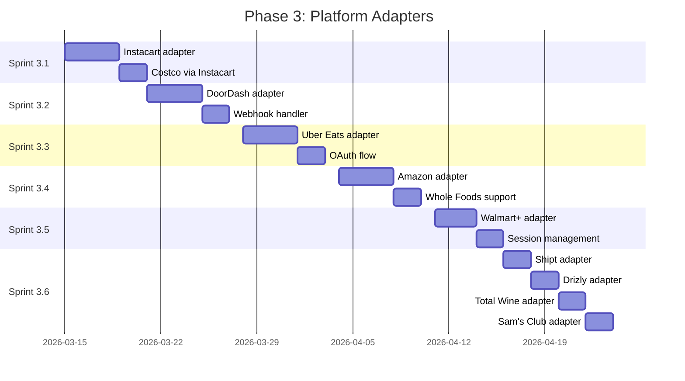

# Phase 3: Platform Adapters

**Duration:** 4 weeks (Weeks 7-10)
**Objective:** Implement platform-specific adapters for all supported delivery services

---

## Phase Overview



---

## Sprint 3.1: Instacart Adapter

**Duration:** 6 days
**Complexity:** High
**Dependencies:** Phase 2 complete (adapter base class)
**Priority:** Highest (Costco dependency)

### Objectives
- Implement Instacart Connect API integration
- Support OAuth 2.0 authentication flow
- Handle Costco orders through Instacart
- Implement real-time order tracking

### Tasks

#### OAuth Implementation
- [ ] Create Instacart OAuth configuration
- [ ] Implement authorization URL generation
- [ ] Handle OAuth callback (`/api/auth/callback/instacart`)
- [ ] Implement token exchange
- [ ] Store encrypted tokens in database
- [ ] Implement token refresh logic

#### Adapter Class
- [ ] Create `InstacartAdapter` class (`lib/adapters/instacart/index.ts`)
- [ ] Extend `PlatformAdapter` base class
- [ ] Implement required abstract methods:
  - [ ] `getActiveDeliveries()`
  - [ ] `getDeliveryDetails()`
  - [ ] `supportsOAuth()` -> true
  - [ ] `getOAuthUrl()`
  - [ ] `exchangeCode()`
  - [ ] `refreshToken()`
- [ ] Add Instacart-specific methods:
  - [ ] `getOrderHistory()`
  - [ ] `getShopperInfo()`

#### API Integration
- [ ] Create API client (`lib/adapters/instacart/client.ts`)
- [ ] Implement request interceptors
- [ ] Handle rate limiting (100 req/min)
- [ ] Implement retry with exponential backoff
- [ ] Add request logging

#### Status Mapping
- [ ] Create status mapping (`lib/adapters/instacart/status-map.ts`)
- [ ] Map Instacart statuses to unified statuses:
  - [ ] `placed` -> `ORDER_PLACED`
  - [ ] `shopping` -> `PREPARING`
  - [ ] `checkout` -> `PREPARING`
  - [ ] `delivering` -> `OUT_FOR_DELIVERY`
  - [ ] `delivered` -> `DELIVERED`
  - [ ] `cancelled` -> `CANCELLED`
- [ ] Handle edge cases and unknown statuses

#### Webhook Handler (if supported)
- [ ] Create webhook endpoint (`/api/webhooks/instacart`)
- [ ] Verify webhook signatures
- [ ] Handle order status updates
- [ ] Handle shopper assignment updates
- [ ] Publish events to Redis

#### Costco Support
- [ ] Detect Costco orders in Instacart response
- [ ] Add Costco branding/styling
- [ ] Handle Costco-specific order fields
- [ ] Map Costco product categories

#### Testing
- [ ] Create mock Instacart API responses
- [ ] Write unit tests for adapter methods
- [ ] Write integration tests for OAuth flow
- [ ] Test status mapping exhaustively
- [ ] Test error handling scenarios

### Acceptance Criteria
- [ ] Users can connect Instacart account via OAuth
- [ ] Active deliveries retrieved correctly
- [ ] Delivery details include all required fields
- [ ] Costco orders identified and styled correctly
- [ ] Status updates reflect in real-time
- [ ] Token refresh works automatically
- [ ] Rate limits respected

### Technical Notes
```typescript
// Instacart adapter structure
export class InstacartAdapter extends PlatformAdapter {
  readonly platformId = 'instacart' as const;
  readonly displayName = 'Instacart';
  readonly iconUrl = '/icons/instacart.svg';
  readonly primaryColor = '#43B02A';

  private readonly baseUrl = 'https://connect.instacart.com/v2';
  private readonly scopes = ['orders:read', 'profile:read'];

  async getActiveDeliveries(connection: AdapterConnection): Promise<UnifiedDelivery[]> {
    const orders = await this.fetchOrders(connection, { status: 'active' });
    return orders.map(this.normalizeOrder);
  }
}
```

---

## Sprint 3.2: DoorDash Adapter

**Duration:** 6 days
**Complexity:** High
**Dependencies:** Sprint 3.1
**Priority:** High (webhook support)

### Objectives
- Implement DoorDash Drive API integration
- Support webhook-based updates
- Handle restaurant and grocery deliveries
- Implement real-time tracking

### Tasks

#### OAuth Implementation
- [ ] Create DoorDash OAuth configuration
- [ ] Implement authorization URL generation
- [ ] Handle OAuth callback (`/api/auth/callback/doordash`)
- [ ] Implement token exchange
- [ ] Store encrypted tokens
- [ ] Implement token refresh

#### Adapter Class
- [ ] Create `DoorDashAdapter` class (`lib/adapters/doordash/index.ts`)
- [ ] Extend `PlatformAdapter` base class
- [ ] Implement required abstract methods
- [ ] Override `supportsWebhooks()` -> true
- [ ] Add DoorDash-specific methods:
  - [ ] `getDasherLocation()`
  - [ ] `getEstimatedArrival()`

#### API Integration
- [ ] Create API client (`lib/adapters/doordash/client.ts`)
- [ ] Implement JWT authentication
- [ ] Handle rate limiting (1000 req/hour)
- [ ] Implement retry logic
- [ ] Add request/response logging

#### Webhook System
- [ ] Create webhook endpoint (`/api/webhooks/doordash`)
- [ ] Implement signature verification (HMAC-SHA256)
- [ ] Handle webhook event types:
  - [ ] `delivery.status_updated`
  - [ ] `delivery.location_updated`
  - [ ] `delivery.completed`
  - [ ] `delivery.cancelled`
- [ ] Parse and normalize webhook payloads
- [ ] Publish events to Redis pub/sub

#### Status Mapping
- [ ] Create status mapping (`lib/adapters/doordash/status-map.ts`)
- [ ] Map DoorDash statuses:
  - [ ] `created` -> `ORDER_PLACED`
  - [ ] `confirmed` -> `ORDER_CONFIRMED`
  - [ ] `preparing` -> `PREPARING`
  - [ ] `ready_for_pickup` -> `READY_FOR_PICKUP`
  - [ ] `dasher_confirmed` -> `DRIVER_ASSIGNED`
  - [ ] `en_route_to_customer` -> `OUT_FOR_DELIVERY`
  - [ ] `delivered` -> `DELIVERED`

#### Location Tracking
- [ ] Implement `getDasherLocation()` method
- [ ] Parse location coordinates
- [ ] Calculate bearing/heading
- [ ] Handle location privacy settings

#### Testing
- [ ] Create mock DoorDash API responses
- [ ] Create mock webhook payloads
- [ ] Write unit tests for adapter
- [ ] Write integration tests for webhooks
- [ ] Test location tracking accuracy

### Acceptance Criteria
- [ ] Users can connect DoorDash account
- [ ] Webhook events processed correctly
- [ ] Dasher location updates in real-time
- [ ] Status transitions are accurate
- [ ] ETA calculations are correct
- [ ] Webhook signatures verified

### Technical Notes
```typescript
// Webhook signature verification
verifyWebhook(payload: unknown, signature: string | null): boolean {
  if (!signature) return false;
  const expectedSignature = crypto
    .createHmac('sha256', this.webhookSecret)
    .update(JSON.stringify(payload))
    .digest('hex');
  return crypto.timingSafeEqual(
    Buffer.from(signature),
    Buffer.from(expectedSignature)
  );
}
```

---

## Sprint 3.3: Uber Eats Adapter

**Duration:** 6 days
**Complexity:** High
**Dependencies:** Sprint 3.2
**Priority:** High (Consumer Delivery API)

### Objectives
- Implement Uber Eats Consumer Delivery API
- Support OAuth 2.0 with PKCE
- Handle restaurant delivery tracking
- Implement driver location updates

### Tasks

#### OAuth with PKCE
- [ ] Create Uber OAuth configuration
- [ ] Implement PKCE code verifier generation
- [ ] Implement code challenge generation (S256)
- [ ] Generate authorization URL with PKCE
- [ ] Handle OAuth callback with code verifier
- [ ] Store tokens with encryption

#### Adapter Class
- [ ] Create `UberEatsAdapter` class (`lib/adapters/uber-eats/index.ts`)
- [ ] Extend `PlatformAdapter` base class
- [ ] Implement all abstract methods
- [ ] Add Uber Eats-specific methods:
  - [ ] `getDriverInfo()`
  - [ ] `getLiveTracking()`
  - [ ] `getDeliveryPhotos()`

#### API Integration
- [ ] Create API client (`lib/adapters/uber-eats/client.ts`)
- [ ] Implement OAuth bearer token auth
- [ ] Handle rate limiting
- [ ] Implement automatic token refresh
- [ ] Add error handling

#### Real-Time Tracking
- [ ] Implement polling for active deliveries
- [ ] Parse driver location updates
- [ ] Calculate ETA from Uber API
- [ ] Handle delivery photo attachments
- [ ] Process delivery instructions

#### Status Mapping
- [ ] Create status mapping (`lib/adapters/uber-eats/status-map.ts`)
- [ ] Map Uber Eats statuses:
  - [ ] `PROCESSING` -> `ORDER_PLACED`
  - [ ] `ACCEPTED` -> `ORDER_CONFIRMED`
  - [ ] `PREPARING` -> `PREPARING`
  - [ ] `READY_FOR_PICKUP` -> `READY_FOR_PICKUP`
  - [ ] `COURIER_ASSIGNED` -> `DRIVER_ASSIGNED`
  - [ ] `EN_ROUTE` -> `OUT_FOR_DELIVERY`
  - [ ] `ARRIVING` -> `ARRIVING`
  - [ ] `DELIVERED` -> `DELIVERED`

#### Sandbox Testing
- [ ] Set up Uber sandbox environment
- [ ] Create test orders in sandbox
- [ ] Test OAuth flow with sandbox credentials
- [ ] Verify status transitions
- [ ] Test edge cases

#### Testing
- [ ] Create mock Uber API responses
- [ ] Write unit tests for PKCE implementation
- [ ] Write unit tests for adapter methods
- [ ] Write integration tests for OAuth
- [ ] Test real-time tracking accuracy

### Acceptance Criteria
- [ ] Users can connect Uber Eats account via OAuth
- [ ] PKCE flow implemented correctly
- [ ] Active deliveries retrieved with location
- [ ] Driver location updates accurately
- [ ] ETA reflects Uber's calculations
- [ ] Delivery photos accessible

### Technical Notes
```typescript
// PKCE implementation
private generateCodeVerifier(): string {
  return base64url(crypto.randomBytes(32));
}

private generateCodeChallenge(verifier: string): string {
  const hash = crypto.createHash('sha256').update(verifier).digest();
  return base64url(hash);
}
```

---

## Sprint 3.4: Amazon Adapter

**Duration:** 6 days
**Complexity:** High
**Dependencies:** Sprint 3.3
**Priority:** High (multiple services)

### Objectives
- Implement Amazon Shipping API v2 integration
- Support Amazon Fresh and Whole Foods orders
- Handle package tracking (reverse-engineered)
- Implement unified Amazon experience

### Tasks

#### Authentication Strategy
- [ ] Evaluate OAuth vs session-based approach
- [ ] Implement chosen authentication method
- [ ] Handle Amazon login flow
- [ ] Store credentials securely
- [ ] Implement session refresh

#### Adapter Class
- [ ] Create `AmazonAdapter` class (`lib/adapters/amazon/index.ts`)
- [ ] Extend `PlatformAdapter` base class
- [ ] Implement abstract methods
- [ ] Add Amazon-specific methods:
  - [ ] `getPackageTracking()`
  - [ ] `getFreshOrders()`
  - [ ] `getWholeFoodsOrders()`

#### API Integration
- [ ] Create API client (`lib/adapters/amazon/client.ts`)
- [ ] Implement request signing (if using Shipping API)
- [ ] Handle rate limiting
- [ ] Implement retry logic
- [ ] Add error handling

#### Package Tracking
- [ ] Integrate with Amazon tracking endpoint
- [ ] Parse tracking events
- [ ] Extract location updates
- [ ] Calculate delivery estimates
- [ ] Handle multi-package orders

#### Amazon Fresh/Whole Foods
- [ ] Detect Fresh/Whole Foods orders
- [ ] Parse delivery windows
- [ ] Track delivery driver location (if available)
- [ ] Handle substitutions and changes
- [ ] Add appropriate branding

#### Status Mapping
- [ ] Create status mapping (`lib/adapters/amazon/status-map.ts`)
- [ ] Map Amazon statuses:
  - [ ] `ORDER_RECEIVED` -> `ORDER_PLACED`
  - [ ] `ORDER_CONFIRMED` -> `ORDER_CONFIRMED`
  - [ ] `SHIPPED` -> `SHIPPED`
  - [ ] `OUT_FOR_DELIVERY` -> `OUT_FOR_DELIVERY`
  - [ ] `DELIVERED` -> `DELIVERED`
- [ ] Handle Fresh-specific statuses:
  - [ ] `SHOPPING` -> `PREPARING`
  - [ ] `PACKED` -> `READY_FOR_PICKUP`

#### Carrier Integration
- [ ] Handle UPS tracking
- [ ] Handle USPS tracking
- [ ] Handle FedEx tracking
- [ ] Handle Amazon Logistics tracking
- [ ] Normalize carrier-specific data

#### Testing
- [ ] Create mock Amazon API responses
- [ ] Write unit tests for adapter
- [ ] Test package tracking parsing
- [ ] Test Fresh/Whole Foods detection
- [ ] Test carrier integrations

### Acceptance Criteria
- [ ] Users can connect Amazon account
- [ ] Package tracking displays correctly
- [ ] Fresh orders show delivery windows
- [ ] Whole Foods orders tracked accurately
- [ ] Multiple carriers supported
- [ ] Status updates in real-time

### Technical Notes
```typescript
// Amazon order type detection
private getOrderType(order: AmazonOrder): 'package' | 'fresh' | 'whole_foods' {
  if (order.merchant === 'WHOLE_FOODS') return 'whole_foods';
  if (order.deliveryType === 'SAME_DAY' && order.category === 'GROCERY') return 'fresh';
  return 'package';
}
```

---

## Sprint 3.5: Walmart+ Adapter

**Duration:** 5 days
**Complexity:** Medium-High
**Dependencies:** Sprint 3.4
**Priority:** Medium (session-based)

### Objectives
- Implement Walmart+ session-based integration
- Handle grocery and general merchandise
- Support delivery and pickup orders
- Implement secure session management

### Tasks

#### Session-Based Authentication
- [ ] Create `SessionBasedAdapter` for Walmart (`lib/adapters/walmart/index.ts`)
- [ ] Implement login flow
- [ ] Handle session cookies
- [ ] Implement session refresh
- [ ] Secure cookie storage

#### Adapter Class
- [ ] Create `WalmartAdapter` class
- [ ] Extend `SessionBasedAdapter` base class
- [ ] Implement required methods
- [ ] Add Walmart-specific methods:
  - [ ] `getDeliverySlots()`
  - [ ] `getPickupOrders()`

#### API Integration
- [ ] Create API client (`lib/adapters/walmart/client.ts`)
- [ ] Handle authentication headers
- [ ] Manage session state
- [ ] Implement rate limiting
- [ ] Add error handling

#### Order Tracking
- [ ] Fetch active orders
- [ ] Parse order details
- [ ] Track delivery driver (if available)
- [ ] Handle pickup orders separately
- [ ] Support multi-item orders

#### Status Mapping
- [ ] Create status mapping (`lib/adapters/walmart/status-map.ts`)
- [ ] Map Walmart statuses:
  - [ ] `PLACED` -> `ORDER_PLACED`
  - [ ] `PROCESSING` -> `PREPARING`
  - [ ] `READY` -> `READY_FOR_PICKUP`
  - [ ] `ON_THE_WAY` -> `OUT_FOR_DELIVERY`
  - [ ] `DELIVERED` -> `DELIVERED`
  - [ ] `PICKED_UP` -> `PICKED_UP`

#### Express Delivery Support
- [ ] Detect Express delivery orders
- [ ] Handle faster refresh intervals
- [ ] Show real-time driver location
- [ ] Display accurate ETA

#### Testing
- [ ] Create mock Walmart API responses
- [ ] Write unit tests for adapter
- [ ] Test session management
- [ ] Test order type detection
- [ ] Test status transitions

### Acceptance Criteria
- [ ] Users can connect Walmart+ account
- [ ] Session persists across requests
- [ ] Delivery orders tracked accurately
- [ ] Pickup orders shown separately
- [ ] Express delivery has real-time updates
- [ ] Session refreshes automatically

### Technical Notes
```typescript
// Session-based adapter
export class WalmartAdapter extends SessionBasedAdapter {
  readonly platformId = 'walmart' as const;
  readonly displayName = 'Walmart+';
  readonly iconUrl = '/icons/walmart.svg';
  readonly primaryColor = '#0071DC';

  protected readonly loginUrl = 'https://www.walmart.com/account/login';
  protected readonly sessionCookieName = 'WALMART_SESSION';
}
```

---

## Sprint 3.6: Remaining Adapters

**Duration:** 8 days
**Complexity:** Medium
**Dependencies:** Sprint 3.5
**Priority:** Medium

### Objectives
- Implement Shipt adapter
- Implement Drizly adapter
- Implement Total Wine adapter
- Implement Sam's Club adapter (via Instacart)

### Shipt Adapter (2 days)

#### Tasks
- [ ] Create `ShiptAdapter` class (`lib/adapters/shipt/index.ts`)
- [ ] Implement OAuth integration
- [ ] Create API client
- [ ] Implement status mapping:
  - [ ] `ORDERED` -> `ORDER_PLACED`
  - [ ] `SHOPPING` -> `PREPARING`
  - [ ] `DELIVERING` -> `OUT_FOR_DELIVERY`
  - [ ] `DELIVERED` -> `DELIVERED`
- [ ] Handle Target orders via Shipt
- [ ] Write unit tests

#### Acceptance Criteria
- [ ] Users can connect Shipt account
- [ ] Orders tracked with shopper info
- [ ] Target orders identified correctly
- [ ] ETA updates accurately

### Drizly Adapter (2 days)

#### Tasks
- [ ] Create `DrizlyAdapter` class (`lib/adapters/drizly/index.ts`)
- [ ] Implement authentication (OAuth or session)
- [ ] Create API client
- [ ] Handle age verification status
- [ ] Implement status mapping:
  - [ ] `RECEIVED` -> `ORDER_PLACED`
  - [ ] `ACCEPTED` -> `ORDER_CONFIRMED`
  - [ ] `PREPARING` -> `PREPARING`
  - [ ] `EN_ROUTE` -> `OUT_FOR_DELIVERY`
  - [ ] `DELIVERED` -> `DELIVERED`
- [ ] Show alcohol-specific delivery notes
- [ ] Write unit tests

#### Acceptance Criteria
- [ ] Users can connect Drizly account
- [ ] Age verification status shown
- [ ] Alcohol delivery tracked
- [ ] ID check reminders displayed

### Total Wine Adapter (2 days)

#### Tasks
- [ ] Create `TotalWineAdapter` class (`lib/adapters/total-wine/index.ts`)
- [ ] Implement authentication
- [ ] Create API client
- [ ] Handle delivery and pickup orders
- [ ] Implement status mapping:
  - [ ] `ORDERED` -> `ORDER_PLACED`
  - [ ] `PROCESSING` -> `PREPARING`
  - [ ] `READY` -> `READY_FOR_PICKUP`
  - [ ] `OUT_FOR_DELIVERY` -> `OUT_FOR_DELIVERY`
  - [ ] `DELIVERED` -> `DELIVERED`
- [ ] Handle in-store pickup separately
- [ ] Write unit tests

#### Acceptance Criteria
- [ ] Users can connect Total Wine account
- [ ] Delivery orders tracked
- [ ] Pickup ready notifications
- [ ] Store information displayed

### Sam's Club Adapter (2 days)

#### Tasks
- [ ] Create `SamsClubAdapter` class (`lib/adapters/sams-club/index.ts`)
- [ ] Leverage Instacart integration (many orders via Instacart)
- [ ] Handle direct Sam's Club orders
- [ ] Implement status mapping
- [ ] Detect Instacart vs direct orders
- [ ] Handle club pickup orders
- [ ] Write unit tests

#### Acceptance Criteria
- [ ] Users can connect Sam's Club account
- [ ] Instacart orders routed correctly
- [ ] Direct orders tracked
- [ ] Club pickup supported

### Technical Notes
```typescript
// Sam's Club with Instacart detection
export class SamsClubAdapter extends PlatformAdapter {
  private instacartAdapter: InstacartAdapter;

  async getActiveDeliveries(connection: AdapterConnection): Promise<UnifiedDelivery[]> {
    // Check if order is fulfilled by Instacart
    const orders = await this.fetchOrders(connection);
    return orders.map(order => {
      if (order.fulfillmentPartner === 'INSTACART') {
        return this.instacartAdapter.normalizeOrder(order);
      }
      return this.normalizeDirectOrder(order);
    });
  }
}
```

---

## Phase 3 Completion Checklist

### Adapter Verification
- [ ] Instacart adapter complete and tested
- [ ] DoorDash adapter complete with webhooks
- [ ] Uber Eats adapter complete with PKCE
- [ ] Amazon adapter complete (all services)
- [ ] Walmart+ adapter complete (session-based)
- [ ] Shipt adapter complete
- [ ] Drizly adapter complete
- [ ] Total Wine adapter complete
- [ ] Sam's Club adapter complete

### Integration Testing
- [ ] All adapters registered in registry
- [ ] Cross-adapter status normalization works
- [ ] OAuth flows complete successfully
- [ ] Session-based auth persists
- [ ] Webhooks process correctly
- [ ] Rate limits respected across platforms

### Documentation
- [ ] Each adapter documented with examples
- [ ] Integration guide for each platform
- [ ] Troubleshooting guide created
- [ ] API rate limits documented

### Code Quality
- [ ] All adapters have >80% test coverage
- [ ] No TypeScript errors
- [ ] Biome lint passes
- [ ] Consistent error handling

---

## Dependencies for Phase 4

Phase 3 completion enables:
- **Sprint 4.1**: Live tracking uses adapter location data
- **Sprint 4.2**: ETA calculations use platform ETAs
- **Sprint 4.3**: Notifications use webhook/polling events
- **Sprint 4.4**: Dashboard aggregates all platform data

---

## Risk Mitigation

| Risk | Likelihood | Impact | Mitigation |
|------|------------|--------|------------|
| API changes by platforms | Medium | High | Monitor changelogs, version APIs |
| Rate limit exhaustion | Medium | Medium | Implement backoff, queue requests |
| OAuth token expiration | Low | High | Proactive refresh, error handling |
| Session invalidation | Medium | Medium | Detect and prompt re-auth |
| Webhook delivery failures | Low | Medium | Implement retry, fallback to polling |
| Platform downtime | Low | Medium | Show cached data, status indicators |

---

*Phase 3 Est. Completion: Week 10 | Total Tasks: 142*
