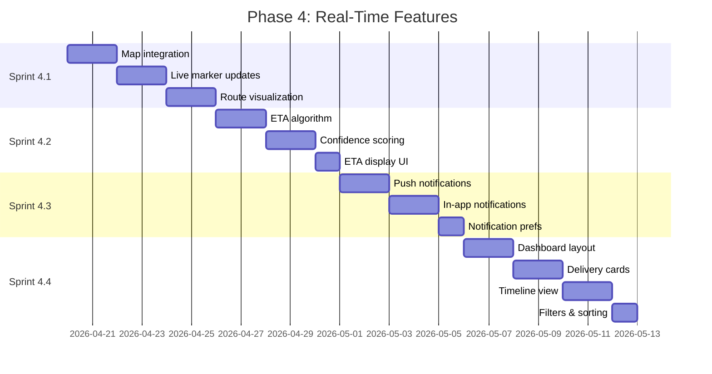

# Phase 4: Real-Time Features

**Duration:** 2.5 weeks (Weeks 11-13)
**Objective:** Build live tracking, ETA system, notifications, and unified dashboard

---

## Phase Overview



---

## Sprint 4.1: Live Tracking

**Duration:** 6 days
**Complexity:** High
**Dependencies:** Phase 2 (MapLibre), Phase 3 (adapters with location data)

### Objectives
- Integrate MapLibre with real delivery data
- Implement smooth marker animations
- Show driver routes and destinations
- Handle multiple simultaneous deliveries

### Tasks

#### Map Data Integration
- [ ] Connect map to delivery subscription
- [ ] Parse driver location from adapters
- [ ] Update markers from real-time events
- [ ] Handle coordinate validation
- [ ] Cache last known positions

#### Delivery Marker Component
- [ ] Create `DeliveryMarker` component (`components/map/delivery-marker.tsx`)
- [ ] Add platform-specific icons
- [ ] Show driver info on hover
- [ ] Display delivery status badge
- [ ] Add pulse animation for active deliveries

#### Smooth Animation System
- [ ] Implement position interpolation
- [ ] Create animation queue for updates
- [ ] Handle rapid position updates
- [ ] Maintain 60fps performance
- [ ] Add easing functions

#### Route Visualization
- [ ] Fetch route polylines (if available)
- [ ] Draw route from driver to destination
- [ ] Style routes by platform color
- [ ] Handle route updates
- [ ] Show remaining distance

#### Destination Markers
- [ ] Create `DestinationMarker` component
- [ ] Show delivery address
- [ ] Add home/work/custom icons
- [ ] Display delivery instructions preview
- [ ] Handle multiple destinations

#### Multi-Delivery View
- [ ] Display all active deliveries on map
- [ ] Implement marker clustering
- [ ] Auto-zoom to fit all markers
- [ ] Allow focus on single delivery
- [ ] Show delivery count indicator

#### Mobile Optimization
- [ ] Optimize touch gestures
- [ ] Handle pinch-to-zoom
- [ ] Implement compass/north indicator
- [ ] Add recenter button
- [ ] Optimize for smaller screens

#### Real-Time Subscriptions
- [ ] Subscribe to location updates via Ably
- [ ] Handle connection drops gracefully
- [ ] Implement reconnection logic
- [ ] Show connection status indicator
- [ ] Queue updates during offline

### Acceptance Criteria
- [ ] Driver markers update in real-time
- [ ] Marker animations are smooth (60fps)
- [ ] Routes display correctly
- [ ] Multiple deliveries visible simultaneously
- [ ] Mobile gestures work correctly
- [ ] Offline state handled gracefully

### Technical Notes
```typescript
// Smooth marker animation
interface AnimatedMarker {
  currentPosition: [number, number];
  targetPosition: [number, number];
  animationFrame: number | null;
}

function animateMarker(marker: AnimatedMarker, duration: number = 1000) {
  const startTime = performance.now();
  const startPos = marker.currentPosition;

  function animate(currentTime: number) {
    const elapsed = currentTime - startTime;
    const progress = Math.min(elapsed / duration, 1);
    const eased = easeOutCubic(progress);

    marker.currentPosition = [
      lerp(startPos[0], marker.targetPosition[0], eased),
      lerp(startPos[1], marker.targetPosition[1], eased),
    ];

    if (progress < 1) {
      marker.animationFrame = requestAnimationFrame(animate);
    }
  }

  marker.animationFrame = requestAnimationFrame(animate);
}
```

---

## Sprint 4.2: ETA System

**Duration:** 5 days
**Complexity:** Medium-High
**Dependencies:** Sprint 4.1

### Objectives
- Build intelligent ETA calculation system
- Combine platform ETAs with traffic data
- Implement confidence scoring
- Create ETA display components

### Tasks

#### ETA Algorithm
- [ ] Create ETA service (`lib/services/eta.ts`)
- [ ] Aggregate platform-provided ETAs
- [ ] Apply historical accuracy adjustments
- [ ] Factor in traffic conditions
- [ ] Handle missing ETA data

#### Platform ETA Integration
- [ ] Extract ETAs from each adapter
- [ ] Normalize ETA formats (absolute vs relative)
- [ ] Handle ETA ranges (window-based)
- [ ] Track platform ETA accuracy history
- [ ] Weight ETAs by platform reliability

#### Confidence Scoring
- [ ] Create confidence calculation algorithm
- [ ] Factors to consider:
  - [ ] Platform historical accuracy
  - [ ] Driver proximity to destination
  - [ ] Current traffic conditions
  - [ ] Order type (restaurant vs grocery)
  - [ ] Time of day patterns
- [ ] Output confidence percentage (0-100%)

#### Traffic Integration (Optional)
- [ ] Evaluate traffic data sources
- [ ] Integrate with traffic API (if available)
- [ ] Adjust ETAs based on traffic
- [ ] Handle API rate limits
- [ ] Cache traffic data appropriately

#### ETA Display Component
- [ ] Create `ETADisplay` component (`components/delivery/eta-display.tsx`)
- [ ] Show primary ETA prominently
- [ ] Display confidence indicator
- [ ] Show ETA range if applicable
- [ ] Add "arriving soon" states

#### ETA Timeline
- [ ] Create timeline visualization
- [ ] Show order progression
- [ ] Display key milestones
- [ ] Highlight current stage
- [ ] Predict future stages

#### ETA Updates
- [ ] Subscribe to ETA changes
- [ ] Animate ETA transitions
- [ ] Handle significant ETA changes
- [ ] Notify on major delays
- [ ] Log ETA accuracy for learning

#### Testing
- [ ] Create ETA calculation tests
- [ ] Test confidence scoring
- [ ] Test edge cases (no ETA, stale data)
- [ ] Validate accuracy over time

### Acceptance Criteria
- [ ] ETAs display accurately
- [ ] Confidence score reflects reliability
- [ ] ETA updates smoothly
- [ ] Major delays trigger notifications
- [ ] Historical data improves predictions

### Technical Notes
```typescript
// ETA confidence calculation
interface ETAConfidence {
  eta: Date;
  confidence: number; // 0-100
  range: { min: Date; max: Date } | null;
  source: 'platform' | 'calculated' | 'estimated';
}

function calculateConfidence(
  platformETA: Date | null,
  driverLocation: Coordinates | null,
  destinationLocation: Coordinates,
  platformAccuracy: number,
  trafficMultiplier: number
): ETAConfidence {
  let confidence = 50; // Base confidence

  // Platform provides ETA
  if (platformETA) confidence += 20;

  // Driver location available
  if (driverLocation) confidence += 15;

  // Adjust by platform accuracy
  confidence *= (platformAccuracy / 100);

  // Adjust by traffic conditions
  if (trafficMultiplier > 1.5) confidence -= 10;

  return {
    eta: calculateFinalETA(platformETA, driverLocation, destinationLocation),
    confidence: Math.min(Math.max(confidence, 0), 100),
    range: calculateRange(confidence),
    source: platformETA ? 'platform' : 'calculated',
  };
}
```

---

## Sprint 4.3: Notifications

**Duration:** 5 days
**Complexity:** Medium
**Dependencies:** Sprint 4.2

### Objectives
- Implement push notification system
- Build in-app notification center
- Create user notification preferences
- Handle notification delivery reliably

### Tasks

#### Push Notification Setup
- [ ] Install web-push library: `bun add web-push`
- [ ] Generate VAPID keys
- [ ] Create service worker for push
- [ ] Register service worker
- [ ] Store push subscriptions in database

#### Push Notification Service
- [ ] Create notification service (`lib/services/notifications.ts`)
- [ ] Implement `sendPushNotification()`
- [ ] Handle subscription management
- [ ] Queue notifications for delivery
- [ ] Track delivery status

#### Notification Types
- [ ] Define notification types:
  - [ ] `DELIVERY_STATUS_CHANGE`
  - [ ] `DRIVER_ASSIGNED`
  - [ ] `OUT_FOR_DELIVERY`
  - [ ] `ARRIVING_SOON`
  - [ ] `DELIVERED`
  - [ ] `DELAY_DETECTED`
  - [ ] `PLATFORM_CONNECTED`
  - [ ] `PLATFORM_DISCONNECTED`
- [ ] Create templates for each type
- [ ] Include action buttons where appropriate

#### In-App Notification Center
- [ ] Create `NotificationCenter` component
- [ ] Display notification list
- [ ] Show unread count badge
- [ ] Mark notifications as read
- [ ] Clear all notifications option
- [ ] Group by date/delivery

#### Notification Bell Component
- [ ] Create `NotificationBell` component
- [ ] Show unread indicator
- [ ] Animate on new notification
- [ ] Open notification panel on click
- [ ] Handle empty state

#### User Preferences
- [ ] Create notification preferences schema
- [ ] Build preferences UI in settings
- [ ] Options to configure:
  - [ ] Enable/disable push notifications
  - [ ] Enable/disable in-app notifications
  - [ ] Notification sounds
  - [ ] Per-platform preferences
  - [ ] Per-event-type preferences
  - [ ] Quiet hours
- [ ] Persist preferences to database

#### Real-Time Triggers
- [ ] Connect to event stream
- [ ] Trigger notifications on status changes
- [ ] Debounce rapid updates
- [ ] Respect user preferences
- [ ] Handle notification permissions

#### Testing
- [ ] Test push notification delivery
- [ ] Test service worker registration
- [ ] Test preference persistence
- [ ] Test notification grouping
- [ ] Test quiet hours

### Acceptance Criteria
- [ ] Push notifications delivered reliably
- [ ] In-app notifications display correctly
- [ ] Preferences respected for all notifications
- [ ] Notification center shows history
- [ ] Quiet hours prevent notifications

### Technical Notes
```typescript
// Notification service
class NotificationService {
  async sendDeliveryUpdate(
    userId: string,
    delivery: UnifiedDelivery,
    event: DeliveryEvent
  ): Promise<void> {
    const preferences = await this.getUserPreferences(userId);

    // Check quiet hours
    if (this.isQuietHours(preferences)) return;

    // Check if user wants this notification type
    if (!preferences.events[event.type]) return;

    const notification = this.buildNotification(delivery, event);

    // Send push if enabled
    if (preferences.pushEnabled) {
      await this.sendPush(userId, notification);
    }

    // Always store in-app notification
    await this.storeNotification(userId, notification);

    // Emit for real-time in-app display
    await this.emitNotification(userId, notification);
  }
}
```

---

## Sprint 4.4: Unified Dashboard

**Duration:** 7 days
**Complexity:** Medium-High
**Dependencies:** All previous Phase 4 sprints

### Objectives
- Build the main dashboard view
- Create delivery card components
- Implement timeline visualization
- Add filtering and sorting

### Tasks

#### Dashboard Layout
- [ ] Create dashboard page (`app/(dashboard)/page.tsx`)
- [ ] Design responsive grid layout
- [ ] Add map section (collapsible)
- [ ] Add delivery list section
- [ ] Implement mobile-first design

#### Delivery Card Component
- [ ] Create `DeliveryCard` component (`components/delivery/delivery-card.tsx`)
- [ ] Display platform icon and name
- [ ] Show current status with badge
- [ ] Display ETA prominently
- [ ] Show order summary (items, total)
- [ ] Add progress indicator
- [ ] Handle click to expand details

#### Delivery Card States
- [ ] Design pending state
- [ ] Design in-progress state (animated)
- [ ] Design arriving soon state (highlighted)
- [ ] Design delivered state
- [ ] Design cancelled state
- [ ] Handle loading/skeleton state

#### Expanded Delivery View
- [ ] Create `DeliveryDetails` component
- [ ] Show full order details
- [ ] Display driver information
- [ ] Show delivery address
- [ ] Include special instructions
- [ ] Add order items list
- [ ] Show pricing breakdown

#### Timeline View
- [ ] Create `DeliveryTimeline` component
- [ ] Display all status changes
- [ ] Show timestamps for each event
- [ ] Highlight current status
- [ ] Animate transitions
- [ ] Handle historical view

#### Platform Filter
- [ ] Create filter component
- [ ] Allow multi-select platforms
- [ ] Show platform counts
- [ ] Persist filter preference
- [ ] Apply filter to all views

#### Status Filter
- [ ] Create status filter
- [ ] Filter by: Active, Completed, Cancelled
- [ ] Show counts per status
- [ ] Combine with platform filter

#### Sorting Options
- [ ] Implement sort options:
  - [ ] By ETA (soonest first)
  - [ ] By status (active first)
  - [ ] By platform
  - [ ] By order time (newest first)
- [ ] Persist sort preference
- [ ] Animate reordering

#### Empty States
- [ ] Design no active deliveries state
- [ ] Design no connected platforms state
- [ ] Design no results (filtered) state
- [ ] Add call-to-action for each

#### Real-Time Updates
- [ ] Connect dashboard to subscriptions
- [ ] Update cards in real-time
- [ ] Animate status changes
- [ ] Handle new deliveries appearing
- [ ] Handle deliveries completing

#### Accessibility
- [ ] Add keyboard navigation
- [ ] Implement focus management
- [ ] Add ARIA labels
- [ ] Ensure color contrast
- [ ] Support screen readers

#### Performance
- [ ] Virtualize long delivery lists
- [ ] Lazy load delivery details
- [ ] Optimize re-renders
- [ ] Measure and log performance
- [ ] Target <100ms interactions

### Acceptance Criteria
- [ ] Dashboard displays all active deliveries
- [ ] Cards update in real-time
- [ ] Filtering works correctly
- [ ] Sorting works correctly
- [ ] Mobile layout is usable
- [ ] Empty states guide users
- [ ] Accessibility requirements met
- [ ] Performance targets achieved

### Technical Notes
```typescript
// Dashboard state management with Zustand
interface DashboardState {
  deliveries: UnifiedDelivery[];
  filters: {
    platforms: Platform[];
    statuses: DeliveryStatus[];
  };
  sortBy: 'eta' | 'status' | 'platform' | 'orderTime';
  sortOrder: 'asc' | 'desc';

  setDeliveries: (deliveries: UnifiedDelivery[]) => void;
  updateDelivery: (deliveryId: string, updates: Partial<UnifiedDelivery>) => void;
  setPlatformFilter: (platforms: Platform[]) => void;
  setStatusFilter: (statuses: DeliveryStatus[]) => void;
  setSortBy: (sortBy: DashboardState['sortBy']) => void;
}

const useDashboardStore = create<DashboardState>((set) => ({
  deliveries: [],
  filters: { platforms: [], statuses: ['active'] },
  sortBy: 'eta',
  sortOrder: 'asc',

  setDeliveries: (deliveries) => set({ deliveries }),
  updateDelivery: (deliveryId, updates) => set((state) => ({
    deliveries: state.deliveries.map((d) =>
      d.id === deliveryId ? { ...d, ...updates } : d
    ),
  })),
  // ... other actions
}));
```

---

## Phase 4 Completion Checklist

### Feature Verification
- [ ] Live tracking works with all connected platforms
- [ ] Map markers animate smoothly
- [ ] ETA calculations are accurate
- [ ] Confidence scores reflect reality
- [ ] Push notifications delivered
- [ ] In-app notifications work
- [ ] Dashboard displays all deliveries
- [ ] Filters and sorting function correctly

### Integration Testing
- [ ] Real-time updates flow from adapters to UI
- [ ] Notifications trigger on correct events
- [ ] Dashboard syncs with map view
- [ ] Mobile and desktop layouts work

### Performance Testing
- [ ] Map maintains 60fps
- [ ] Dashboard updates in <100ms
- [ ] Notification delivery <5 seconds
- [ ] ETA calculations <200ms

### Accessibility Testing
- [ ] Keyboard navigation complete
- [ ] Screen reader compatible
- [ ] Color contrast passes WCAG
- [ ] Focus states visible

### Documentation
- [ ] Real-time architecture documented
- [ ] Notification system documented
- [ ] Dashboard component API documented
- [ ] User guide for features

---

## Dependencies for Phase 5

Phase 4 completion enables:
- **Sprint 5.1**: Unit tests for real-time components
- **Sprint 5.2**: E2E tests for full user flows
- **Sprint 5.3**: Performance testing with real data
- **Sprint 5.4**: Accessibility audit

---

## Risk Mitigation

| Risk | Likelihood | Impact | Mitigation |
|------|------------|--------|------------|
| Map performance issues | Medium | High | Implement clustering, limit markers |
| Push notification failures | Low | Medium | Fallback to in-app, retry logic |
| ETA inaccuracy | Medium | Medium | Show confidence, use ranges |
| Real-time connection drops | Medium | Medium | Reconnection logic, offline UI |
| Dashboard performance | Low | Medium | Virtualization, lazy loading |

---

*Phase 4 Est. Completion: Week 13 | Total Tasks: 118*
