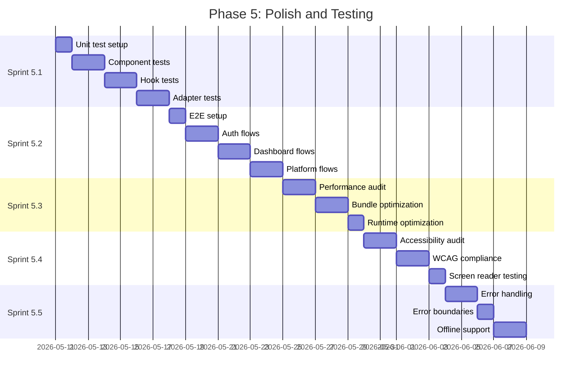

# Phase 5: Polish and Testing

**Duration:** 2.5 weeks (Weeks 14-16)
**Objective:** Comprehensive testing, performance optimization, accessibility, and error handling

---

## Phase Overview



---

## Sprint 5.1: Unit Testing

**Duration:** 7 days
**Complexity:** Medium
**Dependencies:** Phase 4 complete

### Objectives
- Set up comprehensive unit test infrastructure
- Test all React components
- Test custom hooks
- Test platform adapters
- Achieve >80% code coverage

### Tasks

#### Test Infrastructure
- [ ] Configure Vitest for component testing
- [ ] Set up React Testing Library
- [ ] Create test utilities and helpers
- [ ] Configure coverage reporting
- [ ] Set up CI test running

#### Component Test Setup
- [ ] Create component test helpers
- [ ] Set up mock providers (theme, auth, query)
- [ ] Create fixture factories
- [ ] Configure snapshot testing
- [ ] Set up visual regression (optional)

#### UI Component Tests
- [ ] Test Button variants and states
- [ ] Test Card component
- [ ] Test Input components
- [ ] Test Select components
- [ ] Test Dialog component
- [ ] Test Toast notifications
- [ ] Test Skeleton loaders

#### Delivery Component Tests
- [ ] Test `DeliveryCard` component
- [ ] Test `DeliveryDetails` component
- [ ] Test `DeliveryTimeline` component
- [ ] Test `ETADisplay` component
- [ ] Test status badge rendering
- [ ] Test loading states

#### Map Component Tests
- [ ] Test `MapContainer` initialization
- [ ] Test `DeliveryMarker` component
- [ ] Test `DestinationMarker` component
- [ ] Test marker clustering
- [ ] Test map controls
- [ ] Mock MapLibre GL for tests

#### Hook Tests
- [ ] Test `useDeliveries` hook
- [ ] Test `useRealTimeUpdates` hook
- [ ] Test `useLocationSubscription` hook
- [ ] Test `useNotifications` hook
- [ ] Test `usePreferences` hook
- [ ] Test `useTheme` hook

#### tRPC Router Tests
- [ ] Create router test utilities
- [ ] Test `platform` router procedures
- [ ] Test `delivery` router procedures
- [ ] Test `preference` router procedures
- [ ] Test `user` router procedures
- [ ] Test error handling

#### Adapter Unit Tests
- [ ] Test `InstacartAdapter` methods
- [ ] Test `DoorDashAdapter` methods
- [ ] Test `UberEatsAdapter` methods
- [ ] Test `AmazonAdapter` methods
- [ ] Test `WalmartAdapter` methods
- [ ] Test remaining adapters
- [ ] Test status mapping functions
- [ ] Test token encryption/decryption

#### Service Tests
- [ ] Test `NotificationService`
- [ ] Test `ETAService`
- [ ] Test token refresh logic
- [ ] Test rate limiting logic
- [ ] Test retry mechanisms

### Acceptance Criteria
- [ ] All components have tests
- [ ] All hooks have tests
- [ ] All adapters have tests
- [ ] Code coverage >80%
- [ ] Tests run in <60 seconds
- [ ] Zero flaky tests

### Technical Notes
```typescript
// Component test example
import { render, screen } from '@testing-library/react';
import { DeliveryCard } from '@/components/delivery/delivery-card';
import { createMockDelivery } from '@/test/fixtures';

describe('DeliveryCard', () => {
  it('displays platform name and status', () => {
    const delivery = createMockDelivery({
      platform: 'doordash',
      status: 'OUT_FOR_DELIVERY',
    });

    render(<DeliveryCard delivery={delivery} />);

    expect(screen.getByText('DoorDash')).toBeInTheDocument();
    expect(screen.getByText('Out for Delivery')).toBeInTheDocument();
  });

  it('shows ETA when available', () => {
    const delivery = createMockDelivery({
      eta: new Date('2026-05-11T14:30:00'),
    });

    render(<DeliveryCard delivery={delivery} />);

    expect(screen.getByText(/2:30 PM/)).toBeInTheDocument();
  });
});
```

---

## Sprint 5.2: E2E Testing

**Duration:** 7 days
**Complexity:** High
**Dependencies:** Sprint 5.1

### Objectives
- Set up Playwright for E2E testing
- Test complete user flows
- Test authentication flows
- Test platform connection flows
- Test cross-browser compatibility

### Tasks

#### Playwright Setup
- [ ] Install Playwright: `bun add -D @playwright/test`
- [ ] Configure Playwright (`playwright.config.ts`)
- [ ] Set up test browsers (Chromium, Firefox, WebKit)
- [ ] Configure base URL and timeouts
- [ ] Set up test fixtures

#### Test Environment
- [ ] Create E2E test database
- [ ] Seed test data
- [ ] Mock external APIs
- [ ] Set up test user accounts
- [ ] Configure environment variables

#### Authentication Flow Tests
- [ ] Test login with Google OAuth
- [ ] Test login with GitHub OAuth
- [ ] Test session persistence
- [ ] Test logout flow
- [ ] Test unauthenticated redirects
- [ ] Test session expiration

#### Dashboard Flow Tests
- [ ] Test dashboard load
- [ ] Test delivery list display
- [ ] Test filtering deliveries
- [ ] Test sorting deliveries
- [ ] Test delivery card interactions
- [ ] Test empty state display

#### Platform Connection Tests
- [ ] Test adding new platform
- [ ] Test OAuth flow completion
- [ ] Test platform list display
- [ ] Test platform disconnection
- [ ] Test reconnection after token expiry
- [ ] Test connection error handling

#### Delivery Tracking Tests
- [ ] Test live map display
- [ ] Test marker updates
- [ ] Test delivery details view
- [ ] Test timeline display
- [ ] Test ETA updates
- [ ] Test status change notifications

#### Settings Flow Tests
- [ ] Test profile settings update
- [ ] Test notification preferences
- [ ] Test theme switching
- [ ] Test platform management
- [ ] Test data export
- [ ] Test account deletion

#### Mobile Testing
- [ ] Test responsive layout
- [ ] Test mobile navigation
- [ ] Test touch interactions
- [ ] Test mobile-specific features
- [ ] Test viewport sizes

#### Cross-Browser Testing
- [ ] Run tests in Chromium
- [ ] Run tests in Firefox
- [ ] Run tests in WebKit (Safari)
- [ ] Document browser-specific issues
- [ ] Fix compatibility issues

### Acceptance Criteria
- [ ] All critical paths covered
- [ ] Tests pass in all browsers
- [ ] Mobile flows tested
- [ ] Tests stable (no flakiness)
- [ ] CI integration complete
- [ ] Test reports generated

### Technical Notes
```typescript
// E2E test example
import { test, expect } from '@playwright/test';

test.describe('Dashboard', () => {
  test.beforeEach(async ({ page }) => {
    // Login before each test
    await page.goto('/login');
    await page.click('[data-testid="google-login"]');
    // Handle OAuth mock
    await expect(page).toHaveURL('/');
  });

  test('displays active deliveries', async ({ page }) => {
    await expect(page.getByTestId('delivery-list')).toBeVisible();
    await expect(page.getByTestId('delivery-card')).toHaveCount(3);
  });

  test('filters by platform', async ({ page }) => {
    await page.click('[data-testid="filter-button"]');
    await page.click('[data-testid="filter-doordash"]');

    const cards = page.getByTestId('delivery-card');
    await expect(cards).toHaveCount(1);
    await expect(cards.first()).toContainText('DoorDash');
  });
});
```

---

## Sprint 5.3: Performance Optimization

**Duration:** 5 days
**Complexity:** Medium-High
**Dependencies:** Sprint 5.1, Sprint 5.2

### Objectives
- Audit and optimize bundle size
- Improve runtime performance
- Optimize database queries
- Implement caching strategies
- Meet Core Web Vitals targets

### Tasks

#### Performance Audit
- [ ] Run Lighthouse audit
- [ ] Measure Core Web Vitals
- [ ] Analyze bundle with webpack-bundle-analyzer
- [ ] Profile React components
- [ ] Measure API response times

#### Bundle Optimization
- [ ] Implement code splitting
- [ ] Configure dynamic imports
- [ ] Tree-shake unused code
- [ ] Optimize dependencies
- [ ] Configure chunk splitting
- [ ] Minimize CSS

#### Image Optimization
- [ ] Use Next.js Image component
- [ ] Configure image optimization
- [ ] Implement lazy loading
- [ ] Use appropriate formats (WebP, AVIF)
- [ ] Set proper sizing

#### JavaScript Optimization
- [ ] Minimize JavaScript payload
- [ ] Defer non-critical scripts
- [ ] Remove unused polyfills
- [ ] Optimize third-party scripts
- [ ] Implement prefetching

#### React Performance
- [ ] Audit component re-renders
- [ ] Implement React.memo where needed
- [ ] Use useMemo for expensive calculations
- [ ] Use useCallback for event handlers
- [ ] Virtualize long lists

#### Database Query Optimization
- [ ] Analyze slow queries
- [ ] Add missing indexes
- [ ] Optimize N+1 queries
- [ ] Implement query caching
- [ ] Use connection pooling

#### Caching Strategy
- [ ] Configure cache headers
- [ ] Implement service worker caching
- [ ] Cache API responses
- [ ] Implement stale-while-revalidate
- [ ] Cache static assets

#### API Optimization
- [ ] Optimize tRPC batching
- [ ] Implement response compression
- [ ] Add edge caching where possible
- [ ] Optimize payload sizes
- [ ] Implement pagination

### Acceptance Criteria
- [ ] LCP < 2.5 seconds
- [ ] FID < 100ms
- [ ] CLS < 0.1
- [ ] Bundle size < 200KB (initial)
- [ ] API response < 200ms (p95)
- [ ] 60fps map animations

### Technical Notes
```typescript
// Performance monitoring
import { getCLS, getFID, getLCP, getFCP, getTTFB } from 'web-vitals';

function reportWebVitals(metric: Metric) {
  console.log(metric);
  // Send to analytics
  analytics.track('Web Vital', {
    name: metric.name,
    value: metric.value,
    id: metric.id,
  });
}

getCLS(reportWebVitals);
getFID(reportWebVitals);
getLCP(reportWebVitals);
getFCP(reportWebVitals);
getTTFB(reportWebVitals);
```

---

## Sprint 5.4: Accessibility

**Duration:** 5 days
**Complexity:** Medium
**Dependencies:** Sprint 5.1

### Objectives
- Achieve WCAG 2.1 AA compliance
- Ensure keyboard navigability
- Support screen readers
- Implement proper focus management
- Test with accessibility tools

### Tasks

#### Accessibility Audit
- [ ] Run axe-core audit
- [ ] Run Lighthouse accessibility audit
- [ ] Manual keyboard testing
- [ ] Screen reader testing (NVDA, VoiceOver)
- [ ] Document issues

#### Semantic HTML
- [ ] Review heading hierarchy
- [ ] Use semantic landmarks
- [ ] Add proper list structures
- [ ] Use correct button/link elements
- [ ] Add form labels

#### ARIA Implementation
- [ ] Add ARIA labels where needed
- [ ] Implement ARIA live regions
- [ ] Add ARIA descriptions
- [ ] Use ARIA roles correctly
- [ ] Add ARIA states

#### Keyboard Navigation
- [ ] Ensure all interactive elements focusable
- [ ] Implement logical tab order
- [ ] Add keyboard shortcuts
- [ ] Handle focus trapping in modals
- [ ] Skip link for main content

#### Focus Management
- [ ] Visible focus indicators
- [ ] Focus restoration after modals
- [ ] Focus on route changes
- [ ] Announce page changes
- [ ] Handle dynamic content

#### Color and Contrast
- [ ] Check color contrast ratios
- [ ] Don't rely on color alone
- [ ] Test with color blindness simulators
- [ ] High contrast mode support
- [ ] Dark mode accessibility

#### Motion and Animation
- [ ] Respect prefers-reduced-motion
- [ ] Pause animations on hover
- [ ] Provide animation controls
- [ ] Avoid flashing content
- [ ] Smooth transitions

#### Screen Reader Testing
- [ ] Test with NVDA (Windows)
- [ ] Test with VoiceOver (macOS/iOS)
- [ ] Test with TalkBack (Android)
- [ ] Document issues and fixes
- [ ] Verify announcements

### Acceptance Criteria
- [ ] WCAG 2.1 AA compliant
- [ ] No axe-core errors
- [ ] Full keyboard navigation
- [ ] Screen reader compatible
- [ ] Color contrast passes
- [ ] Motion preferences respected

### Technical Notes
```typescript
// Accessible component patterns
import { useId } from 'react';

function DeliveryCard({ delivery }: { delivery: UnifiedDelivery }) {
  const headingId = useId();
  const statusId = useId();

  return (
    <article
      aria-labelledby={headingId}
      aria-describedby={statusId}
      role="article"
    >
      <h3 id={headingId}>{delivery.platform} Order</h3>
      <p id={statusId}>
        Status: <span aria-live="polite">{delivery.status}</span>
      </p>
      <button
        aria-label={`View details for ${delivery.platform} order`}
      >
        View Details
      </button>
    </article>
  );
}
```

---

## Sprint 5.5: Error Handling and Offline Support

**Duration:** 5 days
**Complexity:** Medium
**Dependencies:** Sprint 5.3

### Objectives
- Implement comprehensive error handling
- Create error boundary components
- Build offline support
- Add graceful degradation
- Improve error messaging

### Tasks

#### Error Handling Strategy
- [ ] Define error types and categories
- [ ] Create error handling utilities
- [ ] Implement error logging
- [ ] Set up error tracking (Sentry)
- [ ] Create error recovery patterns

#### Error Boundary Components
- [ ] Create root error boundary
- [ ] Create route-level error boundaries
- [ ] Create component-level error boundaries
- [ ] Design error fallback UIs
- [ ] Implement error retry logic

#### API Error Handling
- [ ] Handle network errors
- [ ] Handle timeout errors
- [ ] Handle 4xx errors
- [ ] Handle 5xx errors
- [ ] Handle rate limit errors
- [ ] Create user-friendly messages

#### Platform Error Handling
- [ ] Handle OAuth failures
- [ ] Handle token expiration
- [ ] Handle platform unavailability
- [ ] Handle data parsing errors
- [ ] Provide reconnection flows

#### User-Friendly Error Messages
- [ ] Create error message templates
- [ ] Avoid technical jargon
- [ ] Provide actionable guidance
- [ ] Include support contact
- [ ] Localize error messages

#### Offline Support
- [ ] Detect online/offline status
- [ ] Show offline indicator
- [ ] Cache essential data
- [ ] Queue actions for sync
- [ ] Sync when back online

#### Service Worker
- [ ] Implement caching strategy
- [ ] Cache static assets
- [ ] Cache API responses
- [ ] Handle offline requests
- [ ] Background sync support

#### Graceful Degradation
- [ ] Show cached data when offline
- [ ] Disable unavailable features
- [ ] Provide fallback UI
- [ ] Queue user actions
- [ ] Notify users of limitations

#### Error Reporting
- [ ] Set up Sentry integration
- [ ] Configure error grouping
- [ ] Add context to errors
- [ ] Track error frequency
- [ ] Set up alerts

### Acceptance Criteria
- [ ] No unhandled exceptions
- [ ] Error boundaries prevent crashes
- [ ] Offline mode functional
- [ ] Error messages helpful
- [ ] Error tracking operational
- [ ] Graceful degradation works

### Technical Notes
```typescript
// Error boundary with retry
class ErrorBoundary extends React.Component<
  { children: React.ReactNode; fallback: React.ReactNode },
  { hasError: boolean; error: Error | null }
> {
  state = { hasError: false, error: null };

  static getDerivedStateFromError(error: Error) {
    return { hasError: true, error };
  }

  componentDidCatch(error: Error, errorInfo: React.ErrorInfo) {
    // Log to Sentry
    Sentry.captureException(error, { extra: errorInfo });
  }

  handleRetry = () => {
    this.setState({ hasError: false, error: null });
  };

  render() {
    if (this.state.hasError) {
      return (
        <ErrorFallback
          error={this.state.error}
          onRetry={this.handleRetry}
        />
      );
    }
    return this.props.children;
  }
}
```

---

## Phase 5 Completion Checklist

### Testing Verification
- [ ] Unit test coverage >80%
- [ ] E2E tests pass in all browsers
- [ ] No flaky tests
- [ ] CI pipeline stable

### Performance Verification
- [ ] Core Web Vitals passing
- [ ] Bundle size optimized
- [ ] API responses fast
- [ ] 60fps animations

### Accessibility Verification
- [ ] WCAG 2.1 AA compliant
- [ ] Screen readers work
- [ ] Keyboard navigation complete
- [ ] Color contrast passing

### Error Handling Verification
- [ ] Error boundaries in place
- [ ] Offline mode functional
- [ ] Error tracking operational
- [ ] User messages helpful

### Documentation
- [ ] Testing guide complete
- [ ] Performance benchmarks documented
- [ ] Accessibility statement created
- [ ] Error handling guide complete

---

## Dependencies for Phase 6

Phase 5 completion enables:
- **Sprint 6.1**: Production deployment confidence
- **Sprint 6.2**: Monitoring and alerting setup
- **Sprint 6.3**: Beta testing with real users
- **Sprint 6.4**: User documentation

---

## Risk Mitigation

| Risk | Likelihood | Impact | Mitigation |
|------|------------|--------|------------|
| Low test coverage | Medium | High | Prioritize critical paths |
| E2E test flakiness | High | Medium | Increase timeouts, retry logic |
| Performance regression | Low | High | CI performance gates |
| Accessibility gaps | Medium | Medium | Automated + manual testing |
| Complex error scenarios | Medium | Medium | Comprehensive logging |

---

*Phase 5 Est. Completion: Week 16 | Total Tasks: 138*
