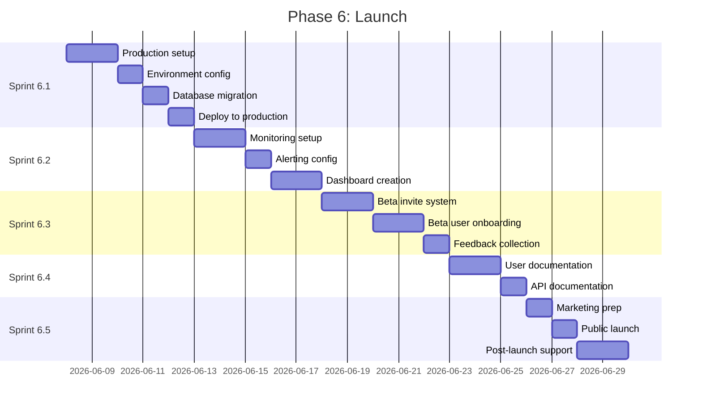

# Phase 6: Launch

**Duration:** 2 weeks (Weeks 17-18)
**Objective:** Production deployment, monitoring, beta testing, documentation, and public launch

---

## Phase Overview



---

## Sprint 6.1: Production Deployment

**Duration:** 5 days
**Complexity:** High
**Dependencies:** Phase 5 complete

### Objectives
- Set up production environment on Vercel
- Configure production database
- Set up Redis for production
- Deploy application
- Verify all systems operational

### Tasks

#### Vercel Production Setup
- [ ] Create production Vercel project
- [ ] Configure production domain
- [ ] Set up SSL certificates
- [ ] Configure build settings
- [ ] Set up environment variables

#### Environment Configuration
- [ ] Set all production environment variables:
  - [ ] `DATABASE_URL` (Neon production)
  - [ ] `REDIS_URL` (Upstash production)
  - [ ] `NEXTAUTH_SECRET` (production secret)
  - [ ] `NEXTAUTH_URL`
  - [ ] OAuth credentials (production)
  - [ ] `ABLY_API_KEY` (production)
  - [ ] `ENCRYPTION_KEY`
  - [ ] All platform API keys
- [ ] Verify environment validation passes
- [ ] Document environment setup

#### Database Production Setup
- [ ] Create Neon production database
- [ ] Configure connection pooling
- [ ] Run migrations on production
- [ ] Verify schema matches development
- [ ] Set up database backups
- [ ] Configure point-in-time recovery

#### Redis Production Setup
- [ ] Create Upstash production instance
- [ ] Configure connection string
- [ ] Set up eviction policies
- [ ] Configure persistence settings
- [ ] Test pub/sub functionality

#### Ably Production Setup
- [ ] Create production Ably app
- [ ] Configure production API keys
- [ ] Set up channel namespaces
- [ ] Configure capabilities
- [ ] Test WebSocket connections

#### OAuth Production Credentials
- [ ] Update Google OAuth for production domain
- [ ] Update GitHub OAuth for production domain
- [ ] Update all platform OAuth callbacks
- [ ] Verify OAuth flows work
- [ ] Document callback URLs

#### Deployment Process
- [ ] Create deployment checklist
- [ ] Deploy to production
- [ ] Run smoke tests
- [ ] Verify all endpoints
- [ ] Check database connectivity
- [ ] Verify real-time connections
- [ ] Test OAuth flows

#### DNS Configuration
- [ ] Configure custom domain
- [ ] Set up DNS records
- [ ] Verify SSL certificate
- [ ] Configure WWW redirect
- [ ] Test domain resolution

### Acceptance Criteria
- [ ] Production environment operational
- [ ] All environment variables configured
- [ ] Database migrations applied
- [ ] OAuth flows working
- [ ] Real-time connections stable
- [ ] Custom domain accessible

### Technical Notes
```typescript
// Production environment validation
import { z } from 'zod';

const productionEnvSchema = z.object({
  DATABASE_URL: z.string().url().startsWith('postgresql://'),
  REDIS_URL: z.string().url().startsWith('rediss://'),
  NEXTAUTH_SECRET: z.string().min(32),
  NEXTAUTH_URL: z.string().url(),
  ABLY_API_KEY: z.string().includes(':'),
  ENCRYPTION_KEY: z.string().length(64), // 32 bytes hex encoded
  NODE_ENV: z.literal('production'),
});

export function validateProductionEnv() {
  const result = productionEnvSchema.safeParse(process.env);
  if (!result.success) {
    console.error('Invalid production environment:', result.error);
    process.exit(1);
  }
  return result.data;
}
```

---

## Sprint 6.2: Monitoring and Alerting

**Duration:** 5 days
**Complexity:** Medium
**Dependencies:** Sprint 6.1

### Objectives
- Set up comprehensive monitoring
- Configure alerting for critical issues
- Create operational dashboards
- Implement logging strategy
- Set up uptime monitoring

### Tasks

#### Vercel Analytics
- [ ] Enable Vercel Analytics
- [ ] Configure Web Vitals tracking
- [ ] Set up audience insights
- [ ] Review analytics dashboard
- [ ] Set up custom events

#### Error Tracking (Sentry)
- [ ] Create Sentry production project
- [ ] Configure Sentry SDK
- [ ] Set up source maps upload
- [ ] Configure error grouping
- [ ] Set up release tracking
- [ ] Configure user feedback

#### Logging Setup
- [ ] Configure structured logging
- [ ] Set up log aggregation
- [ ] Define log levels
- [ ] Add request tracing
- [ ] Configure log retention

#### Application Monitoring
- [ ] Set up API endpoint monitoring
- [ ] Track response times
- [ ] Monitor error rates
- [ ] Track database performance
- [ ] Monitor WebSocket connections

#### Infrastructure Monitoring
- [ ] Monitor database connections
- [ ] Track Redis memory usage
- [ ] Monitor serverless function usage
- [ ] Track bandwidth usage
- [ ] Monitor edge function performance

#### Alert Configuration
- [ ] Define alert thresholds:
  - [ ] Error rate > 1%
  - [ ] Response time > 2s (p95)
  - [ ] Database latency > 100ms
  - [ ] WebSocket disconnections > 5%
  - [ ] Deployment failures
- [ ] Configure alert channels (Slack, email)
- [ ] Set up on-call rotation (if applicable)
- [ ] Create runbooks for alerts

#### Uptime Monitoring
- [ ] Set up uptime checks
- [ ] Monitor critical endpoints:
  - [ ] Homepage
  - [ ] API health check
  - [ ] OAuth callbacks
  - [ ] WebSocket endpoint
- [ ] Configure status page
- [ ] Set up incident response

#### Dashboards
- [ ] Create operations dashboard:
  - [ ] Request volume
  - [ ] Error rates
  - [ ] Response times
  - [ ] Active users
  - [ ] Platform connections
- [ ] Create business metrics dashboard:
  - [ ] Daily active users
  - [ ] Deliveries tracked
  - [ ] Platform usage breakdown
  - [ ] Feature adoption

### Acceptance Criteria
- [ ] All critical metrics tracked
- [ ] Alerts configured and tested
- [ ] Dashboards accessible
- [ ] Logging operational
- [ ] Uptime monitoring active
- [ ] On-call process documented

### Technical Notes
```typescript
// Sentry configuration
import * as Sentry from '@sentry/nextjs';

Sentry.init({
  dsn: process.env.SENTRY_DSN,
  environment: process.env.NODE_ENV,
  tracesSampleRate: 0.1, // 10% of transactions
  profilesSampleRate: 0.1,
  replaysSessionSampleRate: 0.1,
  replaysOnErrorSampleRate: 1.0,

  beforeSend(event) {
    // Scrub sensitive data
    if (event.request?.headers) {
      delete event.request.headers['authorization'];
    }
    return event;
  },
});
```

---

## Sprint 6.3: Beta Testing

**Duration:** 5 days
**Complexity:** Medium
**Dependencies:** Sprint 6.1

### Objectives
- Implement beta invite system
- Onboard beta users
- Collect and analyze feedback
- Fix critical issues
- Prepare for public launch

### Tasks

#### Beta Invite System
- [ ] Create invite code system
- [ ] Build invite code database table
- [ ] Create admin interface for codes
- [ ] Implement code redemption flow
- [ ] Track invite usage

#### Beta User Onboarding
- [ ] Create beta user segment
- [ ] Design onboarding flow for beta
- [ ] Add feature flags for beta
- [ ] Create beta user dashboard badge
- [ ] Set up beta communication channel

#### Beta User Recruitment
- [ ] Identify target beta users
- [ ] Create beta signup form
- [ ] Send invite emails
- [ ] Provide onboarding instructions
- [ ] Schedule onboarding calls (optional)

#### Feedback Collection
- [ ] Integrate feedback widget (Canny, etc.)
- [ ] Create feedback categories
- [ ] Set up feedback triage process
- [ ] Create bug report template
- [ ] Enable in-app feedback

#### Feedback Analysis
- [ ] Review incoming feedback daily
- [ ] Categorize feedback:
  - [ ] Bugs
  - [ ] Feature requests
  - [ ] UX improvements
  - [ ] Platform issues
- [ ] Prioritize issues
- [ ] Track resolution

#### Bug Fixes
- [ ] Address critical bugs immediately
- [ ] Create hotfix deployment process
- [ ] Communicate fixes to users
- [ ] Update known issues list
- [ ] Track regression risks

#### Beta Metrics
- [ ] Track beta user engagement
- [ ] Monitor platform connections
- [ ] Measure feature adoption
- [ ] Track error rates per user
- [ ] Calculate NPS score

#### Beta Graduation
- [ ] Define graduation criteria
- [ ] Plan beta to public transition
- [ ] Communicate launch timeline
- [ ] Thank beta participants
- [ ] Offer beta user benefits

### Acceptance Criteria
- [ ] Beta invite system functional
- [ ] Beta users successfully onboarded
- [ ] Feedback mechanism active
- [ ] Critical bugs fixed
- [ ] Positive beta user sentiment
- [ ] Ready for public launch

### Technical Notes
```typescript
// Beta invite system
const inviteCodes = pgTable('invite_codes', {
  id: text('id').primaryKey().$defaultFn(() => createId()),
  code: text('code').notNull().unique(),
  createdBy: text('created_by').references(() => users.id),
  redeemedBy: text('redeemed_by').references(() => users.id),
  redeemedAt: timestamp('redeemed_at'),
  expiresAt: timestamp('expires_at'),
  maxRedemptions: integer('max_redemptions').default(1),
  redemptionCount: integer('redemption_count').default(0),
  createdAt: timestamp('created_at').defaultNow(),
});

async function redeemInviteCode(code: string, userId: string): Promise<boolean> {
  const invite = await db.query.inviteCodes.findFirst({
    where: eq(inviteCodes.code, code),
  });

  if (!invite) return false;
  if (invite.redemptionCount >= invite.maxRedemptions) return false;
  if (invite.expiresAt && invite.expiresAt < new Date()) return false;

  await db.update(inviteCodes)
    .set({
      redeemedBy: userId,
      redeemedAt: new Date(),
      redemptionCount: invite.redemptionCount + 1,
    })
    .where(eq(inviteCodes.id, invite.id));

  return true;
}
```

---

## Sprint 6.4: Documentation

**Duration:** 3 days
**Complexity:** Low-Medium
**Dependencies:** Sprint 6.1

### Objectives
- Create comprehensive user documentation
- Document API for potential integrations
- Create FAQ and troubleshooting guides
- Set up help center

### Tasks

#### User Documentation
- [ ] Getting Started guide:
  - [ ] Account creation
  - [ ] Connecting first platform
  - [ ] Understanding the dashboard
  - [ ] Tracking a delivery
- [ ] Platform connection guides:
  - [ ] Instacart setup
  - [ ] DoorDash setup
  - [ ] Uber Eats setup
  - [ ] Amazon setup
  - [ ] Walmart+ setup
  - [ ] Other platforms
- [ ] Feature guides:
  - [ ] Live tracking
  - [ ] Notifications setup
  - [ ] Settings configuration
  - [ ] Mobile usage

#### FAQ Documentation
- [ ] Authentication FAQ
- [ ] Platform connection FAQ
- [ ] Tracking accuracy FAQ
- [ ] Privacy and security FAQ
- [ ] Account management FAQ
- [ ] Troubleshooting FAQ

#### Troubleshooting Guides
- [ ] Connection issues
- [ ] Missing deliveries
- [ ] Notification problems
- [ ] Map not loading
- [ ] Account issues
- [ ] Platform-specific issues

#### API Documentation (if applicable)
- [ ] API overview
- [ ] Authentication
- [ ] Endpoints reference
- [ ] Rate limits
- [ ] Error codes
- [ ] Examples

#### Help Center Setup
- [ ] Choose help center platform
- [ ] Configure search functionality
- [ ] Set up article categories
- [ ] Add contact support option
- [ ] Integrate with app

#### Legal Documentation
- [ ] Privacy Policy
- [ ] Terms of Service
- [ ] Cookie Policy
- [ ] Data Processing Agreement
- [ ] Acceptable Use Policy

### Acceptance Criteria
- [ ] All user guides complete
- [ ] FAQ comprehensive
- [ ] Troubleshooting guides helpful
- [ ] Help center searchable
- [ ] Legal documents in place
- [ ] Documentation accessible from app

### Technical Notes
```markdown
# Help Center Structure

/help
  /getting-started
    - create-account.md
    - connect-platform.md
    - dashboard-overview.md
    - track-delivery.md
  /platforms
    - instacart.md
    - doordash.md
    - uber-eats.md
    - amazon.md
    - walmart.md
  /features
    - live-tracking.md
    - notifications.md
    - settings.md
  /troubleshooting
    - connection-issues.md
    - missing-deliveries.md
    - notification-problems.md
  /faq
    - general.md
    - security.md
    - account.md
  /legal
    - privacy-policy.md
    - terms-of-service.md
```

---

## Sprint 6.5: Launch

**Duration:** 4 days
**Complexity:** Medium
**Dependencies:** All previous Phase 6 sprints

### Objectives
- Prepare for public launch
- Execute launch plan
- Monitor post-launch metrics
- Provide launch support
- Celebrate success

### Tasks

#### Pre-Launch Checklist
- [ ] All tests passing
- [ ] Performance targets met
- [ ] Accessibility verified
- [ ] Security audit passed
- [ ] Documentation complete
- [ ] Monitoring operational
- [ ] Beta issues resolved
- [ ] Legal documents approved

#### Launch Preparation
- [ ] Create launch announcement
- [ ] Prepare social media posts
- [ ] Design launch graphics
- [ ] Write press release (optional)
- [ ] Prepare Product Hunt listing (optional)
- [ ] Schedule launch communications

#### Feature Flags
- [ ] Review feature flags
- [ ] Disable beta-only features
- [ ] Enable public features
- [ ] Prepare rollback plan
- [ ] Document flag states

#### Capacity Planning
- [ ] Review expected traffic
- [ ] Scale resources if needed
- [ ] Verify rate limits
- [ ] Test under load
- [ ] Prepare scaling runbook

#### Launch Execution
- [ ] Remove beta restrictions
- [ ] Publish launch announcement
- [ ] Post on social media
- [ ] Send email to waitlist
- [ ] Submit to directories
- [ ] Monitor systems closely

#### Post-Launch Monitoring
- [ ] Watch error rates
- [ ] Monitor performance
- [ ] Track user signups
- [ ] Monitor platform connections
- [ ] Check support queue

#### Launch Support
- [ ] Staff support channels
- [ ] Quick response to issues
- [ ] Hotfix deployment ready
- [ ] Communication templates ready
- [ ] Escalation path defined

#### Post-Launch Analysis
- [ ] Review launch metrics
- [ ] Analyze user feedback
- [ ] Document lessons learned
- [ ] Plan next iteration
- [ ] Celebrate team success

### Acceptance Criteria
- [ ] Application publicly accessible
- [ ] No critical issues at launch
- [ ] Monitoring shows healthy metrics
- [ ] Users successfully signing up
- [ ] Support responsive
- [ ] Team prepared for issues

### Technical Notes
```typescript
// Launch feature flag configuration
const featureFlags = {
  // Beta-only features to disable
  betaInviteRequired: false,
  betaFeaturePreview: false,

  // Public features to enable
  publicSignup: true,
  allPlatforms: true,
  notifications: true,
  liveTracking: true,

  // Gradual rollout
  newDashboard: { enabled: true, percentage: 100 },
  advancedFilters: { enabled: true, percentage: 100 },
};

// Launch monitoring checklist
const launchMonitoring = {
  errorRate: { threshold: 0.01, alert: true },
  signupRate: { expected: 100, alert: false },
  platformConnections: { expected: 50, alert: false },
  p95Latency: { threshold: 2000, alert: true },
  wsConnections: { threshold: 1000, alert: false },
};
```

---

## Phase 6 Completion Checklist

### Deployment Verification
- [ ] Production environment stable
- [ ] All services operational
- [ ] Database performing well
- [ ] Real-time working correctly
- [ ] OAuth flows complete

### Monitoring Verification
- [ ] Metrics collecting
- [ ] Alerts configured
- [ ] Dashboards populated
- [ ] Logging operational
- [ ] Uptime monitoring active

### Beta Verification
- [ ] Beta feedback addressed
- [ ] Critical bugs fixed
- [ ] User sentiment positive
- [ ] Platform stability confirmed

### Documentation Verification
- [ ] User guides complete
- [ ] FAQ comprehensive
- [ ] Legal documents in place
- [ ] Help center accessible

### Launch Verification
- [ ] Public access enabled
- [ ] Launch communications sent
- [ ] Support ready
- [ ] Monitoring active
- [ ] Team on standby

---

## Post-Launch Roadmap

### Week 1-2 Post-Launch
- Monitor stability
- Fix emerging issues
- Respond to feedback
- Optimize performance

### Month 1 Post-Launch
- Analyze user behavior
- Prioritize feature requests
- Plan v1.1 release
- Expand platform support

### Quarter 1 Post-Launch
- Add new platforms
- Implement top feature requests
- Improve ETA accuracy
- Enhance mobile experience

---

## Risk Mitigation

| Risk | Likelihood | Impact | Mitigation |
|------|------------|--------|------------|
| Production outage | Low | Critical | Rollback plan, monitoring |
| Traffic spike | Medium | High | Auto-scaling, rate limiting |
| Security incident | Low | Critical | Security monitoring, response plan |
| Negative user feedback | Medium | Medium | Rapid response, iteration |
| Platform API issues | Medium | High | Graceful degradation |
| Support overload | Medium | Medium | Self-service docs, queue management |

---

## Success Metrics

| Metric | Target | Measurement |
|--------|--------|-------------|
| Uptime | >99.9% | Monitoring |
| Error rate | <0.1% | Sentry |
| User signups (week 1) | 500+ | Analytics |
| Platform connections | 70% of users | Database |
| User satisfaction | >4.0/5.0 | Feedback |
| Support response time | <4 hours | Support system |

---

*Phase 6 Est. Completion: Week 18 | Total Tasks: 108*

---

## Project Completion Summary

| Phase | Duration | Tasks | Focus |
|-------|----------|-------|-------|
| Phase 1 | 3 weeks | 68 | Foundation |
| Phase 2 | 2.5 weeks | 64 | Core Infrastructure |
| Phase 3 | 4 weeks | 142 | Platform Adapters |
| Phase 4 | 2.5 weeks | 118 | Real-Time Features |
| Phase 5 | 2.5 weeks | 138 | Polish and Testing |
| Phase 6 | 2 weeks | 108 | Launch |
| **Total** | **16.5 weeks** | **638** | **Complete Product** |

---

*Congratulations on completing the DropDeck development plan!*
